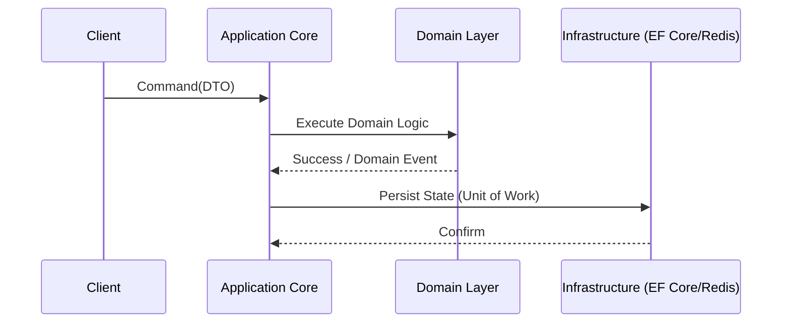

# Clean & Onion Architecture en Sistemas Distribuidos

## 1. Contexto & Definición del Problema
En sistemas de microservicios, el acoplamiento entre la lógica de negocio y los detalles de infraestructura (bases de datos, frameworks, protocolos de red) conduce a una deuda técnica asfixiante. El reto es desacoplar el núcleo del negocio (Domain) de los efectos secundarios (I/O, Red) manteniendo la mantenibilidad en entornos distribuidos.

## 2. Decisión Arquitectónica & Justificación
Adoptaremos Onion Architecture (basada en el principio de dependencia invertida) para garantizar que el core solo dependa de sí mismo. La infraestructura debe ser un plugin inyectado mediante interfaces, permitiendo la implementación de patrones de resiliencia (como [[Circuit-Breaker-Pattern]]) sin contaminar el dominio.

## 3. Flujo y Diagrama de Secuencia


## 4. Matriz de Trade-offs
| Ventaja | Desventaja | Costo Operacional |
| :--- | :--- | :--- |
| Alta testeabilidad | Boilerplate excesivo | Medio (requiere disciplina) |
| Desacoplamiento total | Curva de aprendizaje alta | Bajo a largo plazo |
| Facilidad de refactor | Complejidad en mapeo DTO | Bajo |

## 5. Consideraciones de Concurrencia, Consistencia y Rendimiento
- **Concurrencia:** Implementar *Optimistic Concurrency* mediante `RowVersion` o `ETag` en las entidades del dominio para evitar condiciones de carrera.
- **Consistencia:** Utilizar el [[Outbox-Pattern]] para garantizar consistencia eventual al publicar eventos desde el dominio hacia el bus de mensajes.
- **Rendimiento:** Evitar mapeos pesados en el hot-path; usar `records` de C# para inmutabilidad y rendimiento.

## 6. Implementación de Referencia en .NET 10
```csharp
// Domain: La capa interna es pura y no depende de nada.
public record OrderId(Guid Value);
public class Order(OrderId id, string sku) {
    public OrderId Id { get; } = id;
    public string Sku { get; } = sku;
    public void Validate() => ArgumentException.ThrowIfNullOrEmpty(Sku);
}

// Application: Uso de ReziliencePipeline de .NET 10
public class CreateOrderHandler(IOrderRepository repository, ResiliencePipeline pipeline) {
    public async Task Handle(CreateOrderCommand command) {
        await pipeline.ExecuteAsync(async token => {
            var order = new Order(new OrderId(Guid.NewGuid()), command.Sku);
            order.Validate();
            await repository.SaveAsync(order, token);
        });
    }
}
```

## 7. Enlaces y Referencias en Obsidian
- [[clean-onion-architecture-distributed-systems]]
- [[Circuit-Breaker-Pattern]]
- [[Outbox-Pattern]]
