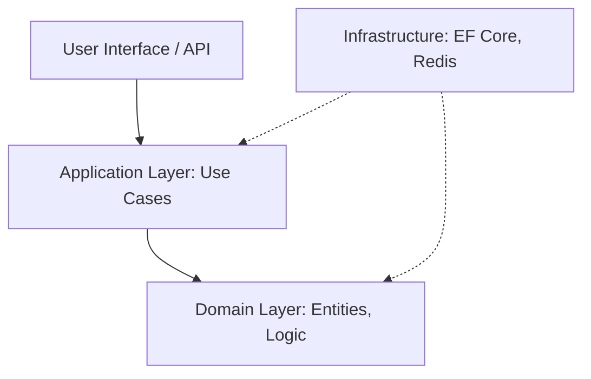

# Clean Architecture & Onion Architecture

## 1. Contexto & Definición del Problema
En sistemas distribuidos complejos, el acoplamiento excesivo entre la infraestructura (bases de datos, APIs externas) y la lógica de negocio conduce a una deuda técnica insostenible. La Clean Architecture y la Onion Architecture proponen una estructura de capas donde la dependencia apunta siempre hacia el centro (el Dominio).

## 2. Decisión Arquitectónica & Justificación
Adoptamos estas arquitecturas para asegurar que el núcleo del negocio sea testeable, independiente de frameworks y portable. En el contexto de .NET 10, esto permite aislar los cambios en la capa de infraestructura (ej. migrar de SQL Server a CosmosDB) sin tocar las reglas de negocio.

## 3. Flujo y Diagrama de Topología


## 4. Matriz de Trade-offs
| Ventaja | Desventaja |
| :--- | :--- |
| Alta testeabilidad y aislamiento | Curva de aprendizaje empinada |
| Independencia tecnológica | "Boilerplate" excesivo (Mapeos constantes) |
| Cumplimiento estricto de DDD | Complejidad inicial en proyectos pequeños |

## 5. Consideraciones de Concurrencia, Consistencia y Rendimiento
- **Consistencia**: El uso de la capa de dominio asegura la integridad transaccional mediante agregados. Para sistemas distribuidos, esto debe complementarse con el [[Outbox-Pattern]].
- **Concurrencia**: Se recomienda el uso de `System.Threading.Channels` en la capa de aplicación para el procesamiento asíncrono de eventos internos.
- **Performance**: El exceso de abstracción puede penalizar la latencia; se debe permitir el "bypass" de consultas de lectura mediante CQRS.

## 6. Implementación de Referencia en .NET 10
```csharp
// Domain Layer: Pure Logic
public record OrderId(Guid Value);
public class Order(OrderId id, decimal amount) {
    public OrderId Id { get; } = id;
    public decimal Amount { get; private set; } = amount;
}

// Application Layer: Use Case
public class CreateOrderHandler(IOrderRepository repository) {
    public async Task Handle(CreateOrderCommand cmd) {
        var order = new Order(new OrderId(Guid.NewGuid()), cmd.Amount);
        await repository.SaveAsync(order);
    }
}

// Infrastructure: Resilient Persistence
public class OrderRepository(ApplicationDbContext db) : IOrderRepository {
    public async Task SaveAsync(Order order) {
        await db.Orders.AddAsync(order);
        await db.SaveChangesAsync();
    }
}
```

## 7. Enlaces y Referencias en Obsidian
- [[Circuit-Breaker-Pattern]] para resiliencia en infraestructura.
- [[Outbox-Pattern]] para mantener consistencia en transacciones distribuidas.
