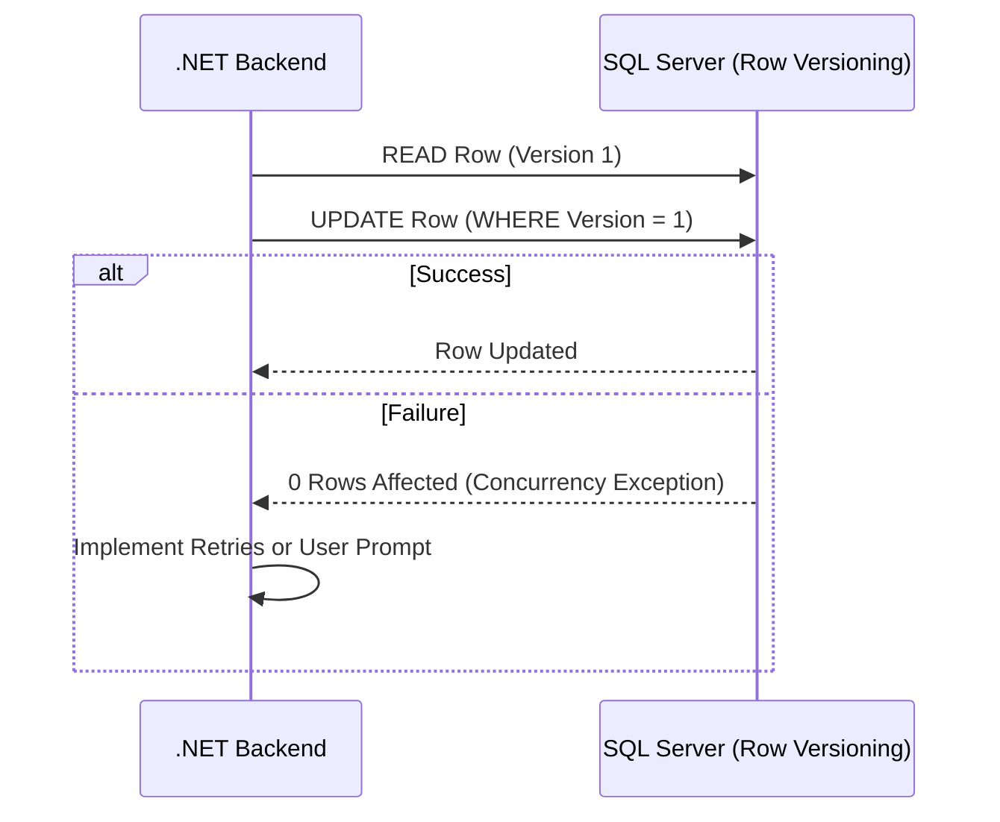

# Estrategias de Concurrencia en SQL Server [Semi-Senior]

## 1. Contexto General & Definición del Concepto
La concurrencia en SQL Server se refiere a cómo el motor de base de datos maneja múltiples transacciones accediendo a los mismos datos simultáneamente. Sin una estrategia adecuada, ocurren fenómenos como *Lost Updates*, *Dirty Reads* o *Deadlocks*.

El problema principal es el equilibrio entre **Consistencia** (evitar datos corruptos) y **Disponibilidad** (evitar que los usuarios esperen bloqueos).

## 2. Forma de Aplicación, Buenas Prácticas & Ventajas
- **Pesimista (Locking):** Bloquea filas/tablas antes de leer/escribir. Ideal para alta contención.
- **Optimista (Row Versioning):** Permite concurrencia permitiendo que las transacciones fallen si detectan cambios externos. Ideal para lectura intensiva.

| Estrategia | Ventaja | Desventaja | Caso de Uso |
| :--- | :--- | :--- | :--- |
| Pesimista | Consistencia total | Deadlocks, latencia | Sistemas Financieros |
| Optimista | Alta escalabilidad | Reintentos requeridos | E-commerce, Catálogos |

## 3. Flujo Arquitectónico y Diagrama (Mermaid)


## 4. Implementación y Ejemplos Prácticos en C# / .NET 10
Usando EF Core 10 con un valor de fila (RowVersion) para concurrencia optimista.

```csharp
public record Product(int Id, string Name, decimal Price, byte[] RowVersion);

public async Task UpdateProductPrice(int id, decimal newPrice)
{
    var product = await _context.Products.FindAsync(id);
    if (product == null) throw new KeyNotFoundException();

    // EF Core maneja el RowVersion automáticamente si está configurado en el modelo
    _context.Products.Update(product with { Price = newPrice });

    try {
        await _context.SaveChangesAsync();
    } catch (DbUpdateConcurrencyException ex) {
        // Manejar reintento o conflicto de negocio
        throw new ConcurrencyException("El producto fue modificado por otro usuario.", ex);
    }
}
```

## 5. Implementación y Ejemplos Prácticos en React con Vite.js
Uso de estados para manejar el feedback del conflicto de concurrencia.

```typescript
const updateProduct = async (data: Product) => {
  try {
    await apiClient.put('/products', data);
  } catch (error) {
    if (error.response?.status === 409) {
      toast.error("El registro ha cambiado. Recargando datos...");
      refetch();
    }
  }
};
```

## 6. Consideraciones de Concurrencia, Consistencia y Rendimiento
- **Latencia:** La concurrencia optimista reduce bloqueos, pero aumenta el tráfico de red si hay muchos reintentos.
- **Transacciones:** Evita mantener transacciones abiertas durante llamadas a APIs externas.
- **Optimismo vs Pesimismo:** Empieza siempre con optimista; usa pesimista solo cuando los bloqueos sean inevitables y la integridad sea crítica absoluta.

## 7. Enlaces y Referencias en Obsidian
- [[repository-unit-of-work-pattern]]
- [[cqrs-pattern-implementation]]
