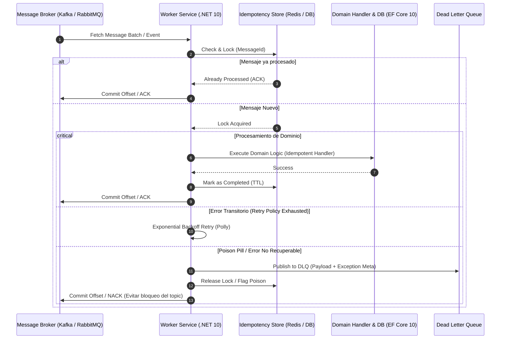

# Arquitectura de Consumidores de Eventos Resilientes `[Senior]`

## 1. Contexto General & Definición del Concepto

En la **Arquitectura de Software & Sistemas Distribuidos**, un **Consumidor de Eventos** (*Event Consumer* o *Subscriber*) es un componente arquitectónico desacoplado diseñado para ingerir, procesar y reaccionar ante flujos continuos o mensajes discretos emitidos por productores a través de un Message Broker (como Apache Kafka, RabbitMQ, Azure Service Bus o AWS SQS).

### Problema Fundamental que Resuelve
- **Acoplamiento Temporal y Espacial:** Rompe la dependencia sincrónica entre emisor y receptor (HTTP/gRPC directo), permitiendo que los servicios operen con disponibilidad asíncrona.
- **Control de Presión y Backpressure:** Previene el colapso de servicios secundarios ante picos de tráfico desmedidos mediante el control de la tasa de ingesta (*pull-based consumption* vs *push-based*).
- **Resiliencia Operativa y Tolerancia a Fallos:** Garantiza que fallas transitorias en la infraestructura de procesamiento no causen pérdida de datos mediante semánticas de entrega y colas de reintento/muertas (*Dead Letter Queues*).

### Principios y Terminología Clave
- **Garantías de Entrega:** *At-most-once* (pérdida tolerable, sin duplicados), *At-least-once* (cero pérdida, duplicados posibles; estándar en la industria), *Effectively-once* (logrado mediante procesamiento idempotente junto con *At-least-once*).
- **Idempotencia:** Capacidad de procesar un mensaje múltiples veces produciendo exactamente el mismo efecto colateral en el estado del dominio (véase [[idempotencia-apis-arquitectura]]).
- **Dead Letter Queue (DLQ):** Destino secundario para mensajes no procesables tras agotar las políticas de reintentos (*poison messages*).
- **Consumer Groups & Particiones:** Mecanismo de escalabilidad horizontal para paralelizar el consumo preservando el orden relativo por clave de partición.

---

## 2. Forma de Aplicación, Buenas Prácticas & Ventajas

### Cuándo Aplicarlo vs. Cuándo es un Antipatrón

- **Aplicar cuando:**
  - Se requiere desacoplar subsistemas de alta latencia (ej. generación de reportes, facturación, notificaciones, sincronización de proyecciones en [[cqrs-pattern-implementation]]).
  - Se procesan flujos de eventos asíncronos generados vía [[transactional-outbox-pattern]].
  - El volumen de transacciones supera la capacidad de procesamiento sincrónico instantáneo y se requiere nivelación de carga (*load leveling*).
- **Antipatrón (Over-engineering):**
  - Operaciones CRUD simples de baja concurrencia donde un endpoint HTTP sincrónico directo es suficiente.
  - Casos donde el cliente requiere una respuesta transaccional inmediata en menos de 50ms para completar una interacción de usuario obligatoria.
  - Sistemas monolíticos pequeños sin cuellos de botella de I/O.

### Matriz de Trade-offs

| Criterio | Consumidores Asíncronos Distribuidos | Comunicación Sincrónica (REST/gRPC) |
| :--- | :--- | :--- |
| **Disponibilidad & Tolerancia a Fallos** | **Muy Alta**: El broker absorbe la indisponibilidad del consumidor. | **Baja/Media**: Fallas en cascada si un servicio aguas abajo falla. |
| **Complejidad Arquitectónica** | **Alta**: Requiere DLQ, Outbox, manejo de idempotencia y trazabilidad distribuida. | **Baja**: Flujo lineal *request-response*. |
| **Consistencia de Datos** | **Consistencia Eventual** (Reconciliación asíncrona). | **Consistencia Inmediata / Transaccional**. |
| **Latencia p99** | **Variable**: Depende de la cola, reintentos y carga del broker. | **Determinista y Baja** (cuando no hay saturación). |
| **Costo Operativo (TCO)** | **Medio-Alto**: Mantenimiento del Broker, observabilidad (OTel), almacenamiento. | **Bajo**: Menor infraestructura intermedia. |

---

## 3. Flujo Arquitectónico y Diagrama (Mermaid)

El siguiente diagrama ilustra el flujo de consumo resiliente con deduplicación idempotente, reintentos con backoff exponencial y derivación a Dead Letter Queue (DLQ).



---

## 4. Implementación y Ejemplos Prácticos en C# / .NET 10 (Backend & Domain)

Implementación de un `BackgroundService` en **.NET 10** utilizando `Channel<T>` para procesamiento concurrente desacoplado, semántica *At-least-once*, almacenamiento de idempotencia y manejo estructurado de errores con pipelines resilientes.

```csharp
// Domain/Events/OrderCreatedIntegrationEvent.cs
namespace DistributedSystems.Domain.Events;

public readonly record struct OrderCreatedIntegrationEvent(
    Guid EventId,
    Guid OrderId,
    Guid CustomerId,
    decimal TotalAmount,
    DateTimeOffset OccurredOnUtc
);

// Infrastructure/Idempotency/IIdempotencyStore.cs
namespace DistributedSystems.Infrastructure.Idempotency;

public interface IIdempotencyStore
{
    ValueTask<bool> TryAcquireLockAsync(Guid eventId, TimeSpan lockTtl, CancellationToken ct);
    ValueTask MarkAsProcessedAsync(Guid eventId, TimeSpan retentionTtl, CancellationToken ct);
    ValueTask ReleaseLockAsync(Guid eventId, CancellationToken ct);
}

// Infrastructure/Consumers/OrderCreatedConsumerService.cs
namespace DistributedSystems.Infrastructure.Consumers;

using System.Threading.Channels;
using Microsoft.Extensions.Hosting;
using Microsoft.Extensions.Logging;
using Microsoft.Extensions.DependencyInjection;
using DistributedSystems.Domain.Events;
using DistributedSystems.Infrastructure.Idempotency;

public sealed class OrderCreatedConsumerService : BackgroundService
{
    private readonly IServiceProvider _serviceProvider;
    private readonly IIdempotencyStore _idempotencyStore;
    private readonly ILogger<OrderCreatedConsumerService> _logger;
    private readonly Channel<OrderCreatedIntegrationEvent> _internalChannel;

    public OrderCreatedConsumerService(
        IServiceProvider serviceProvider,
        IIdempotencyStore idempotencyStore,
        ILogger<OrderCreatedConsumerService> logger)
    {
        _serviceProvider = serviceProvider;
        _idempotencyStore = idempotencyStore;
        _logger = logger;
        
        // Backpressure bounded channel para controlar throughput y memoria
        _internalChannel = Channel.CreateBounded<OrderCreatedIntegrationEvent>(new BoundedChannelOptions(5000)
        {
            FullMode = BoundedChannelFullMode.Wait,
            SingleReader = false,
            SingleWriter = true
        });
    }

    protected override async Task ExecuteAsync(CancellationToken stoppingToken)
    {
        _logger.LogInformation("Iniciando consumidor distribuido de OrderCreated en .NET 10...");

        // Inicia workers concurrentes de procesamiento interno (Escalado vertical in-process)
        var consumerWorkers = Enumerable.Range(0, Environment.ProcessorCount)
            .Select(_ => ProcessQueueAsync(stoppingToken));

        // Simulación de pipeline de ingesta desde el Broker de mensajería
        var ingestionTask = Task.Run(async () =>
        {
            while (!stoppingToken.IsCancellationRequested)
            {
                // Simula recepción desde Kafka/RabbitMQ
                var fakeEvent = new OrderCreatedIntegrationEvent(
                    Guid.NewGuid(),
                    Guid.NewGuid(),
                    Guid.NewGuid(),
                    199.99m,
                    DateTimeOffset.UtcNow
                );

                await _internalChannel.Writer.WriteAsync(fakeEvent, stoppingToken);
                await Task.Delay(50, stoppingToken);
            }
        }, stoppingToken);

        await Task.WhenAll(consumerWorkers.Append(ingestionTask));
    }

    private async Task ProcessQueueAsync(CancellationToken ct)
    {
        var reader = _internalChannel.Reader;

        while (await reader.WaitToReadAsync(ct))
        {
            while (reader.TryRead(out var integrationEvent))
            {
                await HandleEventWithResilienceAsync(integrationEvent, ct);
            }
        }
    }

    private async Task HandleEventWithResilienceAsync(OrderCreatedIntegrationEvent evt, CancellationToken ct)
    {
        var acquired = await _idempotencyStore.TryAcquireLockAsync(evt.EventId, TimeSpan.FromMinutes(2), ct);
        if (!acquired)
        {
            _logger.LogWarning("Evento duplicado ignorado o en procesamiento activo: {EventId}", evt.EventId);
            return;
        }

        using var scope = _serviceProvider.CreateScope();
        try
        {
            // Procesamiento con EF Core 10 / Lógica de Dominio
            _logger.LogInformation("Procesando Orden: {OrderId} para Cliente: {CustomerId}", evt.OrderId, evt.CustomerId);
            
            // Simular persistencia o ejecución de caso de uso
            await Task.Delay(20, ct);

            await _idempotencyStore.MarkAsProcessedAsync(evt.EventId, TimeSpan.FromDays(7), ct);
        }
        catch (Exception ex)
        {
            _logger.LogError(ex, "Fallo al procesar EventId: {EventId}. Liberando lock para reintento / DLQ.", evt.EventId);
            await _idempotencyStore.ReleaseLockAsync(evt.EventId, ct);
            // Derivación a Dead Letter Queue en caso de agotar políticas de reintentos
        }
    }
}
```

---

## 5. Implementación y Ejemplos Prácticos en React con Vite.js (Frontend Architecture)

En arquitecturas asíncronas donde el backend procesa mediante consumidores de eventos, el frontend no recibe respuesta inmediata de finalización de negocio en la petición HTTP. El frontend debe operar mediante **Actualizaciones Optimistas** sincronizadas vía WebSockets / Server-Sent Events (SSE) con degradación elegante (*Polling Fallback*).

### Custom Hook y Componente React 19 / Vite (`useEventStream`)

```tsx
// src/hooks/useEventConsumerStream.ts
import { useEffect, useReducer, useRef } from 'react';

export interface OrderStatusEvent {
  orderId: string;
  status: 'Pending' | 'Processing' | 'Completed' | 'Failed';
  errorMessage?: string;
  timestamp: string;
}

interface StreamState {
  data: OrderStatusEvent | null;
  isConnected: boolean;
  error: Error | null;
}

type Action =
  | { type: 'CONNECTED' }
  | { type: 'DISCONNECTED' }
  | { type: 'MESSAGE_RECEIVED'; payload: OrderStatusEvent }
  | { type: 'ERROR'; payload: Error };

const streamReducer = (state: StreamState, action: Action): StreamState => {
  switch (action.type) {
    case 'CONNECTED':
      return { ...state, isConnected: true, error: null };
    case 'DISCONNECTED':
      return { ...state, isConnected: false };
    case 'MESSAGE_RECEIVED':
      return { ...state, data: action.payload };
    case 'ERROR':
      return { ...state, error: action.payload, isConnected: false };
    default:
      return state;
  }
};

export function useEventConsumerStream(orderId: string, sseEndpoint: string) {
  const [state, dispatch] = useReducer(streamReducer, {
    data: null,
    isConnected: false,
    error: null,
  });

  const eventSourceRef = useRef<EventSource | null>(null);

  useEffect(() => {
    if (!orderId) return;

    const sse = new EventSource(`${sseEndpoint}?orderId=${encodeURIComponent(orderId)}`);
    eventSourceRef.current = sse;

    sse.onopen = () => dispatch({ type: 'CONNECTED' });
    
    sse.onmessage = (event: MessageEvent) => {
      try {
        const parsedData: OrderStatusEvent = JSON.parse(event.data);
        dispatch({ type: 'MESSAGE_RECEIVED', payload: parsedData });
      } catch (err) {
        dispatch({ type: 'ERROR', payload: new Error('Error al parsear payload de evento') });
      }
    };

    sse.onerror = (err) => {
      dispatch({ type: 'ERROR', payload: new Error('Fallo de conexión SSE') });
      sse.close();
    };

    return () => {
      sse.close();
      dispatch({ type: 'DISCONNECTED' });
    };
  }, [orderId, sseEndpoint]);

  return state;
}
```

```tsx
// src/components/OrderStatusTracker.tsx
import React, { useTransition } from 'react';
import { useEventConsumerStream } from '../hooks/useEventConsumerStream';

interface OrderStatusTrackerProps {
  orderId: string;
}

export const OrderStatusTracker: React.FC<OrderStatusTrackerProps> = ({ orderId }) => {
  const [, startTransition] = useTransition();
  const { data, isConnected, error } = useEventConsumerStream(
    orderId,
    '/api/v1/events/order-status-stream'
  );

  return (
    <div className="p-6 max-w-md mx-auto bg-slate-900 text-white rounded-xl shadow-md space-y-4 border border-slate-700">
      <div className="flex items-center justify-between">
        <h3 className="text-lg font-semibold">Estado del Procesamiento Asíncrono</h3>
        <span
          className={`h-3 w-3 rounded-full ${
            isConnected ? 'bg-emerald-500 animate-pulse' : 'bg-rose-500'
          }`}
          title={isConnected ? 'Conectado a Event Stream' : 'Desconectado'}
        />
      </div>

      <p className="text-sm text-slate-400 font-mono">Orden ID: {orderId}</p>

      {error && (
        <div className="p-3 bg-rose-950 border border-rose-800 rounded text-rose-300 text-sm">
          {error.message}
        </div>
      )}

      <div className="p-4 bg-slate-800 rounded-lg border border-slate-700">
        <div className="text-xs text-slate-400 uppercase tracking-wider mb-1">Estado Actual</div>
        <div className="text-xl font-bold text-indigo-400">
          {data?.status ?? 'Esperando confirmación del broker...'}
        </div>
        {data?.errorMessage && (
          <p className="text-sm text-rose-400 mt-2">Error: {data.errorMessage}</p>
        )}
      </div>
    </div>
  );
};
```

---

## 6. Consideraciones de Concurrencia, Consistencia y Rendimiento

1. **Sincronización React Client & .NET 10 Worker:**
   - Tras publicar un comando, la API devuelve `202 Accepted` con un identificador de seguimiento. La interfaz asume un estado optimista (*UI Optimistic Update*).
   - Las mutaciones finales de estado son emitidas por los consumidores de backend hacia una capa de broadcast (SignalR / SSE) que actualiza React sin bloqueos.

2. **Race Conditions y Out-of-Order Execution:**
   - En arquitecturas particionadas, la pérdida de orden estricto entre particiones distintas puede causar que un evento `OrderCancelled` llegue antes que `OrderCreated`.
   - **Mitigación:** Incluir marcas de tiempo lógicas o números de secuencia de versión de agregados (*Aggregate Version*) validados mediante [[repository-unit-of-work-pattern]] y chequeos de concurrencia optimista en el motor de base de datos.

3. **Optimización de Throughput y Latencia p99:**
   - Utilizar el patrón *Batch Consumption* con *Bulk Inserts* en [[EF-Core-DbContext-Pattern]] para maximizar IOPS hacia la base de datos relacional.
   - Mantener el tamaño de los mensajes en el broker por debajo de los 64 KB (guardar referencias a blobs externos / *Claim Check Pattern* si el payload excede el umbral).

---

## 7. Enlaces y Referencias en Obsidian

- [[transactional-outbox-pattern]] - Patrón garantizado para publicar eventos desde la persistencia relacional.
- [[idempotencia-apis-arquitectura]] - Manejo de identificadores de deduplicación y tokens de idempotencia.
- [[cqrs-pattern-implementation]] - Segregación de modelos de comando y consulta mediante consumidores de proyección.
- [[saga-pattern-implementation]] - Orquestación y coreografía distribuida basada en eventos.
- [[EF-Core-DbContext-Pattern]] - Persistencia eficiente dentro del pipeline del consumidor.
- [[repository-unit-of-work-pattern]] - Transaccionalidad atómica durante la ejecución de lógica de dominio.
