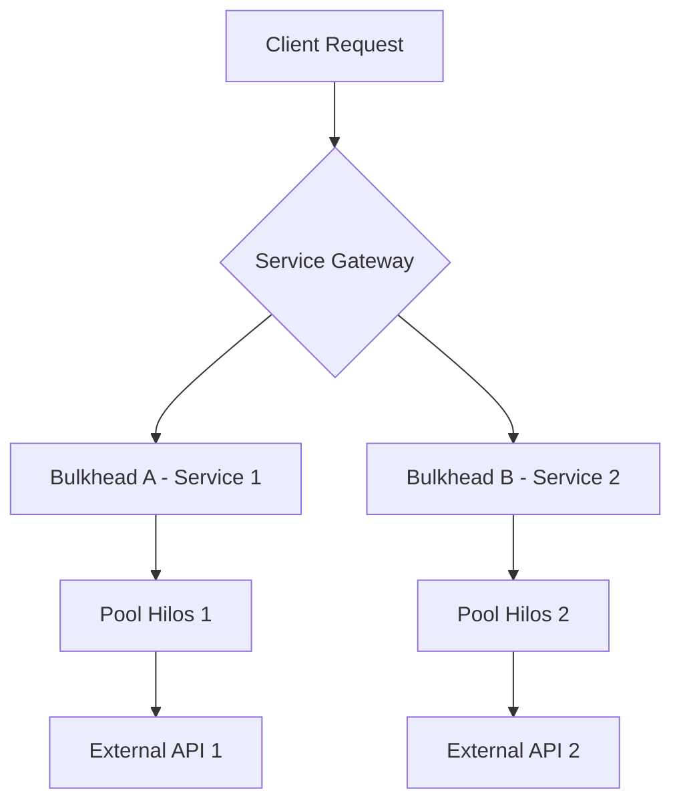

# Bulkhead Pattern: Aislamiento de Recursos [Semi-Senior]

## 1. Contexto General & Definición del Concepto
El patrón Bulkhead (Mamparo) se inspira en la construcción naval: si un compartimento de un barco se inunda, el agua no se propaga al resto del navío, permitiendo que siga a flote. En sistemas distribuidos, consiste en particionar los recursos (hilos, conexiones, memoria, latencia) para que el fallo en un servicio o sub-sistema no sature el pool completo de recursos de la aplicación.

## 2. Forma de Aplicación, Buenas Prácticas & Ventajas
- **Cuándo aplicar**: Cuando tienes múltiples dependencias externas (APIs, DBs) y quieres evitar el "Cascading Failure".
- **Antipatrón**: Aplicar Bulkhead en servicios con una única responsabilidad y poco tráfico (Over-engineering).

| Ventaja | Desventaja |
| :--- | :--- |
| Aislamiento de fallos | Mayor complejidad en monitorización |
| Mejora de la latencia (evita bloqueo) | Overhead en la gestión de pools |
| Tolerancia a fallos parciales | Consumo de memoria adicional |

## 3. Flujo Arquitectónico y Diagrama


## 4. Implementación en C# .NET 10
Usando `Polly` para limitar la concurrencia en llamadas externas.

```csharp
public class ResilientService(IHttpClientFactory httpClientFactory) {
    // Definimos un Bulkhead de 10 llamadas concurrentes y 5 en cola
    private readonly AsyncBulkheadPolicy _bulkhead = Policy.BulkheadAsync<HttpResponseMessage>(10, 5);

    public async Task<string> GetDataAsync() {
        return await _bulkhead.ExecuteAsync(async () => {
            var client = httpClientFactory.CreateClient("ExternalService");
            return await client.GetStringAsync("/api/resource");
        });
    }
}
```

## 5. Implementación en React con Vite.js
Para el frontend, el aislamiento se traduce en manejar estados de carga independientes para componentes que consumen APIs distintas.

```tsx
const DataDashboard = () => {
  const { data: userStats, loading: userLoading } = useService('users');
  const { data: globalStats, loading: globalLoading } = useService('globals');

  // Si una API cae, el otro componente sigue funcionando
  return (
    <div>
       <Widget title="Users" loading={userLoading} data={userStats} />
       <Widget title="Global" loading={globalLoading} data={globalStats} />
    </div>
  );
};
```

## 6. Consideraciones de Concurrencia
- **Server**: Monitorear el `BulkheadRejectedException` para ajustar el tamaño del pool dinámicamente.
- **Client**: Utilizar una estrategia de reintento con backoff exponencial, pero solo cuando la causa del rechazo no sea el saturamiento del bulkhead local.

## 7. Enlaces y Referencias
- [[CQRS-y-Event-Sourcing]]
- [[Distributed-Caching-Redis-Cache-Aside]]
