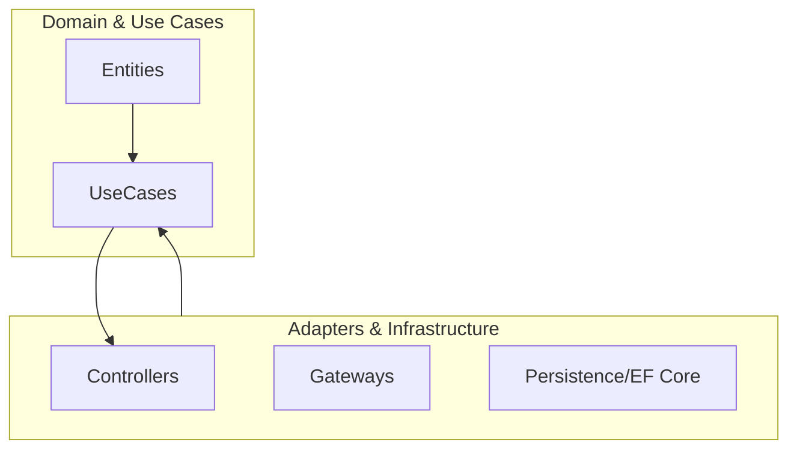

# Clean Architecture [Semi-Senior]

## 1. Contexto General & Definición del Concepto
La Clean Architecture es un patrón de diseño que propone separar las reglas de negocio (entidades) de las preocupaciones técnicas (frameworks, DB, UI). Su objetivo fundamental es lograr sistemas **independientes, testeables y mantenibles**, eliminando el acoplamiento directo con librerías externas.

## 2. Forma de Aplicación, Buenas Prácticas & Ventajas
### Cuándo usarla
- Proyectos con reglas de negocio complejas.
- Necesidad de larga mantenibilidad y testing unitario exhaustivo.
- Cuando se busca evitar el "Big Ball of Mud".

| Ventajas | Desventajas / Costos |
| :--- | :--- |
| Alta testeabilidad | Mayor complejidad inicial (boilerplate) |
| Independencia de Frameworks | Curva de aprendizaje técnica |
| Facilidad de refactorización | Riesgo de Over-engineering en CRUDs simples |

## 3. Flujo Arquitectónico y Diagrama (Mermaid)


## 4. Implementación y Ejemplos Prácticos en C# / .NET 10
Utilizamos inyección de dependencias para mantener el desacoplamiento mediante el uso de interfaces en el core.

```csharp
// Domain/Entities/Product.cs
public record Product(Guid Id, string Name, decimal Price);

// Application/Interfaces/IProductRepository.cs
public interface IProductRepository {
    Task<Product?> GetByIdAsync(Guid id, CancellationToken ct);
}

// Application/UseCases/GetProductHandler.cs
public class GetProductHandler(IProductRepository repository) {
    public async Task<Product> Handle(Guid id, CancellationToken ct) => 
        await repository.GetByIdAsync(id, ct) ?? throw new KeyNotFoundException();
}
```

## 5. Implementación y Ejemplos Prácticos en React con Vite.js
En el frontend, separamos la lógica de comunicación del componente visual mediante servicios y custom hooks.

```typescript
// src/services/ProductService.ts
export const fetchProduct = async (id: string): Promise<Product> => {
  const response = await fetch(`/api/products/${id}`);
  if (!response.ok) throw new Error('Product not found');
  return response.json();
};

// src/hooks/useProduct.ts
export const useProduct = (id: string) => {
  const [data, setData] = useState<Product | null>(null);
  useEffect(() => {
    fetchProduct(id).then(setData).catch(console.error);
  }, [id]);
  return data;
};
```

## 6. Consideraciones de Concurrencia, Consistencia y Rendimiento
- **Consistencia:** Utilizar validaciones en el Domain layer (C#) complementadas con feedback visual inmediato en React.
- **Concurrencia:** Emplear `ETags` o campos `Version` en las entidades para evitar conflictos en actualizaciones concurrentes.
- **Resiliencia:** Implementar políticas de reintento en el servicio (Frontend) usando herramientas como `TanStack Query`.

## 7. Enlaces y Referencias en Obsidian
[[Clean-Architecture-DDD-en-DotNet10]] | [[Onion-Architecture-Fundamentos-y-Estructura]]
