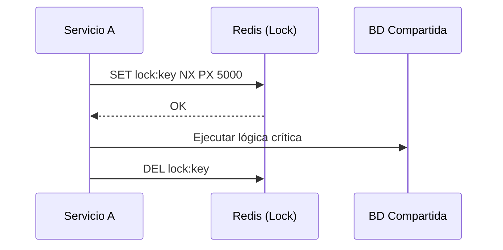

# Distributed Locks: Sincronización en Sistemas Distribuidos [Semi-Senior]

## 1. Contexto General & Definición del Concepto
En sistemas distribuidos, el acceso concurrente a recursos compartidos (como registros en BD o servicios externos) no puede gestionarse con `lock` o `SemaphoreSlim` locales, ya que solo afectan a una instancia. El **Distributed Lock** es un mecanismo que garantiza la exclusión mutua a través de múltiples nodos mediante un almacenamiento centralizado (como Redis).

## 2. Forma de Aplicación, Buenas Prácticas & Ventajas
- **Cuándo aplicar:** Operaciones críticas que no soportan ejecución simultánea (ej. generación de reportes financieros, procesamiento de pagos).
- **Anti-patrón:** Intentar resolver todo con locks. Prefiera [[Optimistic-vs-Pessimistic-Locking]] o diseño idempotente siempre que sea posible.

### Matriz de Trade-offs
| Ventaja | Desventaja |
| :--- | :--- |
| Integridad de datos garantizada | Aumento de latencia de red |
| Evita race conditions entre pods | Riesgo de interbloqueos (deadlocks) |
| Implementación sencilla con Redis | Necesidad de gestionar TTL para fallos |

## 3. Flujo Arquitectónico


## 4. Implementación en C# .NET 10
Utilizando `StackExchange.Redis` con un patrón de diseño limpio.

```csharp
public interface IDistributedLockService {
    Task<bool> AcquireLockAsync(string key, TimeSpan ttl);
    Task ReleaseLockAsync(string key);
}

public class RedisDistributedLock(IConnectionMultiplexer redis) : IDistributedLockService {
    private readonly IDatabase _db = redis.GetDatabase();
    public async Task<bool> AcquireLockAsync(string key, TimeSpan ttl) => 
        await _db.StringSetAsync(key, "locked", ttl, When.NotExists);

    public async Task ReleaseLockAsync(string key) => await _db.KeyDeleteAsync(key);
}
```

## 5. Implementación en React + Vite.js
En el frontend, el bloqueo distribuido se traduce en **Optimistic UI** con validaciones preventivas.

```tsx
const useDistributedAction = (resourceId: string) => {
  const [isProcessing, setIsProcessing] = useState(false);
  const execute = async () => {
    setIsProcessing(true);
    try {
      const response = await api.post(`/sync/${resourceId}`);
      if (response.status === 423) alert("Recurso bloqueado por otro usuario");
    } finally {
      setIsProcessing(false);
    }
  };
  return { isProcessing, execute };
};
```

## 6. Consideraciones
- **Deadlocks:** Siempre asigne un TTL (Time-To-Live) al lock.
- **Relojes:** La consistencia depende del sistema de lock (Redis) y no del reloj local del servidor.

## 7. Referencias
- [[CAP-y-Eventual-Consistency]]
- [[Optimistic-vs-Pessimistic-Locking]]
