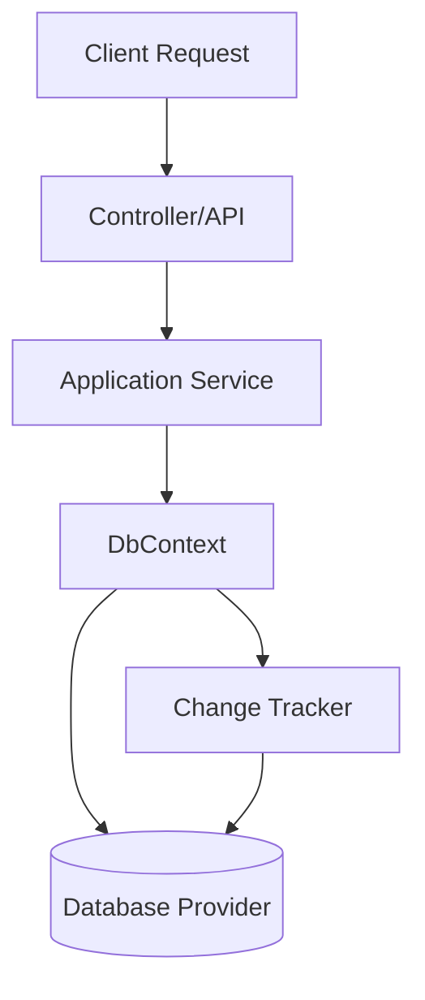

# Dominando EF Core DbContext [Semi-Senior]

## 1. Contexto General & Definición del Concepto
El `DbContext` es el corazón de Entity Framework Core. Actúa como una fachada entre las entidades del dominio y el motor de persistencia. En sistemas modernos, no es solo un puente, sino una unidad de trabajo (Unit of Work) que gestiona el seguimiento de cambios (Change Tracking), la configuración del modelo y la ejecución de transacciones.

## 2. Forma de Aplicación, Buenas Prácticas & Ventajas
- **Uso correcto:** Utilizar un ciclo de vida `Scoped` para alinear el contexto con la solicitud HTTP.
- **Antipatrón:** Evitar el uso de `DbContext` dentro de servicios singleton o como un contenedor global, lo cual provoca problemas de concurrencia.

| Ventajas | Desventajas / Costos |
| :--- | :--- |
| Abstracción de persistencia | Sobrecarga de memoria (Change Tracking) |
| Gestión automática de transacciones | Riesgo de acoplamiento fuerte al modelo de BD |
| Productividad en el desarrollo | Latencia en consultas masivas si no se optimiza |

## 3. Flujo Arquitectónico y Diagrama (Mermaid)


## 4. Implementación en C# .NET 10
```csharp
public class ApplicationDbContext : DbContext
{
    public ApplicationDbContext(DbContextOptions<ApplicationDbContext> options) : base(options) { }
    
    public DbSet<Product> Products => Set<Product>();

    protected override void OnModelCreating(ModelBuilder modelBuilder)
    {
        modelBuilder.ApplyConfigurationsFromAssembly(typeof(ApplicationDbContext).Assembly);
        base.OnModelCreating(modelBuilder);
    }
}

// Registro en Program.cs (.NET 10)
builder.Services.AddDbContext<ApplicationDbContext>(options => 
    options.UseSqlServer(builder.Configuration.GetConnectionString("Default")));
```

## 5. Implementación en React con Vite.js
El frontend debe consumir los datos mediante servicios tipados, tratando al backend como una API RESTful agnóstica a EF Core.
```tsx
import { useQuery } from '@tanstack/react-query';

interface Product { id: string; name: string; }

const useProducts = () => {
  return useQuery<Product[]>({ 
    queryKey: ['products'], 
    queryFn: () => fetch('/api/products').then(res => res.json()) 
  });
};

export const ProductList = () => {
  const { data, isLoading } = useProducts();
  if (isLoading) return <div>Cargando...</div>;
  return <ul>{data?.map(p => <li key={p.id}>{p.name}</li>)}</ul>;
};
```

## 6. Consideraciones de Concurrencia, Consistencia y Rendimiento
Para sistemas de alta carga, desactive el Change Tracking (`.AsNoTracking()`) en consultas de solo lectura para liberar memoria. Use `RowVersion` (concurrencia optimista) para evitar conflictos de sobrescritura en transacciones distribuidas.

## 7. Enlaces y Referencias en Obsidian
[[repository-unit-of-work-pattern]]
[[Clean-Architecture-DDD-en-DotNet10]]
