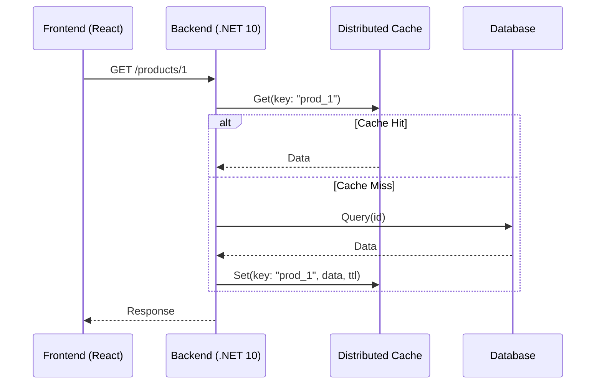

# Estrategias de Caché Distribuido [Semi-Senior]

## 1. Contexto General & Definición del Concepto
El caché distribuido es un componente de arquitectura que almacena datos en memoria fuera del proceso de la aplicación (generalmente en un cluster Redis o Memcached). A diferencia del caché local (In-Memory), permite que múltiples instancias de un servicio horizontalmente escalado compartan el mismo estado, eliminando la inconsistencia entre nodos y reduciendo la carga sobre la base de datos primaria.

## 2. Forma de Aplicación, Buenas Prácticas & Ventajas
### ¿Cuándo aplicar?
- Cuando el cómputo de una respuesta es costoso (agregaciones SQL complejas, llamadas a servicios externos).
- En sistemas de alta concurrencia de lectura.

### Matriz de Trade-offs
| Ventaja | Desventaja |
| :--- | :--- |
| Baja latencia | Complejidad de invalidación |
| Escalabilidad horizontal | Costo de infraestructura |
| Resiliencia ante caídas de BD | Riesgo de datos obsoletos |

## 3. Flujo Arquitectónico


## 4. Implementación en C# .NET 10
Utilizando `IDistributedCache` con el patrón Cache-Aside:

```csharp
public async Task<Product?> GetProductAsync(int id, CancellationToken ct)
{
    string cacheKey = $"product_{id}";
    var cachedData = await _cache.GetStringAsync(cacheKey, ct);
    
    if (cachedData is not null)
        return JsonSerializer.Deserialize<Product>(cachedData);

    var product = await _db.Products.FindAsync(id, ct);
    if (product is not null)
    {
        var options = new DistributedCacheEntryOptions { AbsoluteExpirationRelativeToNow = TimeSpan.FromMinutes(10) };
        await _cache.SetStringAsync(cacheKey, JsonSerializer.Serialize(product), options, ct);
    }
    return product;
}
```

## 5. Implementación en React + Vite
Implementación de un Custom Hook para manejar el estado con invalidación:

```tsx
export const useProduct = (id: number) => {
  const [data, setData] = useState(null);
  
  useEffect(() => {
    const fetchData = async () => {
      const response = await fetch(`/api/products/${id}`);
      const json = await response.json();
      setData(json);
    };
    fetchData();
  }, [id]);

  return { data };
};
```

## 6. Consideraciones de Concurrencia
Para mantener la consistencia entre cliente y servidor, se recomienda el uso de **ETags** en los headers HTTP. Esto permite al navegador validar si el recurso en caché sigue siendo válido mediante una respuesta `304 Not Modified`, ahorrando ancho de banda y evitando estados obsoletos tras una actualización en el lado del servidor.

## 7. Enlaces y Referencias
- [[Distributed-Caching-Redis-Cache-Aside]]
- [[CAP-y-Eventual-Consistency]]
