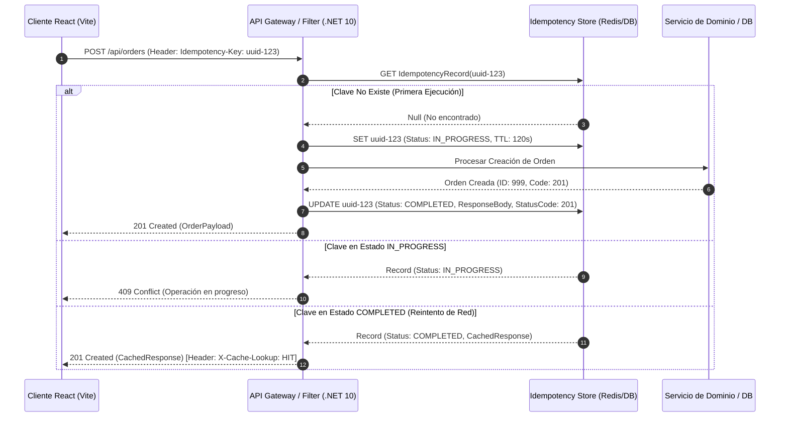

# Idempotencia en APIs y Consumidores de Eventos [Semi-Senior]

## 1. Contexto General & Definición del Concepto

En sistemas distribuidos y arquitecturas orientadas a servicios, la comunicación a través de redes no fiables introduce inevitablemente reintentos (retries), duplicación de paquetes de red y entregas duplicadas de mensajes. La **idempotencia** es la propiedad matemática y arquitectónica por la cual una operación produce exactamente el mismo resultado y estado en el sistema sin importar si se ejecuta una o múltiples veces consecutivas con los mismos parámetros.

```
f(f(x)) = f(x)
```

### Problemas Fundamentales que Resuelve
1. **Doble procesamiento y cobros duplicados:** Previene transacciones financieras duplicadas cuando el cliente experimenta un timeout de red tras haber enviado el comando.
2. **Garantía *At-Least-Once Delivery* en Eventos:** Los Message Brokers (Kafka, RabbitMQ, Azure Service Bus) garantizan por defecto la entrega de al menos una vez. La idempotencia asegura que los consumidores procesen el mensaje duplicado sin alterar el estado del dominio.
3. **Resiliencia ante fallos transitorios:** Permite que los clientes HTTP y workers reintenten de forma segura ante errores `503 Service Unavailable` o caídas temporales de red.

### Terminología Clave
- **Idempotency Key (Clave de Idempotencia):** Identificador único (habitualmente UUID v4) generado por el emisor que identifica una única intención de mutación.
- **Inbox Pattern (Patrón Bandeja de Entrada):** Mecanismo de persistencia en consumidores para registrar identificadores de eventos procesados antes de ejecutar la lógica de negocio.
- **Natural Idempotency vs. Synthetic Idempotency:** 
  - *Natural:* Operaciones intrínsecamente seguras (ej. `SET Status = 'Inactive'`, HTTP `PUT`, `DELETE`).
  - *Sintética:* Operaciones acumulativas que requieren infraestructura de control (ej. `ADD Balance = Balance + 100`, HTTP `POST`).

---

## 2. Forma de Aplicación, Buenas Prácticas & Ventajas

### Cuándo Aplicar
- Endpoints HTTP `POST` que crean recursos críticos (pagos, órdenes, transferencias, facturación).
- Consumidores de eventos asíncronos en arquitecturas dirigidas por eventos (EDA).
- Integraciones con pasarelas de pago y proveedores de terceros.

### Cuándo es un Antipatrón (Over-engineering)
- Endpoints de solo lectura (HTTP `GET`, `HEAD`) que por especificación HTTP ya son idempotentes y seguros.
- Operaciones de actualización total basadas en `PUT` donde el estado resultante es determinista y no genera efectos colaterales acumulativos.
- Entornos estrictamente locales o monolitos síncronos sin colas ni llamadas de red externas.

### Matriz de Trade-offs

| Dimensión | Enfoque con Idempotencia | Enfoque sin Idempotencia |
| :--- | :--- | :--- |
| **Consistencia de Datos** | **Alta:** Elimina inconsistencias y registros duplicados en condiciones de carrera. | **Baja:** Vulnerable a duplicaciones por reintentos de red y fallos de timeout. |
| **Complejidad de Código** | **Media:** Requiere filtros de validación, tablas de idempotencia/inbox y manejo de estados. | **Baja:** Implementación directa sin almacenamiento de claves ni control transaccional. |
| **Sobrecarga de Storage** | **Baja-Media:** Necesita almacenamiento en caché distribuida (Redis) o BD relacional con políticas de TTL. | **Nula:** Sin uso de almacenamiento auxiliar. |
| **Latencia de Respuesta** | **Incremento leve (~2-5ms):** Consulta inicial para verificar existencia de la clave antes de procesar. | **Óptima:** No realiza validaciones previas de clave. |

---

## 3. Flujo Arquitectónico y Diagrama (Mermaid)



---

## 4. Implementación y Ejemplos Prácticos en C# / .NET 10

Implementación de un endpoint idempotente mediante un **Endpoint Filter** en ASP.NET Core (.NET 10) utilizando Entity Framework Core 10 y transacciones atómicas.

### 1. Entidad de Dominio / Persistencia de Idempotencia

```csharp
namespace Shared.Infrastructure.Idempotency;

public sealed class IdempotentRequestRecord
{
    public Guid Id { get; set; } = Guid.NewGuid();
    public required string Key { get; set; }
    public required string Path { get; set; }
    public required string RequestHash { get; set; }
    public int StatusCode { get; set; }
    public string? ResponseBody { get; set; }
    public DateTime CreatedAtUtc { get; set; } = DateTime.UtcNow;
    public DateTime ExpiresAtUtc { get; set; }
}
```

### 2. Filtro de Idempotencia para Minimal APIs / Controllers

```csharp
namespace Shared.Infrastructure.Idempotency;

using System.Security.Cryptography;
using System.Text;
using System.Text.Json;
using Microsoft.AspNetCore.Http;
using Microsoft.EntityFrameworkCore;

public sealed class IdempotencyFilter<TContext>(TContext dbContext, ILogger<IdempotencyFilter<TContext>> logger) 
    : IEndpointFilter where TContext : DbContext
{
    private const string IdempotencyHeader = "Idempotency-Key";

    public async ValueTask<object?> InvokeAsync(EndpointFilterInvocationContext context, EndpointFilterDelegate next)
    {
        var httpContext = context.HttpContext;
        
        if (!httpContext.Request.Headers.TryGetValue(IdempotencyHeader, out var keyHeader) || 
            string.IsNullOrWhiteSpace(keyHeader))
        {
            // Si no se envía cabecera, la petición fluye de forma estándar
            return await next(context);
        }

        var idempotencyKey = keyHeader.ToString();
        var requestPath = httpContext.Request.Path.Value ?? "/";
        
        // 1. Validar si ya existe el registro procesado
        var existingRecord = await dbContext.Set<IdempotentRequestRecord>()
            .AsNoTracking()
            .FirstOrDefaultAsync(r => r.Key == idempotencyKey && r.Path == requestPath,
                httpContext.RequestAborted);

        if (existingRecord is not null)
        {
            logger.LogInformation("Clave de idempotencia duplicada detectada: {Key}. Retornando respuesta en caché.", idempotencyKey);
            httpContext.Response.Headers.Append("X-Idempotent-Replay", "true");
            
            return Results.Content(
                content: existingRecord.ResponseBody ?? string.Empty,
                contentType: "application/json",
                statusCode: existingRecord.StatusCode);
        }

        // 2. Ejecutar la operación real de la API
        var result = await next(context);

        // 3. Persistir la respuesta si el resultado es exitoso
        if (result is IStatusCodeHttpResult { StatusCode: >= 200 and < 300 } statusCodeResult)
        {
            var responsePayload = result is IValueHttpResult valueResult ? JsonSerializer.Serialize(valueResult.Value) : null;
            
            var record = new IdempotentRequestRecord
            {
                Key = idempotencyKey,
                Path = requestPath,
                RequestHash = string.Empty, // Opcional: Calcular SHA256 del Body para detectar mutaciones del payload
                StatusCode = statusCodeResult.StatusCode ?? StatusCodes.Status200OK,
                ResponseBody = responsePayload,
                ExpiresAtUtc = DateTime.UtcNow.AddHours(24)
            };

            dbContext.Set<IdempotentRequestRecord>().Add(record);
            await dbContext.SaveChangesAsync(httpContext.RequestAborted);
        }

        return result;
    }
}
```

### 3. Registro y Uso del Endpoint en .NET 10

```csharp
// Program.cs
var builder = WebApplication.CreateBuilder(args);

builder.Services.AddDbContext<AppDbContext>(options =>
    options.UseNpgsql(builder.Configuration.GetConnectionString("DefaultConnection")));

var app = builder.Build();

app.MapPost("/api/orders", async (CreateOrderRequest request, AppDbContext db) =>
{
    var order = new Order(Guid.NewGuid(), request.CustomerId, request.Amount, DateTime.UtcNow);
    db.Orders.Add(order);
    await db.SaveChangesAsync();
    
    return Results.Created($"/api/orders/{order.Id}", order);
})
.AddEndpointFilter<IdempotencyFilter<AppDbContext>>();

app.Run();

public record CreateOrderRequest(Guid CustomerId, decimal Amount);
public record Order(Guid Id, Guid CustomerId, decimal Amount, DateTime CreatedAtUtc);
```

---

## 5. Implementación y Ejemplos Prácticos en React con Vite.js

En el frontend, la idempotencia requiere que el cliente mantenga una misma `Idempotency-Key` a lo largo de todos los reintentos de una misma intención de usuario, y genere una nueva clave únicamente cuando el usuario cambie conscientemente los datos o inicie una nueva acción.

### Custom Hook: `useIdempotentMutation.ts`

```typescript
import { useState, useCallback, useRef } from 'react';

interface MutationOptions<TData, TVariables> {
  mutationFn: (variables: TVariables, idempotencyKey: string) => Promise<TData>;
  onSuccess?: (data: TData) => void;
  onError?: (error: Error) => void;
}

export function useIdempotentMutation<TData, TVariables>({
  mutationFn,
  onSuccess,
  onError,
}: MutationOptions<TData, TVariables>) {
  const [isLoading, setIsLoading] = useState<boolean>(false);
  const [error, setError] = useState<Error | null>(null);
  const [data, setData] = useState<TData | null>(null);
  
  // Se conserva la clave activa durante reintentos
  const activeKeyRef = useRef<string | null>(null);

  const execute = useCallback(
    async (variables: TVariables) => {
      setIsLoading(true);
      setError(null);

      // Generar clave única si no existe una para el intento actual
      if (!activeKeyRef.current) {
        activeKeyRef.current = crypto.randomUUID();
      }

      try {
        const result = await mutationFn(variables, activeKeyRef.current);
        setData(result);
        onSuccess?.(result);
        // Limpiar la clave tras el éxito para permitir la siguiente transacción
        activeKeyRef.current = null;
      } catch (err) {
        const normalizedError = err instanceof Error ? err : new Error(String(err));
        setError(normalizedError);
        onError?.(normalizedError);
        // NOTA: No limpiamos activeKeyRef.current aquí para que el botón 'Reintentar' use la misma clave
      } finally {
        setIsLoading(false);
      }
    },
    [mutationFn, onSuccess, onError]
  );

  const resetKey = useCallback(() => {
    activeKeyRef.current = null;
    setError(null);
  }, []);

  return {
    execute,
    resetKey,
    isLoading,
    error,
    data,
  };
}
```

### Componente Consumidor: `OrderCheckout.tsx`

```tsx
import React from 'react';
import { useIdempotentMutation } from '../hooks/useIdempotentMutation';

interface OrderPayload {
  customerId: string;
  amount: number;
}

interface OrderResponse {
  id: string;
  amount: number;
  createdAtUtc: string;
}

const createOrderApi = async (payload: OrderPayload, idempotencyKey: string): Promise<OrderResponse> => {
  const response = await fetch('/api/orders', {
    method: 'POST',
    headers: {
      'Content-Type': 'application/json',
      'Idempotency-Key': idempotencyKey,
    },
    body: JSON.stringify(payload),
  });

  if (!response.ok) {
    throw new Error(`Error en la transacción HTTP: ${response.status}`);
  }

  return response.json();
};

export const OrderCheckout: React.FC = () => {
  const { execute, resetKey, isLoading, error, data } = useIdempotentMutation<OrderResponse, OrderPayload>({
    mutationFn: createOrderApi,
    onSuccess: (order) => {
      console.log('Orden completada exitosamente:', order.id);
    },
  });

  const handlePayment = () => {
    execute({ customerId: 'cust_789', amount: 150.00 });
  };

  return (
    <div className="p-6 border rounded-lg shadow-sm bg-white max-w-md mx-auto">
      <h2 className="text-xl font-bold mb-4">Finalizar Compra</h2>
      <p className="text-gray-600 mb-4">Total a pagar: $150.00 USD</p>

      {error && (
        <div className="p-3 mb-4 bg-red-100 text-red-700 rounded text-sm">
          <p>Ocurrió un error: {error.message}</p>
          <button
            onClick={() => handlePayment()} 
            className="underline mt-2 block text-red-900 font-semibold"
          >
            Reintentar de forma segura
          </button>
        </div>
      )}

      {data && (
        <div className="p-3 mb-4 bg-green-100 text-green-700 rounded text-sm">
          Orden procesada correctamente. ID: {data.id}
        </div>
      )}

      <div className="flex gap-2">
        <button
          onClick={handlePayment}
          disabled={isLoading}
          className="px-4 py-2 bg-blue-600 text-white rounded hover:bg-blue-700 disabled:opacity-50"
        >
          {isLoading ? 'Procesando...' : 'Pagar Ahora'}
        </button>
        
        <button
          onClick={resetKey}
          disabled={isLoading}
          className="px-4 py-2 bg-gray-200 text-gray-800 rounded hover:bg-gray-300"
        >
          Nueva Orden
        </button>
      </div>
    </div>
  );
};
```

---

## 6. Consideraciones de Concurrencia, Consistencia y Rendimiento

1. **Condiciones de Carrera (Race Conditions) y Locks:**
   - Si dos peticiones con la misma `Idempotency-Key` llegan exactamente en el mismo milisegundo, existe el riesgo de que ambas ejecuten la validación y comiencen la creación a la vez.
   - **Solución:** Crear el registro en estado `IN_PROGRESS` con una restricción de clave única (`UNIQUE INDEX` en base de datos) o mediante un comando atómico `SET key value NX PX ttl` en Redis (véase [[Distributed-Caching-Redis-Cache-Aside]]).

2. **Consistencia Transaccional:**
   - En consumidores de eventos (Kafka/RabbitMQ), el guardado del `InboxMessage` y la actualización del estado de dominio deben ocurrir dentro de la misma transacción de base de datos (`UnitOfWork`). Si falla el procesamiento del evento, la transacción hace rollback completo y el mensaje puede volver a la cola.

3. **Políticas de Expiración (TTL) y Limpieza de Claves:**
   - Los registros de idempotencia no deben ser permanentes. Debe configurarse un TTL (ej. 24 a 72 horas) mediante índices parciales temporales o tareas en segundo plano (`BackgroundService` / cron jobs) para prevenir el crecimiento desmedido del storage.

---

## 7. Enlaces y Referencias en Obsidian

- [[Transactional-Outbox-Pattern]] - Patrón complementario para emisión garantizada de eventos y outbox deduplicado.
- [[CAP-y-Eventual-Consistency]] - Fundamentos de consistencia eventual y particionamiento de red.
- [[Optimistic-vs-Pessimistic-Locking]] - Mecanismos de control de concurrencia para evitar sobreescrituras en base de datos.
- [[Distributed-Caching-Redis-Cache-Aside]] - Estrategias de almacenamiento distribuido para validación atómica de claves.
