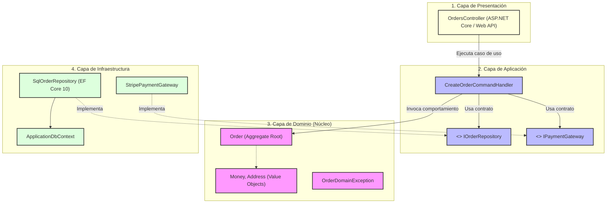

# Onion Architecture: Fundamentos, Estructura y Separación de Responsabilidades [Semi-Senior]

## 1. Contexto General & Definición del Concepto

La **Onion Architecture** (Arquitectura Cebolla), propuesta originalmente por Jeffrey Palermo en 2008, es un patrón de diseño arquitectónico centrado en el **Principio de Inversión de Dependencias (DIP)**. Su propósito medular es desacoplar el núcleo de negocio (Dominio) de los mecanismos de entrega (UI, APIs) y de las tecnologías de persistencia/infraestructura (bases de datos, frameworks, servicios externos).

En las arquitecturas tradicionales por capas (N-Tier), la capa de Negocio suele depender directamente de la capa de Acceso a Datos (`UI -> Business Logic -> Data Access`). Esto genera un alto acoplamiento hacia el motor de base de datos o el ORM. Onion Architecture invierte este flujo mediante anillos concéntricos:

- **El núcleo es invariante**: El modelo de dominio no conoce bases de datos, librerías HTTP ni frameworks externos.
- **Regla de Dependencia**: Todas las dependencias apuntan exclusivamente **hacia adentro**, hacia el centro de la cebolla.
- **Abstracción sobre Concreción**: Las capas externas implementan las interfaces declaradas y requeridas por las capas internas.

```
+-------------------------------------------------------------+
|                      Infraestructura                        |
|   +-----------------------------------------------------+   |
|   |                   Aplicación / Casos de Uso         |   |
|   |   +---------------------------------------------+   |   |
|   |   |               Servicios de Dominio          |   |   |
|   |   |   +-------------------------------------+   |   |   |
|   |   |   |         Modelos de Dominio          |   |   |   |
|   |   |   |             (Entities, VOs)         |   |   |   |
|   |   |   +-------------------------------------+   |   |   |
|   |   +---------------------------------------------+   |   |
|   +-----------------------------------------------------+   |
+-------------------------------------------------------------+
```

### Principios Fundamentales y Terminología
1. **Domain Model**: Entidades, Value Objects, Enums y lógica intrínseca del negocio puro.
2. **Domain Services**: Coordinadores de operaciones de dominio que involucran múltiples entidades.
3. **Application Services / Use Cases**: Orquestadores del flujo de la aplicación. Definen interfaces de repositorios y coordinan transacciones.
4. **Infrastructure & Presentation**: Adaptadores externos (Entity Framework Core, Repositorios concretos, Controladores REST, Clientes de mensajería, Frontends).

---

## 2. Forma de Aplicación, Buenas Prácticas & Ventajas

### Cuándo Aplicar
- Aplicaciones empresariales medianas o grandes con reglas de negocio cambiantes.
- Sistemas con alta expectativa de vida útil que requieren pruebas unitarias exhaustivas sin levantar infraestructura pesada (DBs, Web Servers).
- Proyectos donde se prevé cambiar o actualizar mecanismos de persistencia o APIs externas.

### Cuándo es un Antipatrón (Over-engineering)
- **Sistemas CRUD puros**: Si la aplicación únicamente lee y escribe datos sin reglas de negocio complejas, aplicar 4 capas genera código repetitivo (mappers, interfaces innecesarias, DTOs idénticos a las tablas).
- **Prototipos rápidos o MVPs de ciclo corto**: La sobrecarga inicial de estructurar proyectos y contratos retrasa el time-to-market.

### Matriz de Trade-offs

| Criterio | Ventajas | Desventajas / Costos |
| :--- | :--- | :--- | |
| **Testabilidad** | Las pruebas unitarias del Dominio y Aplicación no requieren mocks complejos de DB ni contenedores. | Mayor cantidad de archivos de test y mocks para interfaces en capa de aplicación. |
| **Mantenibilidad** | Los cambios en la DB o frameworks externos no rompen la lógica central. | Curva de aprendizaje inicial para desarrolladores acostumbrados a N-Tier tradicional. |
| **Evolución Tecnológica** | Migrar de EF Core a Dapper o cambiar de SQL Server a PostgreSQL se aísla en Infraestructura. | Sobrecarga de mapeo entre entidades de dominio, DTOs y modelos de persistencia. |
| **Acoplamiento** | Dependencia dirigida únicamente al centro; inversión estricta de control. | Mayor número de ensamblados/proyectos en la solución y tiempo de compilación. |

---

## 3. Flujo Arquitectónico y Diagrama (Mermaid)

El siguiente diagrama ilustra cómo fluyen las llamadas en tiempo de ejecución frente a la dirección estricta de las dependencias de código (tiempo de compilación):



---

## 4. Implementación y Ejemplos Prácticos en C# / .NET 10 (Backend & Domain)

Estructura típica de la solución:
```text
src/
  ├── Core/
  │    ├── Domain/         (Entidades, Enums, Excepciones de Dominio)
  │    └── Application/    (Interfaces, DTOs, Casos de Uso/Handlers)
  └── External/
       ├── Infrastructure/ (EF Core DbContext, Implementación de Repositorios)
       └── WebApi/         (Controllers, Middlewares, Program.cs)
```

### 4.1. Capa de Dominio (`Core/Domain`)

```csharp
namespace Store.Domain.Orders;

public sealed class OrderId
{
    public Guid Value { get; }
    public OrderId(Guid value)
    {
        if (value == Guid.Empty)
            throw new ArgumentException("OrderId cannot be empty.", nameof(value));
        Value = value;
    }
    public static OrderId New() => new(Guid.NewGuid());
}

public enum OrderStatus
{
    Draft = 1,
    Confirmed = 2,
    Cancelled = 3
}

public class Order
{
    public OrderId Id { get; private set; } = null!;
    public string CustomerEmail { get; private set; } = null!;
    public decimal TotalAmount { get; private set; }
    public OrderStatus Status { get; private set; }
    public DateTime CreatedAtUtc { get; private set; }

    // Constructor privado para EF Core / Mapeadores
    private Order() { }

    public Order(OrderId id, string customerEmail, decimal totalAmount)
    {
        if (string.IsNullOrWhiteSpace(customerEmail) || !customerEmail.Contains('@'))
            throw new ArgumentException("A valid email is required.", nameof(customerEmail));
            
        if (totalAmount <= 0)
            throw new ArgumentException("Total amount must be greater than zero.", nameof(totalAmount));

        Id = id;
        CustomerEmail = customerEmail;
        TotalAmount = totalAmount;
        Status = OrderStatus.Draft;
        CreatedAtUtc = DateTime.UtcNow;
    }

    public void Confirm()
    {
        if (Status != OrderStatus.Draft)
            throw new InvalidOperationException($"Cannot confirm order in status {Status}.");

        Status = OrderStatus.Confirmed;
    }
}
```

### 4.2. Capa de Aplicación (`Core/Application`)

```csharp
namespace Store.Application.Orders;

using Store.Domain.Orders;

// Contrato de persistencia requerido por la aplicación
public interface IOrderRepository
{
    Task<Order?> GetByIdAsync(OrderId id, CancellationToken cancellationToken = default);
    Task AddAsync(Order order, CancellationToken cancellationToken = default);
    Task UpdateAsync(Order order, CancellationToken cancellationToken = default);
}

// DTOs para comunicación externa
public record CreateOrderRequest(string CustomerEmail, decimal TotalAmount);
public record OrderResponse(Guid Id, string CustomerEmail, decimal TotalAmount, string Status, DateTime CreatedAtUtc);

// Caso de Uso: Servicio de Aplicación
public interface IOrderService
{
    Task<OrderResponse> CreateOrderAsync(CreateOrderRequest request, CancellationToken ct = default);
    Task ConfirmOrderAsync(Guid orderId, CancellationToken ct = default);
}

public class OrderService(IOrderRepository orderRepository) : IOrderService
{
    public async Task<OrderResponse> CreateOrderAsync(CreateOrderRequest request, CancellationToken ct = default)
    {
        var order = new Order(OrderId.New(), request.CustomerEmail, request.TotalAmount);
        await orderRepository.AddAsync(order, ct);
        
        return new OrderResponse(
            order.Id.Value,
            order.CustomerEmail,
            order.TotalAmount,
            order.Status.ToString(),
            order.CreatedAtUtc
        );
    }

    public async Task ConfirmOrderAsync(Guid orderId, CancellationToken ct = default)
    {
        var id = new OrderId(orderId);
        var order = await orderRepository.GetByIdAsync(id, ct)
            ?? throw new KeyNotFoundException($"Order with ID {orderId} was not found.");

        order.Confirm();
        await orderRepository.UpdateAsync(order, ct);
    }
}
```

### 4.3. Capa de Infraestructura (`External/Infrastructure`)

```csharp
namespace Store.Infrastructure.Persistence;

using Microsoft.EntityFrameworkCore;
using Store.Application.Orders;
using Store.Domain.Orders;

public class AppDbContext(DbContextOptions<AppDbContext> options) : DbContext(options)
{
    public DbSet<Order> Orders => Set<Order>();

    protected override void OnModelCreating(ModelBuilder modelBuilder)
    {
        modelBuilder.Entity<Order>(builder =>
        {
            builder.HasKey(o => o.Id);
            builder.Property(o => o.Id)
                .HasConversion(id => id.Value, val => new OrderId(val))
                .IsRequired();

            builder.Property(o => o.CustomerEmail).HasMaxLength(255).IsRequired();
            builder.Property(o => o.TotalAmount).HasPrecision(18, 2);
            builder.Property(o => o.Status).HasConversion<string>().HasMaxLength(50);
        });
    }
}

public class SqlOrderRepository(AppDbContext context) : IOrderRepository
{
    public async Task<Order?> GetByIdAsync(OrderId id, CancellationToken cancellationToken = default)
    {
        return await context.Orders.FirstOrDefaultAsync(o => o.Id == id, cancellationToken);
    }

    public async Task AddAsync(Order order, CancellationToken cancellationToken = default)
    {
        await context.Orders.AddAsync(order, cancellationToken);
        await context.SaveChangesAsync(cancellationToken);
    }

    public async Task UpdateAsync(Order order, CancellationToken cancellationToken = default)
    {
        context.Orders.Update(order);
        await context.SaveChangesAsync(cancellationToken);
    }
}
```

---

## 5. Implementación y Ejemplos Prácticos en React con Vite.js (Frontend Architecture)

En el frontend, la filosofía de capas desacopladas se refleja aislando las llamadas HTTP en clientes de API dedicados y encapsulando el estado y la lógica de mutación en Custom Hooks reutilizables.

### 5.1. Definición de Tipos y Servicio API (`src/services/orderService.ts`)

```typescript
export interface OrderResponse {
  id: string;
  customerEmail: string;
  totalAmount: number;
  status: 'Draft' | 'Confirmed' | 'Cancelled';
  createdAtUtc: string;
}

export interface CreateOrderPayload {
  customerEmail: string;
  totalAmount: number;
}

const API_BASE = '/api/orders';

export const orderService = {
  async createOrder(payload: CreateOrderPayload, signal?: AbortSignal): Promise<OrderResponse> {
    const res = await fetch(API_BASE, {
      method: 'POST',
      headers: { 'Content-Type': 'application/json' },
      body: JSON.stringify(payload),
      signal
    });

    if (!res.ok) {
      const errorData = await res.json().catch(() => ({ message: 'Error al procesar orden' }));
      throw new Error(errorData.message || `HTTP ${res.status}`);
    }
    return res.json();
  },

  async confirmOrder(orderId: string, signal?: AbortSignal): Promise<void> {
    const res = await fetch(`${API_BASE}/${orderId}/confirm`, {
      method: 'PUT',
      signal
    });

    if (!res.ok) {
      throw new Error(`Error al confirmar orden: HTTP ${res.status}`);
    }
  }
};
```

### 5.2. Custom Hook para Consumo Resiliente (`src/hooks/useOrders.ts`)

```typescript
import { useState, useCallback } from 'react';
import { orderService, type OrderResponse, type CreateOrderPayload } from '../services/orderService';

export function useOrders() {
  const [orders, setOrders] = useState<OrderResponse[]>([]);
  const [loading, setLoading] = useState(false);
  const [error, setError] = useState<string | null>(null);

  const createOrder = useCallback(async (payload: CreateOrderPayload) => {
    setLoading(true);
    setError(null);
    const controller = new AbortController();
    try {
      const created = await orderService.createOrder(payload, controller.signal);
      setOrders((prev) => [created, ...prev]);
      return created;
    } catch (err: unknown) {
      const msg = err instanceof Error ? err.message : 'Error desconocido';
      setError(msg);
      throw err;
    } finally {
      setLoading(false);
    }
  }, []);

  const confirmOrder = useCallback(async (orderId: string) => {
    setLoading(true);
    setError(null);
    try {
      await orderService.confirmOrder(orderId);
      // Actualización de estado local inmutable
      setOrders((prev) =>
        prev.map((ord) => (ord.id === orderId ? { ...ord, status: 'Confirmed' } : ord))
      );
    } catch (err: unknown) {
      const msg = err instanceof Error ? err.message : 'Error al confirmar';
      setError(msg);
      throw err;
    } finally {
      setLoading(false);
    }
  }, []);

  return { orders, loading, error, createOrder, confirmOrder };
}
```

### 5.3. Componente Vista (`src/components/OrderManager.tsx`)

```tsx
import React, { useState } from 'react';
import { useOrders } from '../hooks/useOrders';

export const OrderManager: React.FC = () => {
  const { orders, loading, error, createOrder, confirmOrder } = useOrders();
  const [email, setEmail] = useState('');
  const [amount, setAmount] = useState<number>(0);

  const handleSubmit = async (e: React.FormEvent) => {
    e.preventDefault();
    if (!email || amount <= 0) return;
    try {
      await createOrder({ customerEmail: email, totalAmount: amount });
      setEmail('');
      setAmount(0);
    } catch {
      // Error manejado en el hook
    }
  };

  return (
    <div style={{ maxWidth: '600px', margin: '2rem auto', fontFamily: 'sans-serif' }}>
      <h2>Gestor de Órdenes (Onion Client)</h2>
      
      {error && <div style={{ color: 'red', marginBottom: '1rem' }}>⚠️ {error}</div>}

      <form onSubmit={handleSubmit} style={{ display: 'flex', gap: '0.5rem', marginBottom: '1.5rem' }}>
        <input
          type="email"
          placeholder="Email del cliente"
          value={email}
          onChange={(e) => setEmail(e.target.value)}
          required
        />
        <input
          type="number"
          placeholder="Monto"
          value={amount || ''}
          onChange={(e) => setAmount(parseFloat(e.target.value))}
          min="0.01"
          step="0.01"
          required
        />
        <button type="submit" disabled={loading}>
          {loading ? 'Procesando...' : 'Crear Orden'}
        </button>
      </form>

      <ul style={{ listStyle: 'none', padding: 0 }}>
        {orders.map((ord) => (
          <li
            key={ord.id}
            style={{
              border: '1px solid #ccc',
              borderRadius: '6px',
              padding: '0.75rem',
              marginBottom: '0.5rem',
              display: 'flex',
              justifyContent: 'space-between',
              alignItems: 'center'
            }}
          >
            <div>
              <strong>{ord.customerEmail}</strong> - ${ord.totalAmount.toFixed(2)}
              <br />
              <small>Estado: <em>{ord.status}</em></small>
            </div>
            {ord.status === 'Draft' && (
              <button onClick={() => confirmOrder(ord.id)} disabled={loading}>
                Confirmar
              </button>
            )}
          </li>
        ))}
      </ul>
    </div>
  );
};
```

---

## 6. Consideraciones de Concurrencia, Consistencia y Rendimiento

1. **Alineación de Concurrencia con el Dominio**: Cuando dos clientes intentan modificar el estado de la misma entidad en paralelo (ej. confirmar la misma orden simultáneamente), el Dominio debe validar la transición de estado, y la Infraestructura debe respaldarlo con [[Optimistic-vs-Pessimistic-Locking]]. En EF Core, esto se gestiona mediante un token de concurrencia (`RowVersion` o `xmin`).
2. **Consistencia de Transacciones**: La capa de Aplicación delimita el ámbito transaccional (Unit of Work). Si una operación requiere coordinar cambios en varios agregados o disparar eventos, se debe recurrir al [[Transactional-Outbox-Pattern]] en la capa de infraestructura para no romper la atomicidad.
3. **Caché y Proyecciones**: Para evitar sobrecargar el modelo de dominio en lecturas de alto volumen, se puede desacoplar el modelo de consulta mediante [[CQRS-y-Event-Sourcing]] o aplicar estrategias como [[Distributed-Caching-Redis-Cache-Aside]] a nivel de infraestructura.

---

## 7. Enlaces y Referencias en Obsidian

- [[Clean-Architecture-DDD-en-DotNet10]] - Profundización en Domain-Driven Design y arquitectura limpia.
- [[clean-architecture-fundamentos]] - Principios de diseño desacoplado e inversión de dependencias.
- [[CQRS-Patron-Implementacion-Practica]] - Separación de caminos de lectura y escritura.
- [[Optimistic-vs-Pessimistic-Locking]] - Manejo de colisiones en capas de infraestructura y persistencia.
