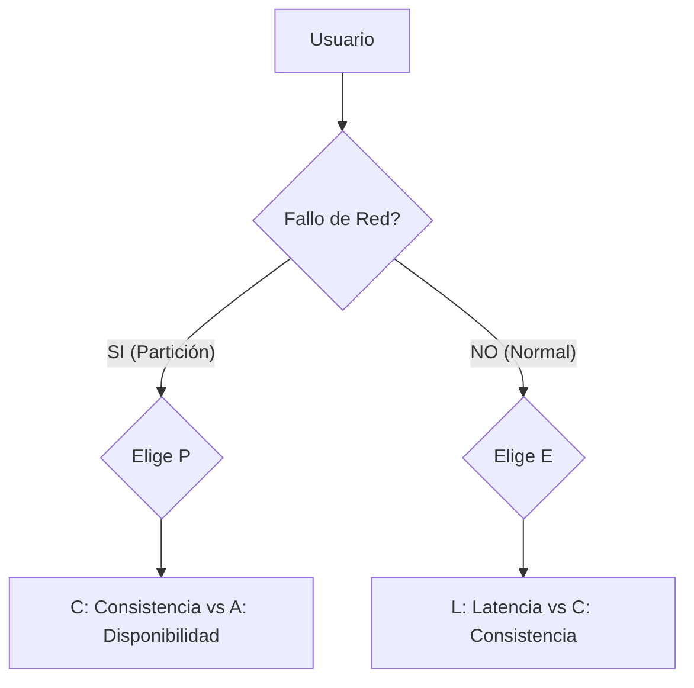

# Teorema CAP y PACELC [Semi-Senior]

## 1. Contexto General & Definición del Concepto
El **Teorema CAP** establece que en cualquier sistema de almacenamiento de datos distribuido, es imposible garantizar simultáneamente más de dos de tres propiedades: Consistencia, Disponibilidad y Tolerancia a particiones. Como los fallos de red son inevitables, debemos elegir entre C o A cuando ocurre una partición (P).

**PACELC** extiende esto: **P**articionado (si ocurre) -> elegir **A** o **C**. **E**lse (si el sistema funciona normalmente) -> elegir entre **L**atencia o **C**onsistencia. Esto es crítico para diseñar sistemas modernos de alta escala.

## 2. Forma de Aplicación, Buenas Prácticas & Ventajas
Aplicar CAP/PACELC evita el diseño ingenuo de sistemas distribuidos. 

| Criterio | Ventaja | Desventaja / Costo |
| :--- | :--- | :--- |
| **Consistencia (CP)** | Datos exactos siempre | Mayor latencia, disponibilidad reducida |
| **Disponibilidad (AP)** | Alta resiliencia y velocidad | Consistencia eventual (posibles datos stale) |
| **Latencia (ELC)** | Respuesta rápida al usuario | Riesgo de desfase temporal |

## 3. Flujo Arquitectónico y Diagrama


## 4. Implementación en C# .NET 10
Para manejar consistencia eventual (AP), utilizamos patrones de mensajería asíncrona mediante un servicio de background.

```csharp
public record ProductUpdatedEvent(Guid Id, decimal NewPrice, DateTime Timestamp);

public class EventPublisherService(IPublishEndpoint bus) : IEventPublisher
{
    public async Task PublishUpdateAsync(Product product)
    {
        // Implementación de Eventual Consistency para alta disponibilidad
        var message = new ProductUpdatedEvent(product.Id, product.Price, DateTime.UtcNow);
        await bus.Publish(message);
    }
}
```

## 5. Implementación en React con Vite.js
El frontend debe ser resiliente ante la falta de consistencia inmediata, usando estrategias de **Optimistic UI**.

```tsx
import { useState } from 'react';

export const useUpdatePrice = () => {
  const [isSyncing, setIsSyncing] = useState(false);
  
  const updatePrice = async (id: string, price: number) => {
    setIsSyncing(true);
    // Optimistic Update: asumir éxito mientras el backend resuelve la consistencia
    try {
      await api.patch(`/products/${id}`, { price });
    } catch (err) {
      console.error("Fallback si falla la red", err);
    } finally {
      setIsSyncing(false);
    }
  };
  return { updatePrice, isSyncing };
};
```

## 6. Consideraciones de Concurrencia
- **Consistencia:** En sistemas .NET, considere el uso de `Optimistic Locking` con `RowVersion` en EF Core.
- **Latencia:** En el frontend, priorice el estado local para mejorar la percepción del usuario, pero maneje los errores de sincronización con `ErrorBoundaries`.

## 7. Enlaces y Referencias
- [[CAP-y-Eventual-Consistency]]
- [[Distributed-Caching-Redis-Cache-Aside]]
