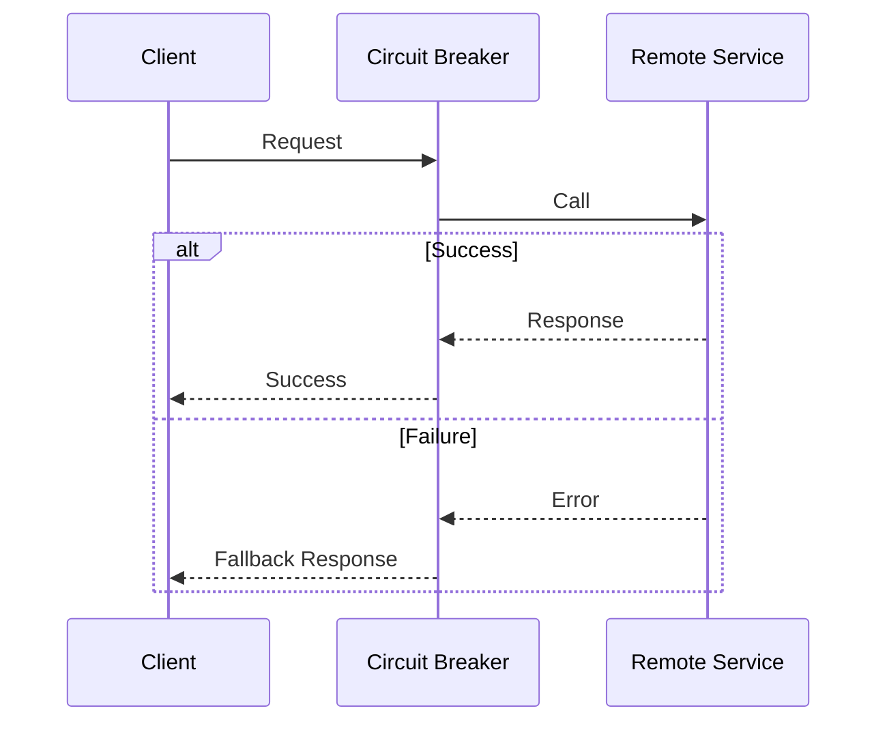

# Patrones de Resiliencia: Circuit Breaker, Retry y Fallback [Semi-Senior]

## 1. Contexto General & Definición del Concepto
En sistemas distribuidos, la falla es inevitable. El objetivo no es evitar fallos, sino gestionarlos. Estos tres patrones forman la tríada de resiliencia:
- **Retry**: Reintenta una operación que falló temporalmente (ej. latencia de red).
- **Circuit Breaker**: Evita que un sistema colapse deteniendo llamadas a un servicio que está fallando constantemente, permitiendo su recuperación.
- **Fallback**: Define una respuesta alternativa cuando una llamada principal falla definitivamente.

## 2. Forma de Aplicación, Buenas Prácticas & Ventajas
- **Cuándo aplicar**: En comunicación inter-servicio (gRPC, REST) o acceso a bases de datos.
- **Antipatrón**: Aplicar Retries infinitos sin *exponential backoff* (puede causar un *retry storm*).

| Ventaja | Desventaja | Costo Operativo |
| :--- | :--- | :--- |
| Aislamiento de fallos | Aumenta la latencia percibida | Medio (Configuración) |
| Recuperación automática | Complejidad en debug | Bajo (Polly / Libraries) |

## 3. Flujo Arquitectónico y Diagrama


## 4. Implementación en C# .NET 10
Usamos `Polly`, el estándar de industria para resiliencia.
```csharp
public class ResilienceService {
    private readonly ResiliencePipeline _pipeline;
    public ResilienceService() {
        _pipeline = new ResiliencePipelineBuilder()
            .AddRetry(new RetryStrategyOptions { MaxRetryAttempts = 3 })
            .AddCircuitBreaker(new CircuitBreakerStrategyOptions { 
                FailureRatio = 0.5, 
                SamplingDuration = TimeSpan.FromSeconds(30) 
            })
            .Build();
    }
    public async Task<string> GetDataAsync() => 
        await _pipeline.ExecuteAsync(async ct => await _httpClient.GetAsync("/api/data", ct));
}
```

## 5. Implementación en React con Vite.js
Utilizamos un custom hook para manejar el estado de resiliencia en el frontend.
```typescript
export const useResilientFetch = <T>(url: string) => {
  const [data, setData] = useState<T | null>(null);
  const [error, setError] = useState(false);
  
  const execute = async (retries = 3) => {
    try {
      const response = await fetch(url);
      if (!response.ok) throw new Error("API Failure");
      setData(await response.json());
    } catch (e) {
      if (retries > 0) setTimeout(() => execute(retries - 1), 1000);
      else setError(true);
    }
  };
  return { data, error, execute };
};
```

## 6. Consideraciones de Concurrencia y Consistencia
La comunicación entre el cliente y el servidor debe ser **idempotente**. Si una operación de escritura falla y se reintenta, el backend debe garantizar que el estado no se corrompa ([[Idempotencia-en-APIs-y-Consumidores-de-Eventos]]). Usar estados optimistas en React permite mejorar la UX mientras los patrones de resiliencia aseguran la integridad.

## 7. Enlaces y Referencias
- [[Clean-Architecture-DDD-en-DotNet10]]
- [[Idempotencia-en-APIs-y-Consumidores-de-Eventos]]
