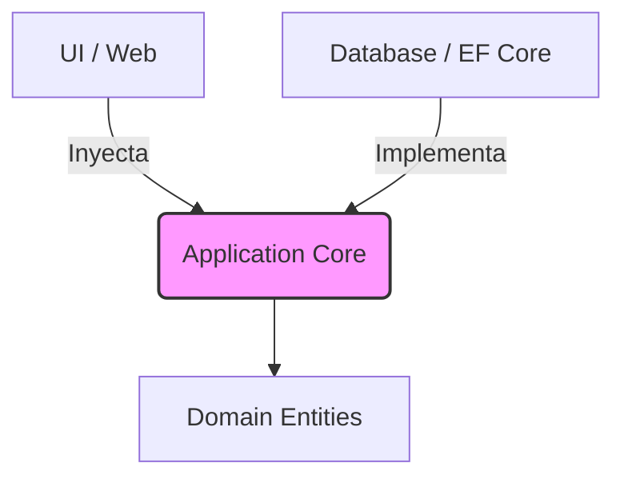

# Clean Architecture: Fundamentos y Aplicación [Semi-Senior]

## 1. Contexto General & Definición del Concepto
Clean Architecture, popularizada por Robert C. Martin, es una filosofía de diseño que organiza el sistema en capas concéntricas, asegurando que la **regla de dependencia** se cumpla: las dependencias siempre apuntan hacia adentro, hacia las entidades de negocio. Esto desacopla el software de frameworks, bases de datos y herramientas externas.

## 2. Forma de Aplicación, Buenas Prácticas & Ventajas

### Matriz de Trade-offs
| Ventajas | Desventajas | Costos |
| :--- | :--- | :--- |
| Independencia de frameworks | Sobrecarga de abstracción | Mayor complejidad inicial |
| Facilidad de testing | Curva de aprendizaje alta | Mantenimiento de mappings |
| Alta mantenibilidad | Propenso a sobre-ingeniería | Boilerplate elevado |

## 3. Flujo Arquitectónico


## 4. Implementación en C# .NET 10
Utilizando C# 10+, empleamos records para inmutabilidad y Primary Constructors.

```csharp
// Domain/User.cs
public record User(Guid Id, string Email);

// Application/Interfaces/IUserRepository.cs
public interface IUserRepository {
    Task<User?> GetByIdAsync(Guid id, CancellationToken ct);
}

// Application/UseCases/GetUserHandler.cs
public class GetUserHandler(IUserRepository repo) {
    public async Task<User?> Handle(Guid id, CancellationToken ct) => 
        await repo.GetByIdAsync(id, ct);
}
```

## 5. Implementación en React con Vite.js
En el frontend, el patrón se traduce manteniendo la lógica de estado separada de los componentes visuales mediante Custom Hooks.

```typescript
// hooks/useUser.ts
import { useQuery } from '@tanstack/react-query';

export const useUser = (id: string) => {
  return useQuery({
    queryKey: ['user', id],
    queryFn: async () => {
      const res = await fetch(`/api/users/${id}`);
      if (!res.ok) throw new Error('Network error');
      return res.json();
    }
  });
};
```

## 6. Consideraciones de Concurrencia y Consistencia
Para evitar *race conditions* en arquitecturas distribuidas, el servidor .NET debe implementar **Optimistic Concurrency** (usando RowVersion o ETag en EF Core). En el cliente, React debe manejar estados de carga y error mediante `ErrorBoundaries` para garantizar una UX robusta ante fallos de consistencia eventual.

## 7. Enlaces y Referencias en Obsidian
[[CQRS-y-Event-Sourcing]]
[[Clean-Architecture-DDD-en-DotNet10]]
