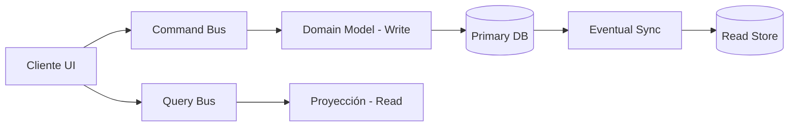

# CQRS: Command Query Responsibility Segregation [Semi-Senior]

## 1. Contexto General & Definición del Concepto
CQRS es un patrón de arquitectura que propone separar las operaciones de lectura (Query) de las operaciones de modificación (Command). En sistemas tradicionales, un mismo objeto suele manejar ambos, lo que genera acoplamiento y cuellos de botella en el modelo de datos. CQRS resuelve la complejidad de los modelos de dominio ricos cuando las necesidades de lectura difieren drásticamente de las de escritura.

## 2. Forma de Aplicación, Buenas Prácticas & Ventajas
### Cuándo aplicar
- Cuando el dominio tiene alta complejidad de reglas de negocio.
- Cuando las cargas de lectura y escritura son asimétricas (ej: mucho más lectura que escritura).
- Cuando se necesita escalar los modelos de lectura independientemente mediante caché o réplicas.

### Matriz de Trade-offs
| Ventaja | Desventaja |
| :--- | :--- |
| Escalabilidad independiente | Aumento de complejidad operativa |
| Optimización de lecturas | Consistencia eventual (dificultad técnica) |
| Claridad en el modelo de dominio | Código redundante inicial | 

## 3. Flujo Arquitectónico


## 4. Implementación en C# / .NET 10
```csharp
// Comando usando Records de C# 10+
public record CreateProductCommand(string Name, decimal Price);

// Handler del Comando
public class CreateProductHandler(AppDbContext db) : IRequestHandler<CreateProductCommand>
{
    public async Task Handle(CreateProductCommand command, CancellationToken ct) {
        var product = new Product { Name = command.Name, Price = command.Price };
        db.Products.Add(product);
        await db.SaveChangesAsync(ct);
    }
}

// Query sencilla para lectura optimizada
public record GetProductQuery(Guid Id);
public class ProductReadModel { public string Name { get; init; } public decimal Price { get; init; } }
```

## 5. Implementación en React con Vite.js
```typescript
// Hook personalizado para separar consultas
export const useProductQuery = (id: string) => {
  return useQuery({
    queryKey: ['product', id],
    queryFn: async () => {
      const res = await fetch(`/api/products/${id}`);
      return res.json();
    }
  });
};

// Acción de mutación (Command)
export const useCreateProduct = () => {
  const queryClient = useQueryClient();
  return useMutation({
    mutationFn: (data: ProductDto) => fetch('/api/commands/products', { method: 'POST', body: JSON.stringify(data) }),
    onSuccess: () => queryClient.invalidateQueries({ queryKey: ['products'] })
  });
};
```

## 6. Consideraciones de Concurrencia y Consistencia
La principal trampa para el nivel Semi-Senior es ignorar la *Consistencia Eventual*. En CQRS, tras ejecutar un comando, la lectura podría no reflejar el cambio inmediatamente. Se recomienda el uso de **Actualizaciones Optimistas** en el Frontend (React Query `onMutate`) para mejorar la percepción de velocidad mientras el backend procesa el comando de forma asíncrona.

## 7. Enlaces y Referencias
- [[CQRS-y-Event-Sourcing]]
- [[CAP-y-Eventual-Consistency]]
