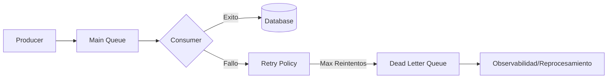

# Dead Letter Queue (DLQ) & Poison Message Handling [Semi-Senior]

## 1. Contexto General & Definición del Concepto
Una **Dead Letter Queue (DLQ)** es una cola secundaria donde se envían mensajes que no pudieron ser procesados correctamente por un consumidor después de un número determinado de reintentos. Un **Poison Message** es aquel mensaje que, por razones de estructura, lógica o datos corrompidos, causará un error constante (bucle de fallo) si se reintenta indefinidamente.

Este patrón resuelve el problema de la "falla en cascada" y el bloqueo de colas, asegurando que el sistema sea capaz de aislar fallos sin detener el procesamiento de mensajes válidos.

## 2. Forma de Aplicación, Buenas Prácticas & Ventajas
- **Cuándo aplicar:** Indispensable en cualquier arquitectura basada en eventos (RabbitMQ, Azure Service Bus, AWS SQS).
- **Antipatrón:** No implementar una estrategia de observabilidad sobre la DLQ. La DLQ no debe ser un "cementerio de elefantes"; requiere monitoreo y alertas.

| Ventaja | Desventaja / Costo |
| :--- | :--- |
| Aislamiento de fallos | Mayor complejidad operativa |
| Resiliencia del sistema | Necesidad de logs y métricas adicionales |
| Continuidad operativa | Requiere lógica de reprocesamiento |

## 3. Flujo Arquitectónico y Diagrama


## 4. Implementación en C# .NET 10
Utilizando un enfoque de middleware o políticas de reintento con Polly.

```csharp
public async Task ProcessMessageAsync(Message message, CancellationToken ct) {
    var policy = Policy.Handle<Exception>().RetryAsync(3);
    
    try {
        await policy.ExecuteAsync(async () => {
            await _domainService.Process(message);
        });
    } catch (Exception ex) {
        _logger.LogError(ex, "Mensaje {Id} movido a DLQ", message.Id);
        await _deadLetterProducer.SendToDlqAsync(message, ex.Message);
    }
}
```

## 5. Implementación en React con Vite.js
En frontend, el manejo de "mensajes envenenados" se traduce a manejar fallos en peticiones asíncronas con estados de error persistentes.

```tsx
const useSafeMutation = (data: RequestPayload) => {
  const [error, setError] = useState<string | null>(null);
  const execute = async () => {
    try {
      await apiClient.post('/orders', data);
    } catch (err) {
      // Si el error es 422, asumimos 'poison data' y no reintentamos
      setError('Error de validación persistente: Contactar soporte.');
    }
  };
  return { execute, error };
};
```

## 6. Consideraciones de Concurrencia
- **Consistencia:** Usar [[idempotent-consumer-sql-deduplication]] para evitar duplicados si un mensaje se mueve a DLQ pero parcialmente se procesó.
- **Latencia:** El procesamiento de la DLQ debe ser un proceso asíncrono fuera del camino crítico (critical path) para no penalizar el rendimiento del usuario final.

## 7. Enlaces y Referencias
- [[CQRS-y-Event-Sourcing]]
- [[Transactional-Outbox-Pattern]]
