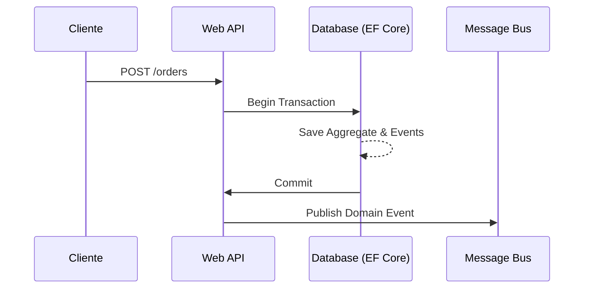

# Domain Events & Dispatching en Transacción [Semi-Senior]

## 1. Contexto General & Definición del Concepto
El patrón de Domain Events permite desacoplar los efectos secundarios de una lógica de negocio. En lugar de ejecutar procesos externos dentro de un caso de uso (como enviar un email), se emite un evento que el sistema gestiona. El reto es el **Dispatching en Transacción**: garantizar que si el estado de la base de datos se guarda, el evento se dispare; si la transacción falla, no debe haber evento.

## 2. Forma de Aplicación, Buenas Prácticas & Ventajas
- **Cuándo aplicar:** Cuando un cambio de estado en el dominio dispara múltiples procesos (ej. Registro -> Enviar Bienvenida, Crear Wallet).
- **Antipatrón:** No uses eventos para flujos sincrónicos que requieran consistencia fuerte inmediata.

| Ventaja | Desventaja |
| :--- | :--- |
| Bajo acoplamiento | Complejidad en debug |
| Escalabilidad asíncrona | Consistencia eventual |
| Mejora legibilidad | Overhead de infraestructura |

## 3. Flujo Arquitectónico y Diagrama


## 4. Implementación en .NET 10
```csharp
public record OrderCreatedEvent(Guid OrderId, decimal Amount) : IDomainEvent;

public class OrderService {
    private readonly DbContext _db;
    private readonly IPublisher _publisher;

    public async Task CreateOrder(Order order) {
        using var transaction = await _db.Database.BeginTransactionAsync();
        _db.Orders.Add(order);
        // Agregamos eventos a la entidad
        order.AddDomainEvent(new OrderCreatedEvent(order.Id, order.Total));
        await _db.SaveChangesAsync();
        // Dispatch post-commit
        await _publisher.Publish(order.DomainEvents);
        await transaction.CommitAsync();
    }
}
```

## 5. Implementación en React + Vite.js
```tsx
// Hook para manejar la propagación optimista
export const useCreateOrder = () => {
  const [loading, setLoading] = useState(false);
  const execute = async (data: OrderRequest) => {
    setLoading(true);
    try {
      const response = await apiClient.post('/orders', data);
      // Actualizar estado global tras éxito
      queryClient.setQueryData(['orders'], (old) => [...old, response.data]);
    } catch (err) {
      handleError(err);
    } finally {
      setLoading(false);
    }
  };
  return { execute, loading };
};
```

## 6. Consideraciones de Concurrencia
Para evitar condiciones de carrera, utiliza [[Optimistic-vs-Pessimistic-Locking]] en la base de datos. En el frontend, utiliza estados optimistas (Update local inmediato) con reintento automático ante fallos de red.

## 7. Enlaces y Referencias
- [[Transactional-Outbox-Pattern]]
- [[Clean-Architecture-DDD-en-DotNet10]]
