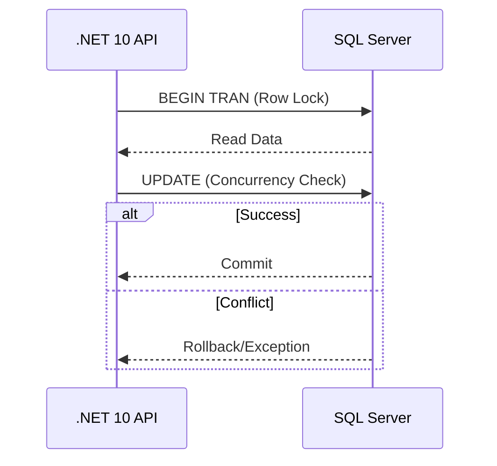

# Estrategias de Concurrencia en SQL Server [Semi-Senior]

## 1. Contexto General & Definición del Concepto
La concurrencia en SQL Server se refiere a la capacidad de múltiples usuarios para acceder o modificar datos simultáneamente. Sin estrategias adecuadas, surgen problemas como *dirty reads*, *lost updates* o *deadlocks*. El objetivo es equilibrar la integridad de los datos con el rendimiento del sistema mediante el aislamiento y el control de transacciones.

## 2. Forma de Aplicación, Buenas Prácticas & Ventajas
- **Bloqueo Optimista:** Ideal para entornos de alta lectura y baja contención. Se basa en versiones de fila (RowVersion).
- **Bloqueo Pesimista:** Necesario cuando la contención es alta y la integridad es crítica, bloqueando recursos antes de la modificación.

| Estrategia | Ventaja | Desventaja | Uso Ideal |
| :--- | :--- | :--- | :--- |
| Optimista | Alta escalabilidad | Excepciones frecuentes | Web APIs con lectura intensa |
| Pesimista | Integridad garantizada | Riesgo de deadlocks | Sistemas bancarios/inventarios |

## 3. Flujo Arquitectónico y Diagrama (Mermaid)


## 4. Implementación y Ejemplos Prácticos en C# / .NET 10
Usando EF Core 10 con Concurrency Token para implementar bloqueo optimista:

```csharp
public record Product(int Id, string Name, decimal Price, byte[] Version);

public class ProductConfiguration : IEntityTypeConfiguration<Product>
{
    public void Configure(EntityTypeBuilder<Product> builder) =>
        builder.Property(p => p.Version).IsRowVersion();
}

// En el Service/Handler
try {
    var product = await context.Products.FindAsync(id);
    product.Price = newPrice;
    await context.SaveChangesAsync();
} catch (DbUpdateConcurrencyException ex) {
    throw new Exception("El registro fue modificado por otro usuario.", ex);
}
```

## 5. Implementación y Ejemplos Prácticos en React con Vite.js
Para manejar la concurrencia en el frontend, utilizamos el estado para evitar múltiples envíos (Optimistic UI).

```typescript
import { useState } from 'react';

export const useUpdateProduct = () => {
  const [loading, setLoading] = useState(false);
  const update = async (id: number, data: any) => {
    setLoading(true);
    try {
      const response = await fetch(`/api/products/${id}`, { method: 'PUT', body: JSON.stringify(data) });
      if (response.status === 409) alert("Conflicto de concurrencia: Actualice la vista.");
    } finally {
      setLoading(false);
    }
  };
  return { update, loading };
};
```

## 6. Consideraciones de Concurrencia, Consistencia y Rendimiento
La sincronización cliente-servidor es vital. Utiliza `ETags` en las cabeceras HTTP para manejar la concurrencia a nivel de API, evitando que el usuario sobrescriba cambios sin saberlo. El bloqueo pesimista debe evitarse en peticiones HTTP largas para prevenir *thread pool starvation*.

## 7. Enlaces y Referencias en Obsidian
- [[Optimistic-vs-Pessimistic-Locking]]
- [[repository-unit-of-work-pattern]]
