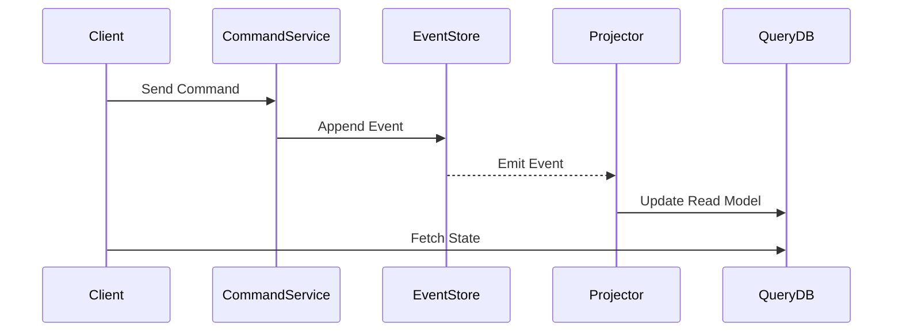

# Arquitectura Event Sourcing y CQRS Sync [Semi-Senior]

## 1. Contexto General & Definición del Concepto
Event Sourcing (ES) redefine cómo persistimos datos: en lugar de guardar el estado actual, almacenamos la secuencia de eventos que llevaron a ese estado. CQRS (Command Query Responsibility Segregation) separa las operaciones de escritura (comandos) de las de lectura (queries). Juntos, resuelven problemas de alta concurrencia y escalabilidad, permitiendo optimizar modelos de lectura de forma independiente.

## 2. Forma de Aplicación, Buenas Prácticas & Ventajas
### Cuándo aplicar:
- Sistemas con alta complejidad de negocio (DDD).
- Necesidad de auditoría completa (Time-travel debugging).
- Escenarios de escalabilidad de lectura mediante proyecciones.

### Trade-offs
| Ventaja | Desventaja | Costo de Operación |
| :--- | :--- | :--- |
| Trazabilidad total | Complejidad de lectura | Eventual Consistency |
| Escalabilidad de lectura | Curva de aprendizaje | Event Store Management |

## 3. Flujo Arquitectónico y Diagrama


## 4. Implementación en .NET 10
```csharp
// Domain Event record
public record OrderCreated(Guid OrderId, decimal Amount, DateTime CreatedAt);

// Command Handler
public class CreateOrderHandler(IEventStore eventStore) : ICommandHandler<CreateOrderCommand>
{
    public async Task Handle(CreateOrderCommand cmd)
    {
        var @event = new OrderCreated(cmd.Id, cmd.Amount, DateTime.UtcNow);
        await eventStore.AppendAsync("orders", @event);
    }
}
```

## 5. Implementación en React con Vite.js
```tsx
import { useQuery, useMutation } from '@tanstack/react-query';

// Hook para lectura (CQRS Query side)
export const useOrder = (id: string) => {
  return useQuery(['order', id], () => fetch(`/api/query/orders/${id}`).then(res => res.json()));
};

// Acción para escritura (CQRS Command side)
export const useCreateOrder = () => {
  return useMutation((data: OrderData) => 
    fetch('/api/commands/orders', { method: 'POST', body: JSON.stringify(data) })
  );
};
```

## 6. Consideraciones de Concurrencia
Al trabajar con consistencia eventual, el cliente debe manejar el estado optimista. En React, usamos `react-query` para actualizar la caché local mientras la proyección en el backend procesa el evento asíncronamente.

## 7. Enlaces y Referencias
[[CQRS-y-Event-Sourcing]]
[[CAP-y-Eventual-Consistency]]
[[Clean-Architecture-DDD-en-DotNet10]]
