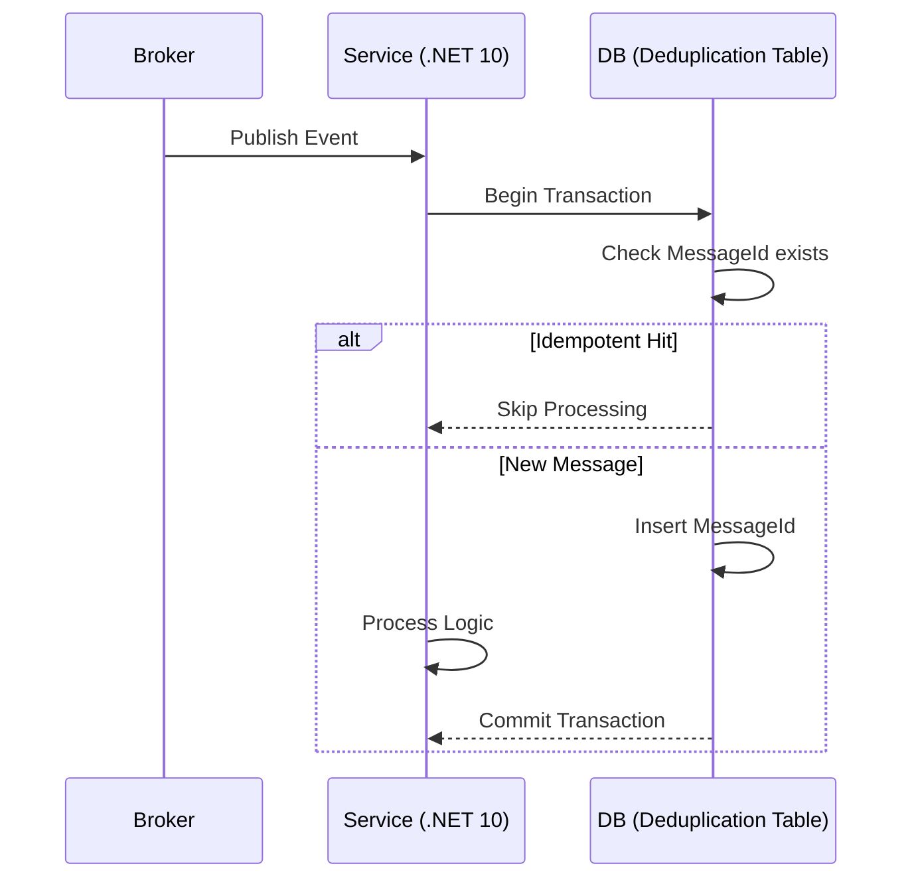

# Idempotent Consumer con SQL Server Deduplication Table [Semi-Senior]

## 1. Contexto General & Definición del Concepto
El patrón **Idempotent Consumer** garantiza que procesar el mismo mensaje varias veces no altere el estado del sistema más allá de la aplicación inicial. En sistemas distribuidos, debido a las garantías de entrega *at-least-once* de los Message Brokers, los duplicados son inevitables. La tabla de deduplicación (Inbound Messages) actúa como una barrera transaccional para asegurar que cada `MessageId` se procese exactamente una vez.

## 2. Forma de Aplicación, Buenas Prácticas & Ventajas
### Cuándo aplicar:
- Cuando el procesamiento de mensajes no es intrínsecamente idempotente (ej: transferencias bancarias).
- En integraciones con sistemas externos que no soportan transacciones distribuidas.

### Matriz de Trade-offs
| Ventajas | Desventajas / Costos |
| :--- | :--- |
| Consistencia fuerte por diseño | Latencia añadida por escritura extra |
| Fácil auditoría de eventos | Mantenimiento de tabla de historial |
| Integración sencilla con EF Core | Necesidad de limpieza (Retention Policy) |

## 3. Flujo Arquitectónico


## 4. Implementación en C# .NET 10
```csharp
public async Task HandleAsync(IntegrationEvent @event, CancellationToken ct)
{
    await using var transaction = await _dbContext.Database.BeginTransactionAsync(ct);
    
    // Verificación atómica en la misma transacción
    bool exists = await _dbContext.ProcessedMessages
        .AnyAsync(m => m.MessageId == @event.Id, ct);
    
    if (exists) return; // Silent discard
    
    // Procesamiento del dominio
    await _domainService.ProcessAsync(@event);
    
    _dbContext.ProcessedMessages.Add(new ProcessedMessage { MessageId = @event.Id });
    await _dbContext.SaveChangesAsync(ct);
    await transaction.CommitAsync(ct);
}
```

## 5. Implementación en React con Vite.js
Para el frontend, la idempotencia se maneja mediante `Idempotency-Key` en headers para evitar duplicados en clics rápidos o reintentos de red.
```tsx
const useSubmitOrder = () => {
  const [idempotencyKey] = useState(crypto.randomUUID());
  
  const submit = async (data: Order) => {
    return await axios.post('/api/orders', data, {
      headers: { 'X-Idempotency-Key': idempotencyKey }
    });
  };
  return { submit };
};
```

## 6. Consideraciones de Concurrencia
El uso de `Serializable` o `ReadCommitted` con bloqueos a nivel de fila (`UPDLOCK`) en SQL Server es crítico para evitar condiciones de carrera donde dos hilos detecten el mismo mensaje simultáneamente.

## 7. Enlaces y Referencias
- [[CQRS-y-Event-Sourcing]]
- [[Transactional-Outbox-Pattern]]
