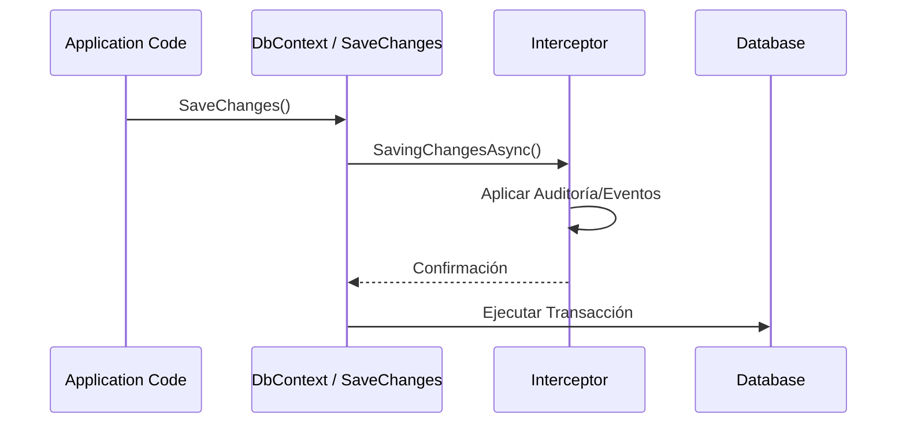

# Interceptor Pattern en EF Core [Semi-Senior]

## 1. Contexto General & Definición del Concepto
El **Interceptor Pattern** en EF Core es un mecanismo que permite ejecutar lógica personalizada en puntos específicos del ciclo de vida de una operación de base de datos (comando o consulta). En sistemas distribuidos, esto es crucial para implementar 'Cross-Cutting Concerns' como auditoría, soft-delete, encriptación en reposo o publicación de eventos de dominio sin ensuciar la lógica de negocio.

## 2. Forma de Aplicación, Buenas Prácticas & Ventajas
Úsalo para centralizar lógica repetitiva. Es un **antipatrón** si intentas inyectar lógica de negocio compleja que debería residir en el dominio (ej. validaciones de reglas de negocio pesadas).

| Ventaja | Desventaja |
| :--- | :--- |
| DRY: Elimina duplicidad en los DbContext | Oculta la lógica de persistencia (dificulta el debug) |
| Centralización de auditoría automática | Impacto en performance si el interceptor es bloqueante |
| Integración limpia con Domain Events | Complejidad al depurar errores de tiempo de ejecución |

## 3. Flujo Arquitectónico


## 4. Implementación en C# / .NET 10
```csharp
public class AuditInterceptor : SaveChangesInterceptor
{
    public override async ValueTask<InterceptionResult<int>> SavingChangesAsync(
        DbContextEventData eventData, InterceptionResult<int> result, CancellationToken ct = default)
    {
        var entries = eventData.Context?.ChangeTracker.Entries<IAuditable>();
        foreach (var entry in entries ?? Enumerable.Empty<EntityEntry<IAuditable>>())
        {
            if (entry.State == EntityState.Added)
                entry.Entity.CreatedAt = DateTime.UtcNow;
        }
        return await base.SavingChangesAsync(eventData, result, ct);
    }
}
// Registro en DI
services.AddDbContext<AppDbContext>(options => options.AddInterceptors(new AuditInterceptor()));
```

## 5. Implementación en React con Vite.js
En el frontend, el patrón se traduce a **Axios Interceptors** o **Fetch Wrappers** para manejar tokens de autenticación o errores globales de forma reactiva.
```typescript
import axios from 'axios';

const apiClient = axios.create({ baseURL: '/api' });

apiClient.interceptors.request.use((config) => {
  const token = localStorage.getItem('auth_token');
  if (token) config.headers.Authorization = `Bearer ${token}`;
  return config;
});

export default apiClient;
```

## 6. Consideraciones de Concurrencia
Evita realizar llamadas I/O externas dentro de interceptores de EF Core, ya que bloquean el thread del pool. Si necesitas persistencia de eventos, usa el patrón [[Transactional-Outbox-Pattern]] para mantener la consistencia eventual.

## 7. Enlaces
[[persistencia-ef-core-arquitectura-avanzada]]
[[domain-events-dispatching-en-transaccion]]
