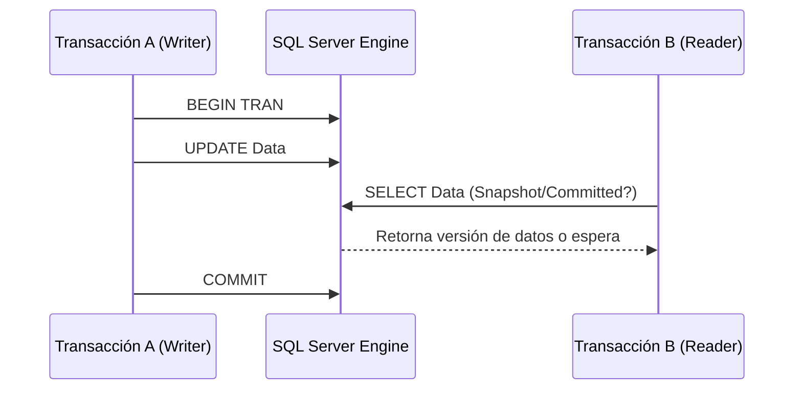

# Niveles de Aislamiento en SQL Server [Semi-Senior]

## 1. Contexto General & Definición del Concepto
Los niveles de aislamiento definen cómo las operaciones de lectura y escritura interactúan en entornos concurrentes dentro de SQL Server, controlando el grado en que una transacción se protege de los efectos secundarios de otras transacciones simultáneas (Dirty Reads, Non-repeatable Reads, Phantoms).

En sistemas distribuidos, elegir el nivel correcto es vital para balancear la **consistencia** frente a la **disponibilidad y el rendimiento**.

## 2. Forma de Aplicación, Buenas Prácticas & Ventajas
- **Read Committed (Default):** Suficiente para el 90% de las aplicaciones transaccionales web.
- **Snapshot Isolation:** Ideal para reportes complejos que no deben bloquear la escritura.
- **Serializable:** Reservado para operaciones financieras críticas donde no se permite ninguna anomalía.

### Matriz de Trade-offs
| Nivel | Consistencia | Concurrencia | Riesgo de Bloqueo | Caso de Uso |
| :--- | :--- | :--- | :--- | :--- |
| Read Uncommitted | Baja | Muy Alta | Nulo | Estadísticas masivas |
| Read Committed | Media | Alta | Medio | Aplicaciones web estándar |
| Repeatable Read | Alta | Media | Alto | Reportes consistentes |
| Serializable | Máxima | Baja | Muy Alto | Integridad contable |

## 3. Flujo Arquitectónico y Diagrama (Mermaid)


## 4. Implementación en C# / .NET 10
Utilizando `Microsoft.EntityFrameworkCore` con `System.Transactions` para control de aislamiento explícito.

```csharp
public async Task ExecuteCriticalTransactionAsync(Guid accountId, decimal amount)
{
    using var scope = new TransactionScope(
        TransactionScopeOption.Required,
        new TransactionOptions { IsolationLevel = IsolationLevel.Serializable },
        TransactionScopeAsyncFlowOption.Enabled);

    var account = await _dbContext.Accounts.FindAsync(accountId);
    account.Balance += amount;
    
    await _dbContext.SaveChangesAsync();
    scope.Complete();
}
```

## 5. Implementación en React con Vite.js
En el frontend, la gestión de aislamiento se traduce en manejo de errores por concurrencia (409 Conflict) y refresco de estado.

```tsx
const useUpdateAccount = () => {
  return useMutation({
    mutationFn: (data: AccountUpdate) => apiClient.patch('/accounts', data),
    onError: (err: any) => {
      if (err.response?.status === 409) {
        alert("Conflicto de concurrencia. Los datos han cambiado, recargando...");
      }
    }
  });
};
```

## 6. Consideraciones de Concurrencia
Evita el uso de `Serializable` a menos que sea estrictamente necesario, ya que eleva drásticamente el riesgo de *Deadlocks*. Para aplicaciones modernas, prefiere la **Concurrencia Optimista** (usando `RowVersion` en EF Core) en lugar de bloqueos pesimistas de base de datos.

## 7. Enlaces y Referencias
- [[concurrencia-y-runtime-dotnet-10]]
- [[persistencia-ef-core-dotnet-10]]
- [[Optimistic-vs-Pessimistic-Locking]]
