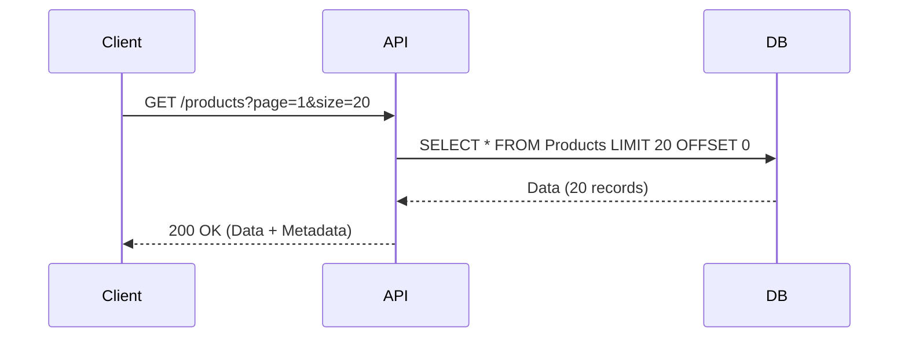

# Paginación Eficiente [Semi-Senior]

## 1. Contexto General & Definición del Concepto
La paginación es la técnica de segmentar grandes conjuntos de datos en porciones manejables (páginas). En sistemas distribuidos, es crítica para evitar el agotamiento de memoria del servidor, reducir la latencia de red y mejorar la experiencia del usuario (UX).

Problemas que resuelve:
- **Memory Overflow**: Evita cargar tablas completas de millones de filas en la RAM.
- **Network Congestion**: Minimiza el payload JSON enviado.
- **Database Load**: Reduce el costo de I/O en motores de base de datos.

## 2. Forma de Aplicación, Buenas Prácticas & Ventajas
- **Offset-based**: Ideal para navegación directa. Sufre de degradación de rendimiento en offsets profundos (`OFFSET 1000000`).
- **Keyset (Cursor-based)**: Escalabilidad constante O(log N). Ideal para feeds infinitos.

| Estrategia | Ventajas | Desventajas |
| :--- | :--- | :--- |
| Offset/Limit | Fácil implementación | Lento en datasets grandes |
| Keyset (Cursor) | Rendimiento constante | No permite saltos de página | 

## 3. Flujo Arquitectónico


## 4. Implementación C# .NET 10
```csharp
public record PagedResponse<T>(IEnumerable<T> Data, int Page, int PageSize, long TotalCount);

public async Task<PagedResponse<Product>> GetProductsAsync(int page, int pageSize, CancellationToken ct)
{
    var query = _context.Products.AsNoTracking();
    var totalCount = await query.CountAsync(ct);
    var items = await query
        .OrderBy(p => p.CreatedAt)
        .Skip((page - 1) * pageSize)
        .Take(pageSize)
        .ToListAsync(ct);

    return new PagedResponse<Product>(items, page, pageSize, totalCount);
}
```

## 5. Implementación React + Vite.js
```tsx
import { useQuery } from '@tanstack/react-query';

const usePaginatedProducts = (page: number) => {
  return useQuery({
    queryKey: ['products', page],
    queryFn: async () => {
      const res = await fetch(`/api/products?page=${page}&size=20`);
      return res.json();
    },
    keepPreviousData: true // Mejora UX durante el fetch
  });
};
```

## 6. Consideraciones de Concurrencia y Rendimiento
Para evitar inconsistencias cuando los datos cambian mientras se navega, se prefiere **Keyset Pagination**. Además, se debe implementar **caching** (e.g., Redis) solo para los metadatos de conteo total, no para los datos transaccionales de alta frecuencia.

## 7. Enlaces y Referencias
- [[Clean-Architecture-DDD-en-DotNet10]]
- [[cqrs-patron-arquitectura]]
- [[Estrategias-Cache-Distribuido]]
