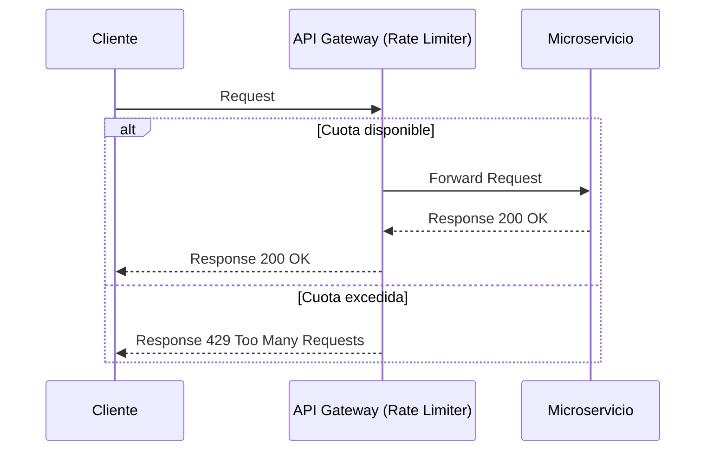

# Rate Limiting & Throttling [Semi-Senior]

## 1. Contexto General & Definición del Concepto
El **Rate Limiting** es una técnica crítica de resiliencia que controla la tasa de peticiones enviadas o recibidas por un sistema. El **Throttling** es una forma específica de limitación donde se ralentiza la tasa de procesamiento para proteger los recursos.

En arquitecturas distribuidas, estos mecanismos previenen el agotamiento de recursos (CPU, RAM, DB Connections) frente a picos de tráfico inesperados, ataques DoS o clientes mal configurados.

## 2. Forma de Aplicación, Buenas Prácticas & Ventajas
Se aplica preferiblemente en el *Edge* (API Gateway) para rechazar tráfico malicioso temprano. Es un antipatrón implementarlo dentro de la lógica de negocio profunda.

| Característica | Ventaja | Desventaja / Costo |
| :--- | :--- | :--- |
| Protección | Evita caídas por sobrecarga | Latencia extra en el proxy |
| Estabilidad | Garantiza QoS (Quality of Service) | Requiere gestión de estados (Redis) |
| UX | Informa al cliente del límite | Manejo complejo de 429 Too Many Requests |

## 3. Flujo Arquitectónico y Diagrama (Mermaid)


## 4. Implementación en .NET 10
Utilizamos el middleware nativo `Microsoft.AspNetCore.RateLimiting` configurado en `Program.cs`.

```csharp
using Microsoft.AspNetCore.RateLimiting;
using System.Threading.RateLimiting;

var builder = WebApplication.CreateBuilder(args);

builder.Services.AddRateLimiter(options => {
    options.AddFixedWindowLimiter("api-policy", opt => {
        opt.Window = TimeSpan.FromSeconds(10);
        opt.PermitLimit = 5;
        opt.QueueLimit = 0;
    });
});

var app = builder.Build();
app.UseRateLimiter();

app.MapGet("/data", () => Results.Ok("Success")).RequireRateLimiting("api-policy");
app.Run();
```

## 5. Implementación en React + Vite
En el frontend, debemos manejar el código 429 para proporcionar feedback al usuario y aplicar *Exponential Backoff*.

```typescript
import axios from 'axios';

const apiClient = axios.create({ baseURL: '/api' });

apiClient.interceptors.response.use(null, (error) => {
  if (error.response?.status === 429) {
    const retryAfter = error.response.headers['retry-after'] || 5;
    console.warn(`Rate limit exceeded. Retrying in ${retryAfter}s`);
    // Implementar lógica de reintento o notificación al usuario
  }
  return Promise.reject(error);
});
```

## 6. Consideraciones de Concurrencia y Rendimiento
- **Consistencia**: Para limitar globalmente, el contador debe vivir en un almacén compartido (Redis), no en memoria local, para evitar inconsistencias entre réplicas del servicio.
- **Optimización**: El uso de `Fixed Window` es simple pero tiene picos en los bordes de la ventana. Para mejor control, considerar `Token Bucket`.

## 7. Enlaces y Referencias en Obsidian
[[circuit-breaker-retry-fallback]]
[[estrategias-cache-distribuido]]
[[Idempotencia-en-APIs-y-Consumidores-de-Eventos]]
