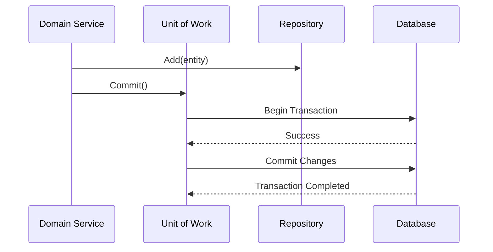

# Repository & Unit of Work [Semi-Senior]

## 1. Contexto General & Definición del Concepto
El patrón **Repository** actúa como una capa de abstracción entre la lógica de negocio y la capa de acceso a datos, permitiendo tratar la persistencia como una colección en memoria. Por otro lado, **Unit of Work (UoW)** mantiene una lista de objetos afectados por una transacción de negocio y coordina la escritura de cambios, asegurando que todas las operaciones se confirmen o reviertan como una única unidad atómica.

En sistemas distribuidos y Clean Architecture, estos patrones evitan que el código de dominio se contamine con detalles de infraestructura (como EF Core o SQL directo).

## 2. Forma de Aplicación, Buenas Prácticas & Ventajas
### Cuándo aplicar
- Cuando buscas desacoplar el dominio de la tecnología de persistencia.
- Cuando necesitas transacciones que involucren múltiples repositorios (aggregates).

### Matriz de Trade-offs
| Ventaja | Desventaja |
| :--- | :--- |
| Centralización de consultas | Sobrecarga de abstracción (boilerplate) |
| Facilidad de testing (Mocking) | Riesgo de "Anemic Domain Model" |
| Encapsulamiento de transacciones | Complejidad innecesaria en proyectos pequeños |

## 3. Flujo Arquitectónico


## 4. Implementación en C# .NET 10
```csharp
public interface IUnitOfWork : IDisposable {
    IRepository<User> Users { get; }
    Task<int> SaveChangesAsync(CancellationToken ct = default);
}

public class UnitOfWork(AppDbContext context) : IUnitOfWork {
    public IRepository<User> Users => new Repository<User>(context);
    public async Task<int> SaveChangesAsync(CancellationToken ct = default) => await context.SaveChangesAsync(ct);
    public void Dispose() => context.Dispose();
}
```

## 5. Implementación en React con Vite.js
En frontend, emulamos esto mediante "Data Services" que encapsulan llamadas API, manteniendo el estado consistente mediante React Query.
```typescript
// hooks/useUserActions.ts
export const useUserActions = () => {
  const queryClient = useQueryClient();
  const mutation = useMutation({
    mutationFn: (data: User) => axios.post('/api/users', data),
    onSuccess: () => queryClient.invalidateQueries({ queryKey: ['users'] })
  });
  return mutation;
};
```

## 6. Consideraciones de Concurrencia
Al usar UoW, la consistencia depende de la base de datos. En entornos distribuidos, considera implementar [[Optimistic-vs-Pessimistic-Locking]] para evitar conflictos cuando múltiples usuarios editan el mismo agregado simultáneamente.

## 7. Enlaces y Referencias
- [[Clean-Architecture-DDD-en-DotNet10]]
- [[cqrs-patron-arquitectura]]
