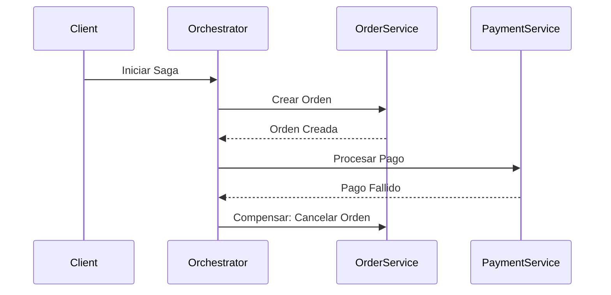

# Saga Pattern: Orquestación vs Coreografía [Semi-Senior]

## 1. Contexto General & Definición del Concepto
El **Patrón Saga** es una solución arquitectónica para gestionar la consistencia de datos en sistemas distribuidos cuando una transacción de negocio atraviesa múltiples microservicios. Como en una base de datos distribuida no podemos usar transacciones ACID tradicionales (debido al Teorema CAP), la Saga descompone la transacción en una serie de pasos locales coordinados por eventos.

- **Orquestación:** Un controlador central (Orquestador) dicta el flujo.
- **Coreografía:** Los servicios reaccionan a eventos publicados por otros servicios (estilo pub/sub).

## 2. Forma de Aplicación, Buenas Prácticas & Ventajas
Use Sagas cuando requiera consistencia eventual en procesos de larga duración. Evite su uso si una transacción puede resolverse en un solo servicio o si la complejidad de compensación supera el beneficio de escalabilidad.

| Característica | Orquestación | Coreografía |
| :--- | :--- | :--- |
| Complejidad | Alta (requiere orquestador) | Baja (descentralizada) |
| Acoplamiento | Bajo (centralizado) | Alto (ciclos de eventos) |
| Visibilidad | Clara (punto central) | Difusa (trazas distribuidas) |

## 3. Flujo Arquitectónico


## 4. Implementación en C# .NET 10
Utilizando un enfoque de Clean Architecture y MediatR para orquestación:

```csharp
public record OrderSagaContext(Guid OrderId, decimal Amount);

public class OrderOrchestrator(IMediator mediator) {
    public async Task ExecuteAsync(OrderSagaContext context) {
        try {
            await mediator.Send(new CreateOrderCommand(context.OrderId));
            await mediator.Send(new ProcessPaymentCommand(context.OrderId, context.Amount));
        } catch (Exception) {
            await mediator.Send(new CompensateOrderCommand(context.OrderId));
            throw;
        }
    }
}
```

## 5. Implementación en React con Vite.js
Para manejar estados de la saga en el cliente con UI optimista:

```tsx
const useSagaOrder = () => {
  const [status, setStatus] = useState<'idle' | 'pending' | 'failed'>('idle');
  
  const initiateOrder = async (data: OrderData) => {
    setStatus('pending');
    try {
      await api.post('/orders', data);
      setStatus('idle');
    } catch (e) {
      setStatus('failed'); // Trigger feedback for manual intervention
    }
  };
  return { initiateOrder, status };
};
```

## 6. Consideraciones de Concurrencia
- **Consistencia Eventual:** Acepte que los datos no serán consistentes inmediatamente.
- **Idempotencia:** Vital. Cada paso de la Saga debe ser capaz de procesarse múltiples veces sin efectos secundarios negativos.
- **Transacciones Compensatorias:** Asegúrese de que el código de "rollback" (compensación) siempre sea ejecutable incluso si el sistema está bajo carga.

## 7. Enlaces y Referencias
- [[CAP-y-Eventual-Consistency]]
- [[Transactional-Outbox-Pattern]]
