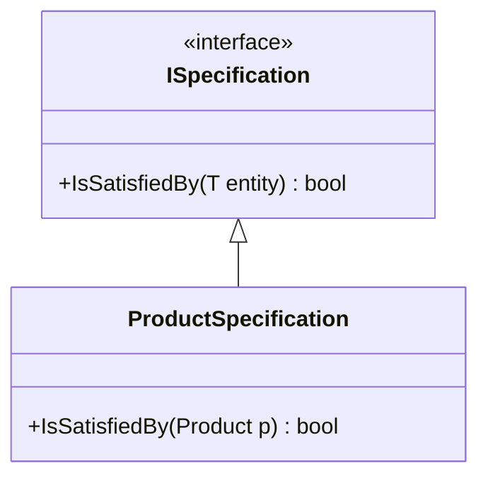

# Specification Pattern [Semi-Senior]

## 1. Contexto General & Definición del Concepto
El Specification Pattern es un patrón de diseño comportamental que permite encapsular reglas de negocio en objetos reutilizables. En sistemas distribuidos y DDD, ayuda a definir criterios de filtrado o validación fuera del modelo de dominio o del repositorio, evitando la "anemia" y el código duplicado.

## 2. Forma de Aplicación, Buenas Prácticas & Ventajas
- **Cuándo aplicar:** Reglas de validación complejas, filtrado dinámico en consultas, o políticas de dominio que deben compartirse entre diferentes capas.
- **Antipatrón:** No sobre-ingenierices con esto para filtros simples; si solo necesitas `WHERE x = y`, un simple LINQ basta.

### Matriz de Trade-offs
| Ventaja | Desventaja |
| :--- | :--- |
| Alta reusabilidad | Incremento en número de archivos |
| Código declarativo | Curva de aprendizaje inicial |
| Facilita pruebas unitarias | Puede ser complejo combinar muchas especificaciones |

## 3. Flujo Arquitectónico y Diagrama (Mermaid)


## 4. Implementación en C# .NET 10
```csharp
public interface ISpecification<T> {
    bool IsSatisfiedBy(T entity);
    Expression<Func<T, bool>> ToExpression();
}

public class MinPriceSpecification(decimal minPrice) : ISpecification<Product> {
    public bool IsSatisfiedBy(Product p) => p.Price >= minPrice;
    public Expression<Func<Product, bool>> ToExpression() => p => p.Price >= minPrice;
}

// Uso en repositorio
public IEnumerable<Product> GetProducts(ISpecification<Product> spec) {
    return _context.Products.Where(spec.ToExpression()).ToList();
}
```

## 5. Implementación en React con Vite.js
```typescript
// Specification como filtro de estado
type Specification<T> = (item: T) => boolean;

const useProductFilter = (products: Product[], spec: Specification<Product>) => {
  return useMemo(() => products.filter(spec), [products, spec]);
};

// Uso en componente
const ExpensiveProductSpec = (p: Product) => p.price > 100;
const filtered = useProductFilter(products, ExpensiveProductSpec);
```

## 6. Consideraciones de Concurrencia y Rendimiento
La serialización de especificaciones complejas hacia el backend puede causar latencia. Es recomendable aplicar las especificaciones principalmente en la capa de persistencia (IQueryable) para reducir el volumen de datos transferidos desde la base de datos, manteniendo la lógica consistente mediante las mismas clases compartidas (si se usan Monorepos).

## 7. Enlaces y Referencias en Obsidian
- [[Clean-Architecture-DDD-en-DotNet10]]
- [[cqrs-patron-arquitectura]]
- [[repository-unit-of-work-pattern]]
