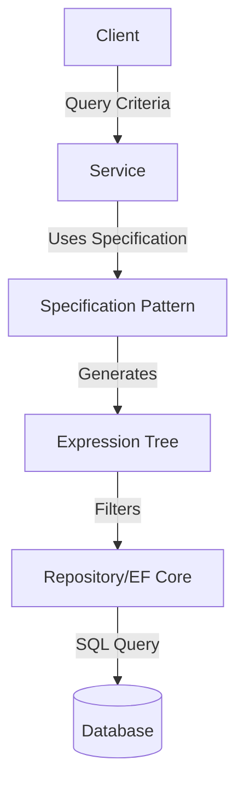

# Specification Pattern y Expression Trees [Semi-Senior]

## 1. Contexto General & Definición del Concepto
El **Specification Pattern** es un patrón de diseño comportamental que permite encapsular reglas de negocio en objetos reutilizables. Al combinarlo con **Expression Trees** en .NET, logramos traducir lógica de dominio fuertemente tipada directamente a sentencias SQL (via EF Core), evitando la fuga de lógica de filtrado hacia las capas de infraestructura.

## 2. Forma de Aplicación, Buenas Prácticas & Ventajas
- **Cuándo aplicar:** Cuando la lógica de filtrado (ej. "Usuarios activos que no han comprado en 30 días") se repite en múltiples servicios o consultas.
- **Antipatrón:** Crear especificaciones para lógica extremadamente simple o de una sola vez (Over-engineering).

| Ventaja | Desventaja |
| :--- | :--- |
| Reutilización de reglas | Curva de aprendizaje técnica |
| Legibilidad del dominio | Riesgo de árboles de expresión complejos |
| Componibilidad (And/Or/Not) | Depuración de expresiones compiladas |

## 3. Flujo Arquitectónico


## 4. Implementación en C# .NET 10
```csharp
public abstract record Specification<T>(Expression<Func<T, bool>> Criteria);

public class UserActiveSpecification : Specification<User>
{
    public UserActiveSpecification() 
        : base(u => u.IsActive && u.LastLogin > DateTime.UtcNow.AddDays(-30)) { }
}

// Uso en repositorio
public async Task<List<User>> GetUsersAsync(Specification<User> spec) =>
    await _context.Users.Where(spec.Criteria).ToListAsync();
```

## 5. Implementación en React + Vite.js
En frontend, el patrón se traduce a la construcción de objetos DTO de filtros para sincronizar con la API.
```typescript
interface FilterCriteria {
  isActive: boolean;
  daysSinceLogin: number;
}

const useUserFilter = (criteria: FilterCriteria) => {
  return useQuery(['users', criteria], () => 
    api.get('/users', { params: criteria }), 
    { keepPreviousData: true }
  );
};
```

## 6. Consideraciones de Concurrencia
Para mantener la consistencia, el cliente debe enviar un *version token* o *etag* si la especificación implica datos de estado crítico, evitando condiciones de carrera al aplicar filtros dinámicos sobre entidades que cambian rápidamente.

## 7. Enlaces
- [[Clean-Architecture-DDD-en-DotNet10]]
- [[CQRS-Patron-Implementacion-Practica]]
