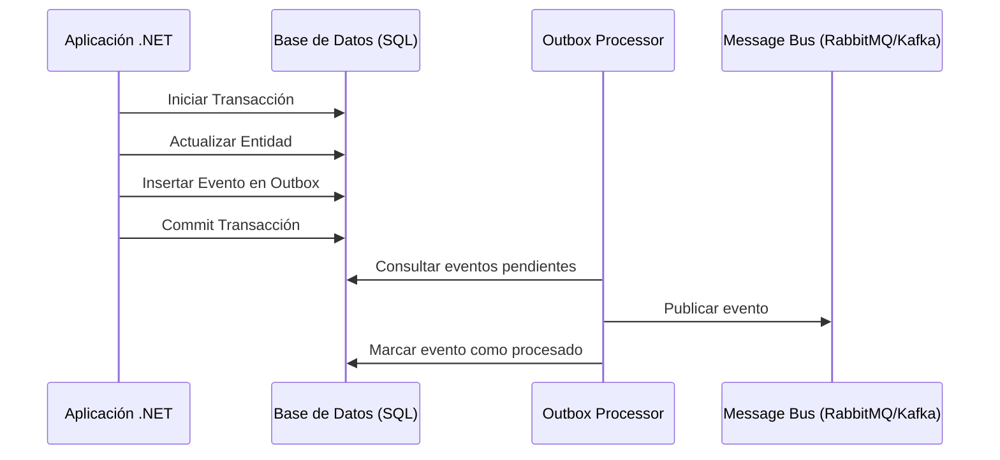

# Transactional Outbox Pattern [Semi-Senior]

## 1. Contexto General & Definición del Concepto
El Transactional Outbox Pattern resuelve el problema del "Dual Write": ¿cómo asegurar que una actualización en la base de datos y la publicación de un evento de dominio ocurran de forma atómica? En sistemas distribuidos, si la DB se actualiza pero el bus de mensajes falla, perdemos la consistencia. Este patrón propone guardar el evento en una tabla `Outbox` dentro de la misma transacción local de la base de datos.

## 2. Forma de Aplicación, Buenas Prácticas & Ventajas
- **Cuándo aplicar:** Indispensable cuando buscas consistencia eventual fuerte entre microservicios.
- **Cuándo evitar:** Si no necesitas consistencia estricta o si el volumen es bajo y puedes tolerar inconsistencias menores (uso de técnicas simples de reintento).

| Ventaja | Desventaja |
| :--- | :--- |
| Consistencia Atómica | Complejidad de infraestructura |
| Resiliencia ante fallos de red | Requiere tabla de Outbox y worker |
| Desacoplamiento de servicios | Overhead de procesamiento | 

## 3. Flujo Arquitectónico


## 4. Implementación en C# / .NET 10
Utilizando EF Core 10 con Unit of Work:

```csharp
public async Task ProcessOrder(Order order, CancellationToken ct) {
    using var transaction = await _dbContext.Database.BeginTransactionAsync(ct);
    try {
        _dbContext.Orders.Add(order);
        
        var outboxMessage = new OutboxMessage {
            Id = Guid.NewGuid(),
            Type = nameof(OrderCreatedEvent),
            Content = JsonSerializer.Serialize(new OrderCreatedEvent(order.Id)),
            OccurredOn = DateTime.UtcNow
        };
        
        _dbContext.OutboxMessages.Add(outboxMessage);
        await _dbContext.SaveChangesAsync(ct);
        await transaction.CommitAsync(ct);
    } catch { 
        await transaction.RollbackAsync(ct); 
        throw; 
    }
}
```

## 5. Implementación en React con Vite.js
En el frontend, el patrón se traduce en el manejo de estados optimistas para reflejar el éxito antes de que la consistencia eventual se resuelva en el backend.

```tsx
const useOrderSubmission = () => {
  const [status, setStatus] = useState('idle');
  const submitOrder = async (data: Order) => {
    setStatus('loading');
    try {
      // Consumo de API con reintento y feedback visual inmediato
      await api.post('/orders', data);
      setStatus('success');
    } catch (err) {
      setStatus('error');
      // Implementar error boundary o rollback de UI
    }
  };
  return { submitOrder, status };
};
```

## 6. Consideraciones de Concurrencia
- **Idempotencia:** Dado que el Worker puede enviar el mismo evento dos veces ante un fallo de red, el consumidor debe ser idempotente.
- **Estado Optimista:** En el frontend, usa IDs temporales (UUIDs) generados en el cliente para evitar duplicados en la UI durante la espera de respuesta.

## 7. Enlaces y Referencias
- [[CQRS-y-Event-Sourcing]]
- [[CAP-y-Eventual-Consistency]]
- [[repository-unit-of-work-pattern]]
