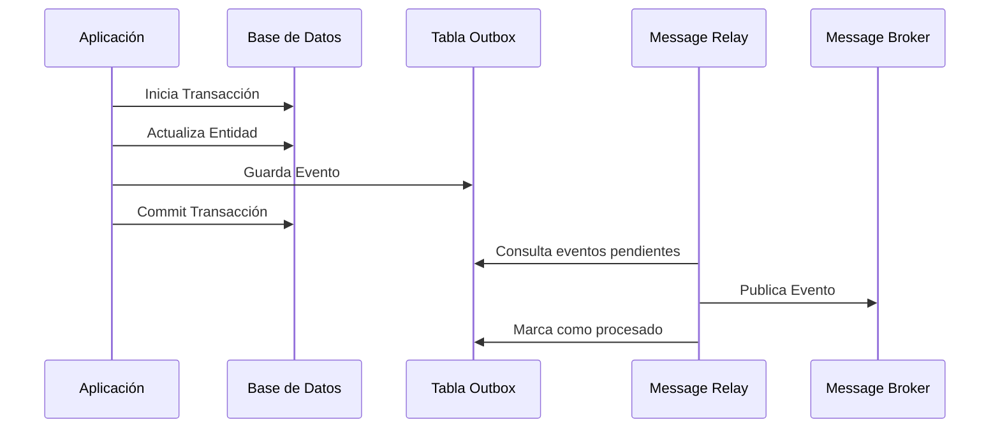

# Transactional Outbox Pattern [Semi-Senior]

## 1. Contexto General & Definición del Concepto
El Transactional Outbox es un patrón diseñado para resolver el problema de la atomicidad en sistemas distribuidos. Cuando una transacción de base de datos debe actualizar el estado local y, simultáneamente, publicar un evento hacia un Message Broker (RabbitMQ, Kafka), se corre el riesgo de que una operación falle mientras la otra tiene éxito. Este patrón garantiza que el evento se envíe al menos una vez (at-least-once delivery) sin recurrir a transacciones distribuidas (2PC), que son costosas y complejas.

## 2. Forma de Aplicación, Buenas Prácticas & Ventajas
### Cuándo aplicarlo
- Aplicaciones basadas en microservicios o DDD.
- Cuando la consistencia eventual entre sistemas es aceptable.
- Cuando el costo de perder un mensaje es inaceptable.

| Ventaja | Desventaja |
| :--- | :--- |
| Garantiza consistencia de datos | Aumenta la complejidad operativa |
| Elimina transacciones distribuidas | Requiere un proceso de "Relay" |
| Alta resiliencia ante caídas del broker | Overhead en la base de datos |

## 3. Flujo Arquitectónico y Diagrama (Mermaid)


## 4. Implementación en C# / .NET 10
```csharp
public record OrderCreatedEvent(Guid OrderId, decimal Amount);

public async Task CreateOrderAsync(Order order, OrderCreatedEvent evt)
{
    using var transaction = await _dbContext.Database.BeginTransactionAsync();
    try
    {
        _dbContext.Orders.Add(order);
        _dbContext.OutboxMessages.Add(new OutboxMessage {
            Type = typeof(OrderCreatedEvent).Name,
            Content = JsonSerializer.Serialize(evt),
            OccurredOn = DateTime.UtcNow
        });
        await _dbContext.SaveChangesAsync();
        await transaction.CommitAsync();
    }
    catch { await transaction.RollbackAsync(); throw; }
}
```

## 5. Implementación en React con Vite.js
En el frontend, el enfoque debe centrarse en la resiliencia ante errores de red y estados optimistas.
```tsx
const useOrderMutation = () => {
  const [status, setStatus] = useState('idle');
  
  const mutate = async (orderData: Order) => {
    setStatus('loading');
    try {
      const response = await apiClient.post('/orders', orderData);
      // El servidor ya garantizó la persistencia atómica
      return response.data;
    } catch (err) {
      // Manejo de errores con lógica de reintentos
      setStatus('error');
    }
  };
  return { mutate, status };
};
```

## 6. Consideraciones de Concurrencia
- **Idempotencia**: Dado que el patrón garantiza 'at-least-once', el consumidor del mensaje debe ser capaz de procesar el mismo mensaje varias veces sin efectos secundarios negativos.
- **Polling**: El proceso de Relay debe ser eficiente para no sobrecargar la BD con consultas constantes.

## 7. Enlaces y Referencias
- [[CQRS-y-Event-Sourcing]]
- [[CAP-y-Eventual-Consistency]]
