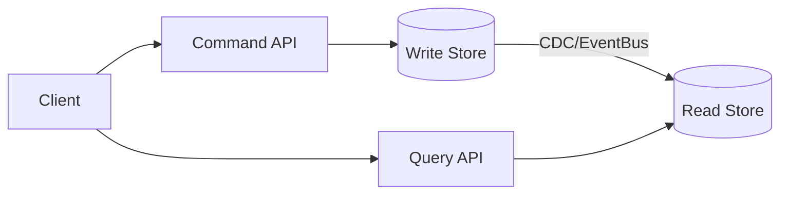

# Arquitectura CQRS Avanzada [Senior]

## 1. Contexto General & Definición del Concepto
CQRS (Command Query Responsibility Segregation) separa los modelos de lectura y escritura. En sistemas distribuidos, permite escalar el throughput de consultas independientemente de la lógica de negocio compleja de escritura, optimizando el uso de recursos y permitiendo esquemas de almacenamiento especializados (ej. SQL para escritura, ElasticSearch para búsqueda).

## 2. Forma de Aplicación, Buenas Prácticas & Ventajas
Aplicar CQRS solo cuando la complejidad del dominio o los requisitos de escala lo justifiquen. Evitar en CRUDs simples.

| Ventaja | Desventaja / Costo Operativo |
| :--- | :--- |
| Escalabilidad independiente | Incremento en complejidad cognitiva |
| Optimización de esquemas (Read/Write) | Eventual Consistency (CAP Theorem) |
| Mejora en latencia p99 | Necesidad de sincronización (Outbox/Relays) |

## 3. Flujo Arquitectónico y Diagrama (Mermaid)


## 4. Implementación y Ejemplos Prácticos en C# / .NET 10
Utilizando MediatR y Records para inmutabilidad.
```csharp
// Comando inmutable
public record CreateOrderCommand(Guid OrderId, decimal Amount) : IRequest<Guid>;

public class CreateOrderHandler : IRequestHandler<CreateOrderCommand, Guid>
{
    private readonly AppDbContext _context;
    public CreateOrderHandler(AppDbContext context) => _context = context;
    
    public async Task<Guid> Handle(CreateOrderCommand cmd, CancellationToken ct) {
        var order = new Order(cmd.OrderId, cmd.Amount);
        _context.Orders.Add(order);
        await _context.SaveChangesAsync(ct);
        return order.Id;
    }
}
```

## 5. Implementación y Ejemplos Prácticos en React con Vite.js
Uso de Query Hooks para separar preocupaciones de UI.
```typescript
// useOrdersQuery.ts
export const useOrders = () => {
  return useQuery({ 
    queryKey: ['orders'], 
    queryFn: fetchOrders, 
    staleTime: 5000 
  });
};

// Componente UI
const OrderList = () => {
  const { data, isLoading } = useOrders();
  if (isLoading) return <Spinner />;
  return <ul>{data.map(o => <li key={o.id}>{o.amount}</li>)}</ul>;
};
```

## 6. Consideraciones de Concurrencia, Consistencia y Rendimiento
La consistencia eventual es el reto principal. Implementar *Optimistic UI* en React para mitigar la percepción de latencia, mientras se gestionan fallos mediante *Retry policies* y *Circuit Breakers* en el backend.

## 7. Enlaces y Referencias en Obsidian
- [[Transactional-Outbox-Pattern]]
- [[CAP-y-Eventual-Consistency]]
