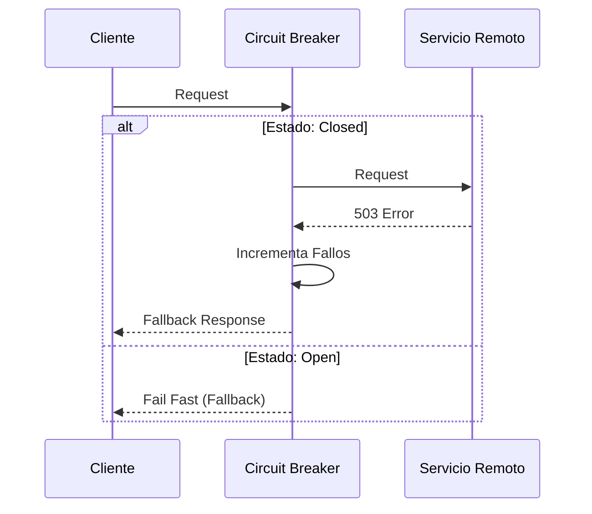

# Patrones de Resiliencia [Senior]

## 1. Contexto General & Definición
En arquitecturas distribuidas, la asunción de "fallo" debe ser una constante. El trío **Retry**, **Circuit Breaker** y **Fallback** conforma la tríada de defensa contra fallos en cascada. Estos patrones buscan aislar errores transitorios, prevenir la saturación de recursos (thundering herd problem) y degradar la experiencia de usuario de forma elegante (graceful degradation).

## 2. Forma de Aplicación & Trade-offs

| Característica | Retry | Circuit Breaker | Fallback |
| :--- | :--- | :--- | :--- |
| **Propósito** | Recuperar fallos fugaces | Evitar sobrecarga | Degradación funcional |
| **Complejidad** | Baja | Media | Media |
| **Riesgo** | Amplificación de latencia | Bloqueo de flujo | Consistencia eventual |

*   **Cuándo aplicar:** Indispensable en llamadas I/O (APIs, DBs, Message Brokers).
*   **Antipatrón:** Aplicar Retry sin *jitter* (randomización de espera) o sin límites, lo que puede causar un DDoS autoinfligido.

## 3. Flujo Arquitectónico


## 4. Implementación en C# / .NET 10
Utilizando `Polly`, el estándar de facto integrado en la infraestructura de .NET.

```csharp
// .NET 10 Pipeline Resiliencia
var pipeline = new ResiliencePipelineBuilder<HttpResponseMessage>()
    .AddRetry(new RetryStrategyOptions<HttpResponseMessage> {
        MaxRetryAttempts = 3,
        Delay = TimeSpan.FromSeconds(2),
        BackoffType = DelayBackoffType.Exponential
    })
    .AddCircuitBreaker(new CircuitBreakerStrategyOptions<HttpResponseMessage> {
        FailureRatio = 0.5,
        SamplingDuration = TimeSpan.FromSeconds(30),
        MinimumThroughput = 10,
        BreakDuration = TimeSpan.FromSeconds(15)
    })
    .Build();

// Consumo
var response = await pipeline.ExecuteAsync(async ct => await _httpClient.GetAsync("/api/v1/resource", ct));
```

## 5. Implementación en React con Vite.js
Uso de un custom hook para manejar el estado de resiliencia del UI.

```typescript
export const useResilientQuery = (fetcher: () => Promise<any>, fallback: any) => {
  const [data, setData] = useState(null);
  const [isError, setIsError] = useState(false);

  const execute = async () => {
    try {
      const result = await fetcher();
      setData(result);
    } catch (e) {
      setIsError(true);
      setData(fallback); // Estrategia de Fallback
    }
  };

  return { data, isError, execute };
};
```

## 6. Consideraciones de Concurrencia y Rendimiento
- **Consistencia:** El uso de Fallback puede llevar a vistas obsoletas. Debe comunicarse mediante encabezados `X-Resilience-State: degraded`.
- **Latencia:** El Circuit Breaker mejora el p99 al evitar esperar tiempos de timeout completos en servicios caídos.

## 7. Referencias
- [[Saga-Pattern-Orquestacion-vs-Coreografia]]
- [[Idempotencia-en-APIs-y-Consumidores-de-Eventos]]
- [[Teorema-CAP-y-PACELC]]
