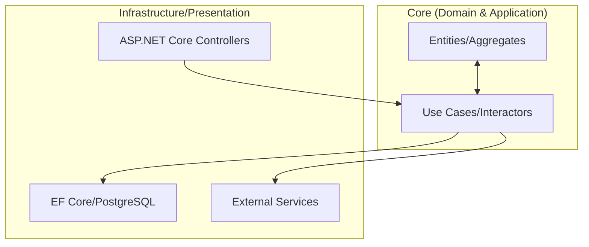

# Clean Architecture: Implementación de Nivel Senior [Senior]

## 1. Contexto General & Definición del Concepto
La Clean Architecture no es solo una separación de capas; es una estrategia para el desacoplamiento agresivo de la lógica de negocio de los detalles de infraestructura (DB, UI, APIs externas). En sistemas distribuidos, permite aislar el 'Core' de las fluctuaciones tecnológicas, facilitando tests unitarios, evolución del stack y portabilidad.

## 2. Forma de Aplicación, Buenas Prácticas & Ventajas
### Matriz de Trade-offs
| Factor | Impacto | Justificación |
| :--- | :--- | :--- |
| **Mantenibilidad** | Muy Alto | Menor deuda técnica al aislar cambios en infraestructura. |
| **Complejidad Inicial** | Alta | Requiere boilerplate, mapeo entre modelos y capas. |
| **Productividad** | Media | Curva de aprendizaje empinada para equipos junior. |
| **Escalabilidad** | Alta | Facilita el despliegue de módulos como microservicios. |

## 3. Flujo Arquitectónico


## 4. Implementación en .NET 10
Utilizando C# 10/11+ con records para inmutabilidad y Primary Constructors.
```csharp
// Domain/Order.cs
public record OrderId(Guid Value);
public class Order(OrderId id, string customerId) {
    public OrderId Id { get; } = id;
    public void Validate() => /* Domain logic */;
}

// Application/CreateOrderHandler.cs
public class CreateOrderHandler(IOrderRepository repo, IUnitOfWork uow) {
    public async Task Handle(CreateOrderCommand cmd) {
        var order = new Order(new OrderId(Guid.NewGuid()), cmd.CustomerId);
        await repo.AddAsync(order);
        await uow.SaveChangesAsync();
    }
}
```

## 5. Implementación en React + Vite.js
Estructura basada en Feature-Folders con capas de servicios.
```tsx
// features/orders/api/createOrder.ts
export const createOrder = async (data: OrderDTO): Promise<Order> => {
    const response = await apiClient.post('/orders', data);
    return response.data;
};

// features/orders/hooks/useCreateOrder.ts
export const useCreateOrder = () => {
    const mutation = useMutation({ mutationFn: createOrder });
    return { ...mutation, submit: mutation.mutateAsync };
};
```

## 6. Consideraciones de Concurrencia y Rendimiento
Para sistemas de alta carga, la Clean Architecture debe soportar **Eventual Consistency**. En .NET 10, implementar el patrón [[Transactional-Outbox-Pattern]] es vital para evitar problemas de atomicidad entre la base de datos y los sistemas de mensajería (RabbitMQ/Kafka). En el Frontend, usar optimistic updates para mejorar la latencia percibida, pero siempre con un mecanismo de *rollback* vía QueryClient invalidation.

## 7. Enlaces y Referencias
- [[Clean-Architecture-DDD-en-DotNet10]]
- [[CQRS-Patron-Implementacion-Practica]]
- [[Idempotencia-en-APIs-y-Consumidores-de-Eventos]]
