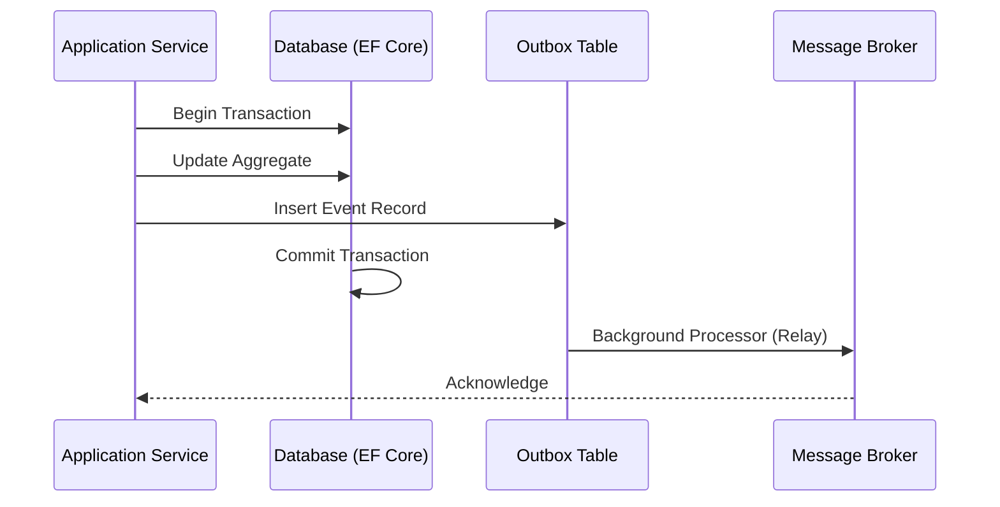

# Domain Events & Dispatching en Transacción [Senior]

## 1. Contexto General & Definición del Concepto
El despacho de eventos de dominio dentro de una transacción garantiza que el estado de la base de datos y la emisión de efectos secundarios (eventos) ocurran de forma atómica. En sistemas distribuidos, desacoplar la lógica de negocio de la infraestructura de mensajería (bus) es vital para evitar el acoplamiento temporal y asegurar la consistencia eventual.

## 2. Forma de Aplicación, Buenas Prácticas & Ventajas
### Matriz de Trade-offs
| Dimensión | Ventajas | Desventajas / Costos |
| :--- | :--- | :--- |
| **Consistencia** | Atoricidad mediante Outbox | Mayor complejidad en persistencia |
| **Acoplamiento** | Bajo (mediante Domain Events) | Requiere infraestructura de Broker |
| **Escalabilidad** | Alta mediante asincronía | Latencia en propagación de eventos |
| **Operatividad** | Alta resiliencia | Necesidad de monitorización (Dead Letter Queues) |

## 3. Flujo Arquitectónico


## 4. Implementación en C# .NET 10
Utilizando EF Core interceptors para inyectar la lógica de persistencia del Outbox.

```csharp
public record OrderCreatedEvent(Guid OrderId, decimal Amount) : IDomainEvent;

public class DomainEventsInterceptor : SaveChangesInterceptor
{
    public override async ValueTask<InterceptionResult<int>> SavingChangesAsync(DbContextEventData eventData, InterceptionResult<int> result, CancellationToken ct = default)
    {
        var context = eventData.Context;
        var entitiesWithEvents = context.ChangeTracker.Entries<IAggregateRoot>()
            .Select(e => e.Entity)
            .Where(e => e.DomainEvents.Any());

        foreach (var entity in entitiesWithEvents)
        {
            var events = entity.DomainEvents.ToList();
            context.Set<OutboxMessage>().AddRange(events.Select(e => new OutboxMessage(e)));
            entity.ClearDomainEvents();
        }
        return await base.SavingChangesAsync(eventData, result, ct);
    }
}
```

## 5. Implementación en React con Vite.js
El frontend debe manejar el estado optimista mientras el backend procesa los eventos. Se utiliza un store con `useMutation` y control de estado de UI.

```typescript
const useCreateOrder = () => {
  const queryClient = useQueryClient();
  return useMutation({
    mutationFn: (data: OrderDTO) => api.post('/orders', data),
    onMutate: async (newOrder) => {
      await queryClient.cancelQueries({ queryKey: ['orders'] });
      // Actualización optimista: asumimos consistencia eventual
      return { previousOrders: queryClient.getQueryData(['orders']) };
    },
    onError: (err, newOrder, context) => {
      queryClient.setQueryData(['orders'], context?.previousOrders);
      toast.error("Error al procesar la orden");
    }
  });
};
```

## 6. Consideraciones de Concurrencia, Consistencia y Rendimiento
Para sistemas de alta carga, la escritura en la tabla `Outbox` debe ser eficiente (uso de índices). La consistencia es eventual: el cliente debe recibir un feedback de "procesamiento iniciado" y utilizar WebSockets o Polling para notificar la finalización real del flujo de eventos.

## 7. Enlaces y Referencias
- [[Transactional-Outbox-Pattern]]
- [[CQRS-y-Event-Sourcing]]
- [[CAP-y-Eventual-Consistency]]
