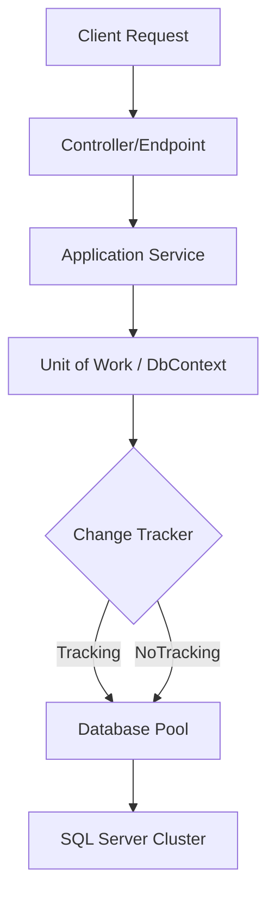

# EF Core DbContext: Arquitectura y Escalabilidad [Senior]

## 1. Contexto General & Definición del Concepto
El `DbContext` de EF Core actúa como la implementación del patrón Unit of Work y Repository. En sistemas distribuidos de alta carga, no es solo un puente de datos; es el guardián de la integridad transaccional dentro del bounded context. A nivel senior, el reto es balancear el *Change Tracking* con la latencia p99 y el uso de memoria bajo concurrencia elevada.

## 2. Forma de Aplicación, Buenas Prácticas & Ventajas
### Matriz de Trade-offs

| Característica | Enfoque Tracking (Default) | Enfoque AsNoTracking | Trade-off |
| :--- | :--- | :--- | :--- |
| **Performance** | Baja (CPU/RAM Overhead) | Alta (Optimizado) | Se pierde autogestión de cambios |
| **Consistencia** | Alta (Estado sincronizado) | Eventual / Read-only | Requiere manejo manual de estados |
| **Escalabilidad** | Limitada por bloqueos | Alta (Ideal para consultas) | Complejidad en la capa de persistencia |

## 3. Flujo Arquitectónico


## 4. Implementación en .NET 10
```csharp
public sealed class ApplicationDbContext : DbContext
{
    public ApplicationDbContext(DbContextOptions<ApplicationDbContext> options) : base(options) 
    {
        // Optimización de rendimiento para sistemas de alto throughput
        ChangeTracker.QueryTrackingBehavior = QueryTrackingBehavior.NoTracking;
    }

    public async Task<int> SaveChangesOptimizedAsync(CancellationToken ct = default)
    {
        // Implementación de intercepción para auditoría o outbox pattern
        return await SaveChangesAsync(ct);
    }
}
// Uso en servicio mediante Inyección de Dependencias scoped
public record UserRecord(Guid Id, string Email);
```

## 5. Implementación en React con Vite.js
```typescript
// API Service resiliente usando un patrón de estados reactivos
import { useQuery } from '@tanstack/react-query';

export const useUserData = (userId: string) => {
  return useQuery({
    queryKey: ['user', userId],
    queryFn: async () => {
      const response = await fetch(`/api/users/${userId}`);
      if (!response.ok) throw new Error('Network failure');
      return response.json();
    },
    staleTime: 1000 * 60 * 5, // Consistencia optimizada para reducir carga al DbContext
  });
};
```

## 6. Consideraciones de Concurrencia
Para evitar *Race Conditions* al usar EF Core, es imperativo implementar `Optimistic Locking` utilizando una columna `RowVersion` (Timestamp). Esto minimiza el bloqueo en el servidor de base de datos, mejorando el throughput en arquitecturas de microservicios.

## 7. Enlaces y Referencias en Obsidian
- [[repository-unit-of-work-pattern-senior]]
- [[Clean-Architecture-Senior-Implementation]]
- [[estrategias-concurrencia-sql-server]]
