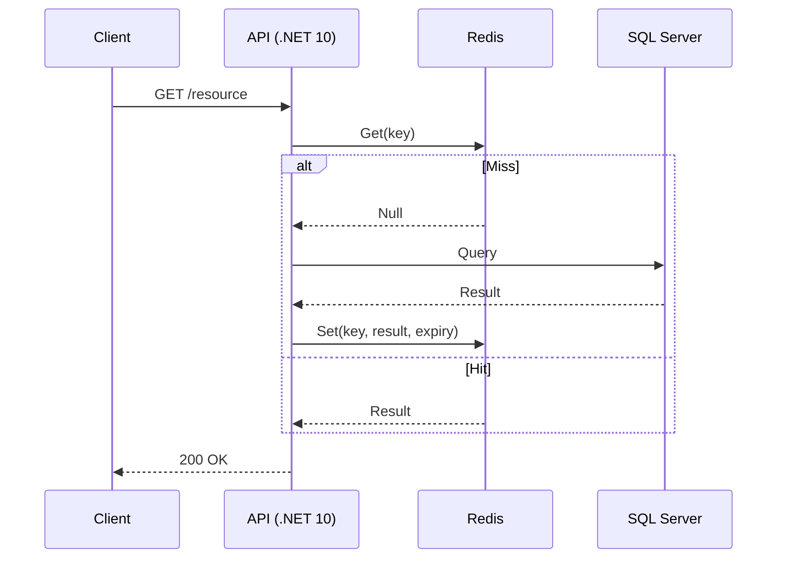

# Estrategias de Caché Distribuido [Senior]

## 1. Contexto General & Definición del Concepto
El caché distribuido es un componente crítico en la arquitectura de microservicios para reducir la latencia p99 y proteger a los almacenes de datos persistentes (RDBMS/NoSQL) bajo cargas de tráfico intensas. En sistemas a escala, no solo buscamos almacenar datos, sino gestionar la consistencia y la invalidación a través de múltiples nodos.

## 2. Forma de Aplicación, Buenas Prácticas & Ventajas
El uso de caché distribuido (e.g., Redis, NCache) es vital cuando el *throughput* excede la capacidad de I/O de la base de datos. Sin embargo, su mala implementación genera el efecto "Thundering Herd".

| Característica | Cache-Aside (Lazy) | Write-Through | Read-Through |
| :--- | :--- | :--- | :--- |
| **Latencia Lectura** | Baja (post-miss) | Muy baja | Muy baja |
| **Consistencia** | Eventual | Alta | Alta |
| **Complejidad** | Media | Alta | Alta |
| **Resiliencia** | Alta | Baja (Punto único) | Media |

## 3. Flujo Arquitectónico y Diagrama (Mermaid)


## 4. Implementación y Ejemplos Prácticos en C# / .NET 10
Utilizamos `IDistributedCache` con estrategias de serialización eficientes mediante `System.Text.Json` y patrones de resiliencia con `Polly`.

```csharp
public interface ICacheService { Task<T?> GetAsync<T>(string key); Task SetAsync<T>(string key, T value, TimeSpan ttl); }

public class DistributedCacheService(IDistributedCache cache) : ICacheService
{
    public async Task<T?> GetAsync<T>(string key) => 
        JsonSerializer.Deserialize<T>(await cache.GetStringAsync(key) ?? "null");

    public async Task SetAsync<T>(string key, T value, TimeSpan ttl) =>
        await cache.SetStringAsync(key, JsonSerializer.Serialize(value), new DistributedCacheEntryOptions { AbsoluteExpirationRelativeToNow = ttl });
}
```

## 5. Implementación y Ejemplos Prácticos en React con Vite.js
Para el frontend, implementamos un *SWR* (Stale-While-Revalidate) para asegurar una experiencia de usuario fluida, minimizando el impacto de los *cache misses*.

```typescript
import useSWR from 'swr';

const fetcher = (url: string) => fetch(url).then(r => r.json());

export const useResource = (id: string) => {
  const { data, error } = useSWR(`/api/resource/${id}`, fetcher, {
    revalidateIfStale: false,
    revalidateOnFocus: false,
    dedupingInterval: 60000 // 1 minuto de caché local
  });
  return { data, isLoading: !error && !data, error };
};
```

## 6. Consideraciones de Concurrencia, Consistencia y Rendimiento
- **Consistencia**: Evaluar siempre el balance entre latencia y frescura del dato (Teorema PACELC).
- **Race Conditions**: Usar `RedLock` en .NET si la actualización del caché requiere atomicidad distribuida.
- **Observabilidad**: Monitorear métricas de `Cache Hit Ratio` mediante OpenTelemetry para ajustar los tiempos de TTL dinámicamente.

## 7. Enlaces y Referencias en Obsidian
- [[Teorema-CAP-y-PACELC]]
- [[Distributed-Caching-Redis-Cache-Aside]]
- [[CQRS-y-Event-Sourcing]]
