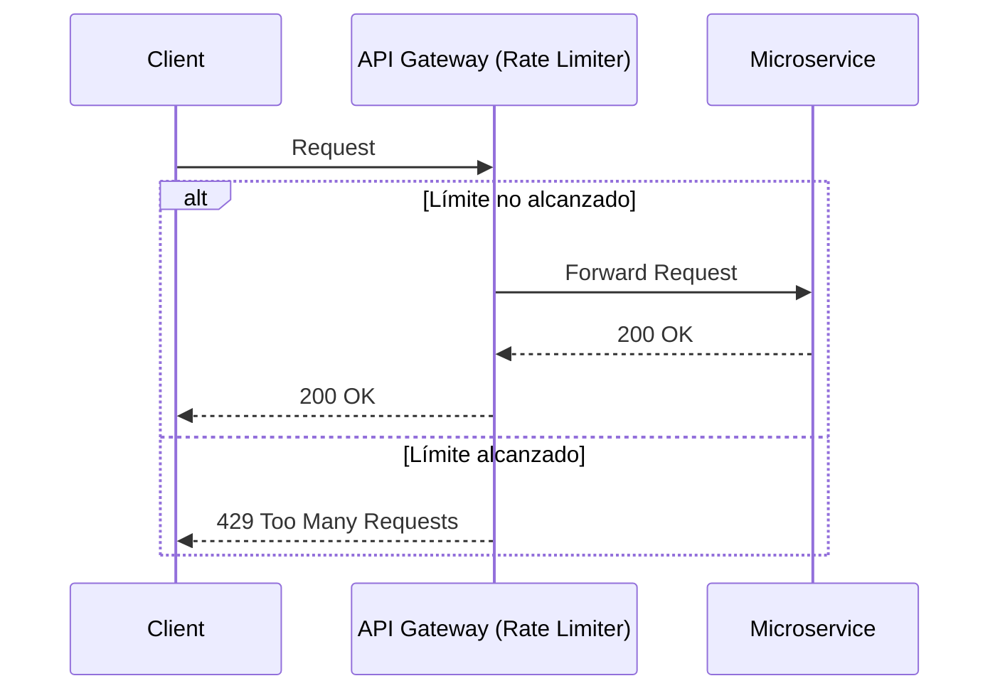

# Rate Limiting & Throttling en Sistemas Distribuidos [Senior]

## 1. Contexto General & Definición del Concepto
El *Rate Limiting* y el *Throttling* son mecanismos críticos de defensa y control de flujo en arquitecturas distribuidas. Mientras el Rate Limiting impone un límite rígido de solicitudes por ventana de tiempo, el Throttling modula el tráfico para mantener la estabilidad del sistema bajo carga.

Resuelven problemas de *Cascading Failures*, protección contra ataques DoS, gestión de SLAs y optimización de recursos compartidos (como bases de datos o servicios downstream).

## 2. Forma de Aplicación, Buenas Prácticas & Ventajas
### Matriz de Trade-offs

| Estrategia | Ventajas | Desventajas / Costos |
| :--- | :--- | :--- |
| **Token Bucket** | Flexibilidad, permite bursts | Requiere estado compartido (Redis) |
| **Fixed Window** | Implementación simple | Problemas en bordes de ventana |
| **Leaky Bucket** | Flujo de salida constante | Latencia artificial incrementada |

## 3. Flujo Arquitectónico y Diagrama (Mermaid)


## 4. Implementación y Ejemplos Prácticos en C# / .NET 10
Utilizando `Microsoft.AspNetCore.RateLimiting` con un almacén de Redis para consistencia distribuida:

```csharp
builder.Services.AddRateLimiter(options => {
    options.AddFixedWindowLimiter("policy-nacional", opt => {
        opt.Window = TimeSpan.FromSeconds(10);
        opt.PermitLimit = 100;
        opt.QueueLimit = 0;
        opt.QueueProcessingOrder = QueueProcessingOrder.OldestFirst;
    });
});

// En el endpoint
app.MapPost("/api/v1/process", () => Results.Ok())
   .RequireRateLimiting("policy-nacional");
```

## 5. Implementación y Ejemplos Prácticos en React con Vite.js
Implementación de un interceptor de Axios con manejo de estados para peticiones rate-limited:

```typescript
import axios from 'axios';

const apiClient = axios.create({ baseURL: '/api' });

apiClient.interceptors.response.use(null, (error) => {
  if (error.response?.status === 429) {
    const retryAfter = error.response.headers['retry-after'] || 5;
    // Implementar lógica de UI (toast, spinner con cuenta regresiva)
    console.warn(`Rate limit excedido. Reintente en ${retryAfter} segundos.`);
  }
  return Promise.reject(error);
});
```

## 6. Consideraciones de Concurrencia, Consistencia y Rendimiento
En sistemas de alta escala, la latencia p99 es afectada por la comprobación del limitador. Se recomienda el uso de *Sidecars* (Envoy) o *API Gateways* para mover esta lógica fuera del servicio de negocio. La sincronización distribuida debe evitar *race conditions* usando scripts Lua en Redis (`INCR` + `EXPIRE` en una operación atómica).

## 7. Enlaces y Referencias en Obsidian
- [[circuit-breaker-retry-fallback]]
- [[Estrategias-Cache-Distribuido-Senior]]
- [[Teorema-CAP-y-PACELC-Senior]]
