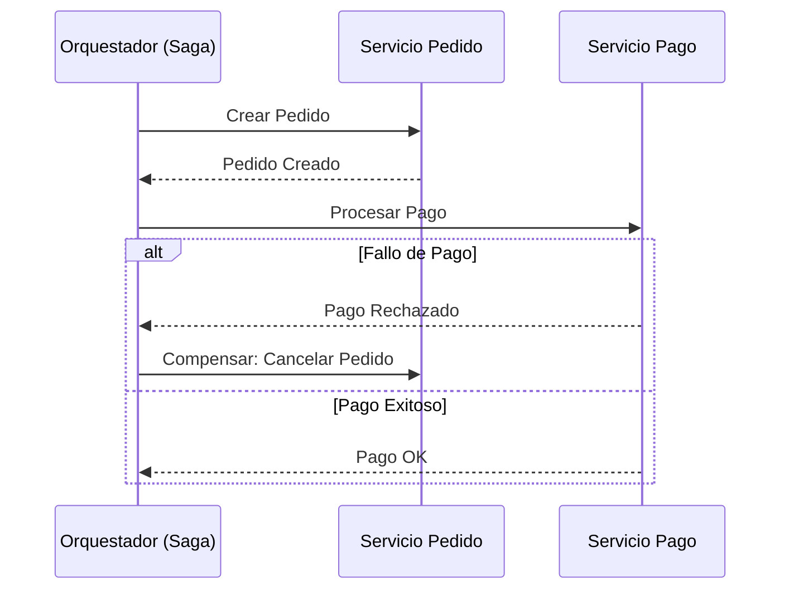

# Saga Pattern: Orquestación vs. Coreografía [Senior]

## 1. Contexto General & Definición del Concepto
El patrón Saga gestiona la consistencia de datos en sistemas distribuidos donde las transacciones ACID locales no son aplicables a través de múltiples microservicios. Se basa en una secuencia de transacciones locales, donde cada una actualiza el estado y publica un evento/mensaje para disparar la siguiente. Si un paso falla, se ejecutan transacciones compensatorias para revertir los cambios (consistencia eventual).

## 2. Forma de Aplicación, Buenas Prácticas & Ventajas
- **Orquestación:** Un controlador central (Orquestador) dicta el flujo. Ideal para flujos de negocio complejos con muchas dependencias.
- **Coreografía:** Comunicación basada en eventos sin un punto central. Alta desacoplamiento pero difícil de monitorizar.

| Criterio | Orquestación | Coreografía |
| :--- | :--- | :--- |
| Complejidad | Alta (Centralizada) | Baja (Descentralizada) |
| Acoplamiento | Bajo | Muy Bajo |
| Visibilidad | Clara (Estado central) | Difusa (Requiere traza distribuida) |
| Mantenimiento | Difícil (Punto único de fallo) | Fácil (Escala independiente) |

## 3. Flujo Arquitectónico y Diagrama (Mermaid)


## 4. Implementación y Ejemplos Prácticos en C# / .NET 10
Utilizando C# 10 records y patrones de diseño asíncronos para transacciones compensatorias.

```csharp
public record SagaContext(Guid CorrelationId, decimal Amount);

public interface ICompensableCommand<T> {
    Task ExecuteAsync(T context);
    Task CompensateAsync(T context);
}

public class PaymentSagaStep : ICompensableCommand<SagaContext> {
    public async Task ExecuteAsync(SagaContext ctx) {
        // Integración con pasarela de pagos vía HttpClient con Polly
    }
    public async Task CompensateAsync(SagaContext ctx) {
        // Lógica de refund o reversión de estado
    }
}
```

## 5. Implementación y Ejemplos Prácticos en React con Vite.js
En el frontend, el patrón Saga se manifiesta a través de UI optimista y manejo de estados intermedios.

```tsx
const useSagaMutation = () => {
  const [status, setStatus] = useState<'idle' | 'processing' | 'rolled-back'>('idle');
  
  const executeOrder = async (data: any) => {
    setStatus('processing');
    try {
      await api.post('/orders', data);
    } catch (e) {
      setStatus('rolled-back');
      toast.error('Operación fallida, revirtiendo cambios...');
    }
  };
  return { status, executeOrder };
};
```

## 6. Consideraciones de Concurrencia, Consistencia y Rendimiento
Para sistemas de alta carga, es crítico implementar [[Idempotencia-en-APIs-y-Consumidores-de-Eventos]]. La latencia p99 se ve afectada por el número de pasos en la saga; use almacenamiento de estado persistente (Redis o base de datos relacional) para los orquestadores a fin de asegurar que, ante una caída, la saga pueda reanudarse desde el último estado conocido.

## 7. Enlaces y Referencias en Obsidian
- [[Transactional-Outbox-Pattern]]
- [[CAP-y-Eventual-Consistency]]
- [[CQRS-Arquitectura-Distribuida]]
