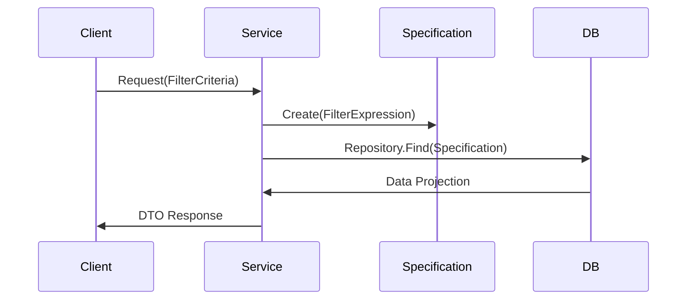

# Specification Pattern con Expression Trees [Senior]

## 1. Contexto General & Definición del Concepto
El Specification Pattern, potenciado por `Expression Trees` en .NET, permite encapsular reglas de negocio o criterios de filtrado como objetos de primera clase. En sistemas distribuidos complejos, este patrón desacopla la lógica de selección de datos (Query) de la ejecución en persistencia, permitiendo componer criterios dinámicos sin exponer la infraestructura al dominio.

## 2. Forma de Aplicación, Buenas Prácticas & Ventajas
- **Cuándo aplicar:** Reglas de negocio altamente dinámicas, filtrado complejo en repositorios, políticas de seguridad basadas en datos.
- **Cuándo evitar:** Consultas triviales donde el overhead de `Expression Trees` supera la ganancia de mantenibilidad.

### Matriz de Trade-offs
| Dimensión | Ventaja | Desventaja / Costo |
| :--- | :--- | :--- |
| **Mantenibilidad** | Alta cohesión de reglas | Curva de aprendizaje técnica |
| **Performance** | Ejecución nativa en DB (SQL) | Posible complejidad en debugging |
| **Flexibilidad** | Composición fluida | Riesgo de acoplamiento al esquema DB |

## 3. Flujo Arquitectónico


## 4. Implementación en C# .NET 10
```csharp
public abstract record Specification<T>(Expression<Func<T, bool>> Criteria);

public class UserActiveSpecification : Specification<User> {
    public UserActiveSpecification() : base(u => u.IsActive && u.LastLogin > DateTime.UtcNow.AddMonths(-6)) { }
}

public async Task<List<User>> GetUsersAsync(Specification<User> spec) {
    return await _context.Users.Where(spec.Criteria).ToListAsync();
}
```

## 5. Implementación en React + Vite.js
Para el frontend, la especificación se traduce en un objeto de configuración que se serializa hacia el API.
```typescript
interface FilterSpec { field: string; operator: 'eq' | 'gt'; value: any; }

const useDataFetching = (spec: FilterSpec) => {
  const [data, setData] = useState(null);
  useEffect(() => {
    api.post('/query', { spec }).then(res => setData(res.data));
  }, [JSON.stringify(spec)]);
  return data;
};
```

## 6. Consideraciones de Concurrencia y Rendimiento
El uso de `Expression Trees` es eficiente porque el ORM (EF Core) traduce el árbol a SQL puro, evitando traer datos innecesarios a memoria. A nivel de concurrencia, asegurar que las especificaciones sean inmutables es crucial para evitar condiciones de carrera en el estado del repositorio.

## 7. Enlaces y Referencias en Obsidian
- [[CQRS-y-Event-Sourcing]]
- [[Clean-Architecture-DDD-en-DotNet10]]
