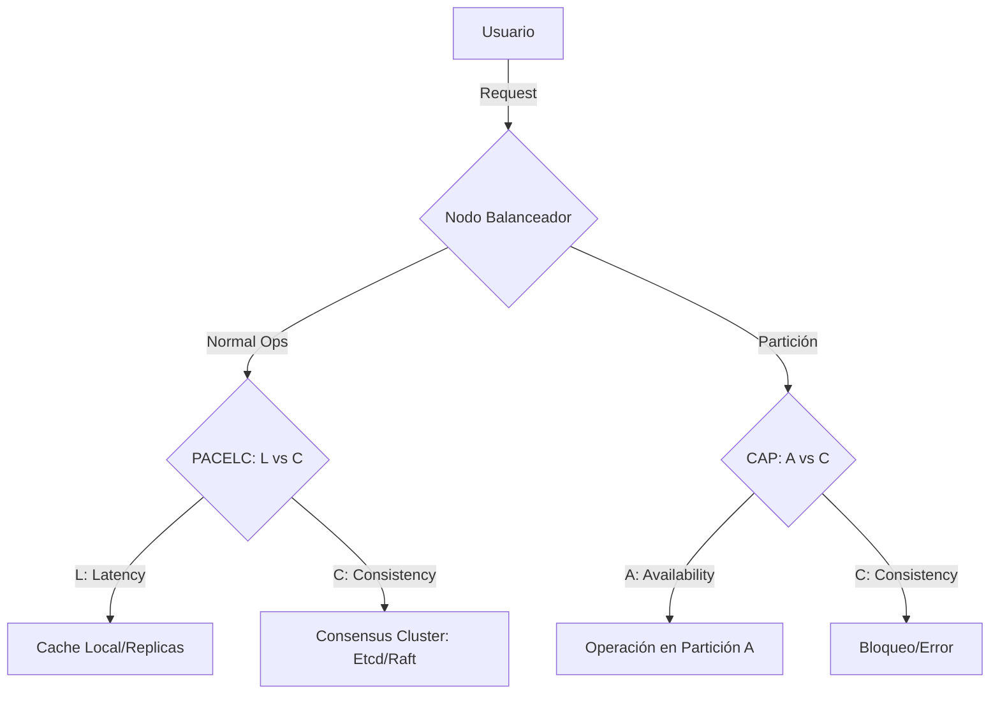

# Análisis Profundo: Teorema CAP y PACELC [Senior]

## 1. Contexto General & Definición del Concepto
El **Teorema CAP** establece que en sistemas distribuidos particionados (P), solo podemos elegir entre Consistencia (C) o Disponibilidad (A). Sin embargo, CAP es insuficiente en condiciones de operación normal. **PACELC** extiende esto: (P)artición -> elijo entre (A)vailability o (C)onsistency; (E)lse (en operación normal) -> elijo entre (L)atency o (C)onsistency.

## 2. Forma de Aplicación, Buenas Prácticas & Ventajas
Aplicar PACELC permite decidir el comportamiento del sistema cuando no hay fallos, priorizando la latencia (Cache/Eventual) o la consistencia (Strong/Linearizable).

| Criterio | Consistencia Fuerte | Disponibilidad / Latencia |
| :--- | :--- | :--- |
| **Ideal para** | Finanzas, Inventario crítico | Social Media, Feed de noticias |
| **Trade-off** | Mayor Latencia (p99 alto) | Datos obsoletos (Stale data) |
| **Complejidad** | Alta (Consensus protocols) | Media (Conflict resolution) |

## 3. Flujo Arquitectónico y Diagrama


## 4. Implementación en C# .NET 10
Utilizando `System.Threading.Channels` y patrones de resiliencia con Polly para manejar consistencia eventual vs fuerte.

```csharp
public record DataConsistencyResult<T>(T Data, bool IsConsistent);

public class DistributedStoreService(IRedisCache cache, IDataRepository repo) {
    public async Task<DataConsistencyResult<T>> GetItemAsync<T>(string id, bool forceConsistent) {
        if (!forceConsistent) {
            var cached = await cache.GetAsync<T>(id);
            if (cached != null) return new(cached, false);
        }
        // Path: Consistencia Fuerte (Raft/Paxos o DB Directo)
        var fresh = await repo.GetByIdAsync(id);
        await cache.SetAsync(id, fresh);
        return new(fresh, true);
    }
}
```

## 5. Implementación en React con Vite.js
Uso de un hook para manejar la estrategia de UI según el NFR de consistencia.

```typescript
const useDistributedData = <T>(key: string, strategy: 'consistent' | 'fast') => {
  const [data, setData] = useState<T | null>(null);
  
  useEffect(() => {
    const fetchData = async () => {
      // Si strategy es 'fast', podríamos omitir validación de servidor
      const response = await fetch(`/api/data/${key}?consistency=${strategy}`);
      setData(await response.json());
    };
    fetchData();
  }, [key, strategy]);

  return data;
};
```

## 6. Consideraciones de Concurrencia y Rendimiento
- **Consistencia Eventual**: Usar `Versioned Entities` o `Vector Clocks` para detectar conflictos.
- **Lecturas Optimistas**: Minimizar bloqueos en .NET con `SemaphoreSlim` a nivel de proceso o distribuido con Redis Redlock para proteger estados críticos.
- **Observabilidad**: Monitorear p99 de latencia; un aumento súbito suele indicar contención en el consensus layer (Raft/Paxos).

## 7. Enlaces y Referencias
- [[CAP-y-Eventual-Consistency]]
- [[CQRS-Arquitectura-Distribuida]]
- [[Saga-Pattern-Orquestacion-vs-Coreografia]]
