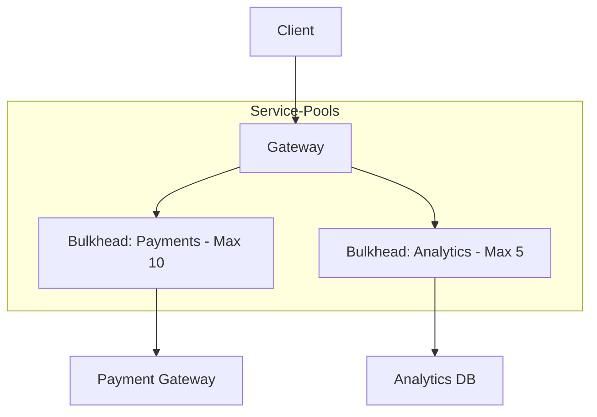

# Bulkhead Pattern - Aislamiento de Recursos [Senior]

## 1. Contexto General & Definición del Concepto
El patrón **Bulkhead** (mamparo) toma su nombre de las secciones estancas de un barco: si una sección se inunda, el resto permanece a flote. En sistemas distribuidos, consiste en particionar los recursos de un servicio (hilos, conexiones, memoria, colas) para evitar que una falla catastrófica en un componente (ej. API externa lenta) agote los recursos de todo el sistema. Resuelve el problema de la **Cascading Failure**.

## 2. Forma de Aplicación, Buenas Prácticas & Ventajas
Se aplica cuando existen dependencias externas o procesos de distinta prioridad. No usar si la sobrecarga de gestión de particiones supera el beneficio de resiliencia.

| Ventaja | Desventaja / Costo |
| :--- | :--- |
| Aislamiento total de fallos | Mayor complejidad operativa |
| Mejora del SLA global (latencia p99) | Consumo de memoria/CPU redundante |
| Control granular de concurrencia | Configuración de límites delicada |

## 3. Flujo Arquitectónico y Diagrama


## 4. Implementación en C# .NET 10
Usamos `SemaphoreSlim` para limitar la concurrencia por dominio de servicio, integrando con `Polly.Core`.

```csharp
public class BulkheadResilienceStrategy
{
    private readonly SemaphoreSlim _paymentSemaphore = new(10); // Límite de 10

    public async Task<Result> ProcessPaymentAsync(PaymentRequest req)
    {
        if (!await _paymentSemaphore.WaitAsync(TimeSpan.FromMilliseconds(500)))
            throw new BulkheadRejectedException("Recurso saturado");

        try
        {
            return await _paymentClient.ExecuteAsync(req);
        }
        finally
        {
            _paymentSemaphore.Release();
        }
    }
}
```

## 5. Implementación en React con Vite.js
En el frontend, el bulkhead se traduce en aislar los intentos de red mediante colas de promesas o pools de peticiones para no bloquear el hilo principal (UI).

```typescript
const bulkhead = (limit: number) => {
  let active = 0;
  const queue: (() => void)[] = [];
  return async <T>(fn: () => Promise<T>): Promise<T> => {
    if (active >= limit) await new Promise<void>(resolve => queue.push(resolve));
    active++;
    try { return await fn(); }
    finally {
      active--;
      if (queue.length > 0) queue.shift()!();
    }
  };
};
```

## 6. Consideraciones de Concurrencia, Consistencia y Rendimiento
El patrón impacta en la **disponibilidad**. Un bulkhead muy restrictivo genera falsos positivos (rechazos cuando el sistema aún tolera carga). Debe ser monitoreado mediante métricas de `rejected_requests` y latencia por bucket. En escenarios de alta concurrencia, el uso de *Backpressure* es obligatorio para completar el aislamiento.

## 7. Enlaces y Referencias en Obsidian
- [[CQRS-y-Event-Sourcing]]
- [[CAP-y-Eventual-Consistency]]
