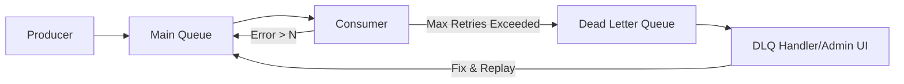

# Patrón Dead Letter Queue (DLQ) y Gestión de Mensajes Envenenados [Senior]

## 1. Contexto General & Definición del Concepto
Un mensaje envenenado (*poison message*) es aquel que causa un fallo irrecuperable en el consumidor (ej. un formato de payload inválido, excepciones de negocio no controladas). Si no se gestionan, bloquean la cola, degradan el throughput y aumentan la latencia p99 debido a reintentos infinitos.

La **DLQ (Dead Letter Queue)** es una cola secundaria donde se redirigen estos mensajes tras alcanzar un umbral de reintentos (*max-delivery-count*), permitiendo la observabilidad, el diagnóstico forense y la recuperación sin detener el pipeline de procesamiento principal.

## 2. Forma de Aplicación, Buenas Prácticas & Ventajas
- **Cuándo aplicar:** Indispensable en sistemas basados en eventos (RabbitMQ, Azure Service Bus, Kafka) donde la consistencia eventual y la resiliencia son críticos.
- **Antipatrón:** Implementar DLQs para errores de red transitorios (esos deben manejarse con *Exponential Backoff* antes de ir a la DLQ).

### Matriz de Trade-offs
| Dimensión | DLQ Implementado | Sin DLQ |
| :--- | :--- | :--- |
| **Resiliencia** | Alta: El sistema sigue vivo | Baja: Bloqueo de hilos/colas |
| **Complejidad** | Media: Requiere monitorización | Baja: Inicialmente |
| **Observabilidad** | Excelente: Registro de errores | Nula: Datos perdidos |
| **Costo Operativo** | Gestión de mensajes erróneos | Alto: Debugging crítico |

## 3. Flujo Arquitectónico y Diagrama (Mermaid)


## 4. Implementación y Ejemplos Prácticos en C# / .NET 10
Utilizando *MassTransit* con .NET 10 para una arquitectura robusta de consumidores:

```csharp
public class ProcessOrderConsumer : IConsumer<ProcessOrderCommand>
{
    public async Task Consume(ConsumeContext<ProcessOrderCommand> context)
    {
        try 
        {
            // Lógica de negocio con C# 10 features
            await _orderService.ValidateAsync(context.Message);
        }
        catch (InvalidOperationException ex) 
        {
            // No reintentar si el mensaje está mal formado, enviar directo a DLQ
            throw new PoisonMessageException("Payload corrupto", ex);
        }
    }
}

// Configuración del Endpoint
cfg.ReceiveEndpoint("order-service", e => {
    e.UseMessageRetry(r => r.Exponential(5, TimeSpan.FromSeconds(1), TimeSpan.FromSeconds(30), TimeSpan.FromSeconds(5)));
    e.ConfigureDeadLetterQueue("order-service-error");
});
```

## 5. Implementación y Ejemplos Prácticos en React con Vite.js
En el frontend, la resiliencia se aplica mediante *Optimistic Updates* y *Error Boundaries* para gestionar fallos cuando el backend rechaza una petición tras un fallo de procesamiento en la cola.

```typescript
const useOrderAction = () => {
  return useMutation({
    mutationFn: (data: Order) => apiClient.post('/orders', data),
    onError: (err: AxiosError) => {
       if (err.response?.status === 422) {
          toast.error("El formato del pedido es inválido. Contacte soporte.");
          // Trigger monitorización de error en el dashboard
       }
    }
  });
};
```

## 6. Consideraciones de Concurrencia, Consistencia y Rendimiento
1. **Idempotencia:** El reintento de mensajes debe ser estrictamente idempotente para evitar duplicados en la base de datos (ver [[idempotent-consumer-sql-deduplication]]).
2. **Orden:** Las DLQ suelen romper el orden de procesamiento. Si el orden es mandatorio, se requiere una estrategia de *Sequence Tracking*.
3. **Backpressure:** La acumulación de mensajes en la DLQ puede saturar el almacenamiento; implementar una política de expiración (TTL) es fundamental.

## 7. Enlaces y Referencias en Obsidian
- [[CQRS-y-Event-Sourcing]]
- [[Bulkhead-Pattern-Aislamiento-Recursos]]
- [[Transactional-Outbox-Pattern]]
