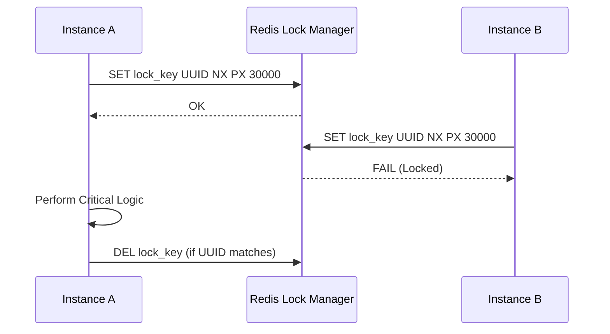

# Patrones de Bloqueos Distribuidos [Senior]

## 1. Contexto General & Definición del Concepto
El bloqueo distribuido es un mecanismo de sincronización que garantiza la exclusión mutua en sistemas distribuidos donde múltiples instancias de servicio compiten por un recurso compartido (BD, archivo, API externa). A diferencia de los mutexes locales, estos deben ser persistentes y tolerantes a fallos (ej: si el nodo que sostiene el lock muere, no debe quedar un bloqueo huérfano indefinidamente).

## 2. Forma de Aplicación, Buenas Prácticas & Ventajas
- **Cuándo aplicar:** Operaciones de escritura críticas, orquestación de procesos de larga duración, evitar condiciones de carrera en lógica de negocio multi-nodo.
- **Antipatrón:** No uses bloqueos distribuidos para reducir la latencia de lectura; prefiere el versionado o el bloqueo optimista.

### Matriz de Trade-offs
| Dimensión | Bloqueo Pesimista (Redis) | Bloqueo Optimista (ETag/Version) |
| :--- | :--- | :--- |
| **Latencia** | Alta (Network Roundtrip) | Baja (Local check) |
| **Throughput** | Limitado por el Lock Manager | Muy Alto |
| **Complejidad** | Media (Fencing Tokens/Leases) | Alta (Manejo de conflictos/Retries) |
| **Resiliencia** | Requiere Heartbeat | Requiere idempotencia |

## 3. Flujo Arquitectónico


## 4. Implementación en C# .NET 10
Utilizando un enfoque moderno con `IDistributedLock` y el patrón *Fencing Token* para evitar problemas de desfase de reloj.

```csharp
public record LockResult(bool Acquired, string Token);

public async Task<LockResult> AcquireLockAsync(string resourceKey, TimeSpan ttl)
{
    var token = Guid.NewGuid().ToString();
    // .NET 10: Uso de StackExchange.Redis con soporte async nativo
    var acquired = await _database.StringSetAsync(resourceKey, token, ttl, When.NotExists);
    return new LockResult(acquired, token);
}

// Uso en un Service层
public async Task ProcessOrderAsync(Guid orderId)
{
    var lockKey = $ "order_lock_{orderId}";
    var result = await _lockProvider.AcquireLockAsync(lockKey, TimeSpan.FromSeconds(10));
    if (!result.Acquired) throw new ConcurrencyException("Recurso ocupado");
    
    try { /* Logica de negocio */ }
    finally { await _lockProvider.ReleaseLockAsync(lockKey, result.Token); }
}
```

## 5. Implementación en React con Vite.js
En el frontend, el bloqueo se gestiona mediante estados de UI y el manejo de peticiones idempotentes.

```tsx
export const useDistributedLock = (resourceId: string) => {
  const [isLocked, setIsLocked] = useState(false);

  const executeWithLock = async (action: () => Promise<void>) => {
    try {
      setIsLocked(true);
      // Implementar reintentos con exponential backoff
      await apiClient.post(`/locks/${resourceId}/acquire`);
      await action();
    } catch (err) {
      console.error("Lock conflict", err);
    } finally {
      await apiClient.delete(`/locks/${resourceId}`);
      setIsLocked(false);
    }
  };

  return { isLocked, executeWithLock };
};
```

## 6. Consideraciones de Concurrencia, Consistencia y Rendimiento
- **Fencing Tokens:** En sistemas de alta escala, el servidor debe validar un contador (o timestamp) para asegurar que el nodo tiene el lock vigente y no es un zombie por GC pauses.
- **Observabilidad:** Monitoriza el tiempo de vida de los bloqueos. Bloqueos que exceden el TTL promedio son indicadores de ineficiencias en los procesos.

## 7. Enlaces y Referencias
- [[CAP-y-Eventual-Consistency]]
- [[Distributed-Locks-Redis-Pattern]]
- [[Optimistic-vs-Pessimistic-Locking]]
