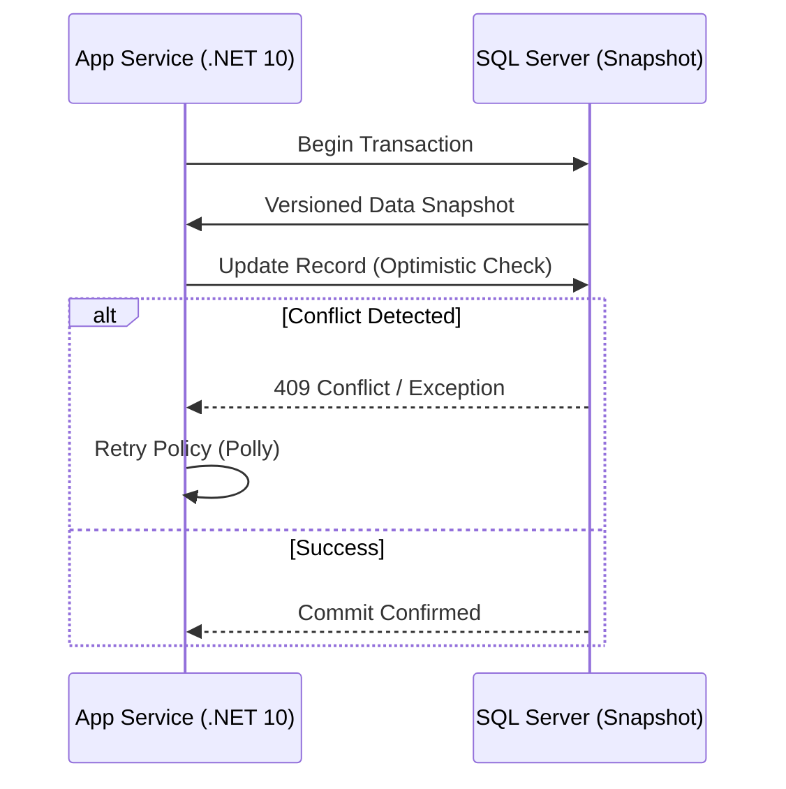

# Estrategias Avanzadas de Concurrencia en SQL Server [Senior]

## 1. Contexto General & Definición del Concepto
En sistemas de alta carga, la gestión de la concurrencia en SQL Server no se limita a elegir entre READ COMMITTED o SERIALIZABLE. Como arquitectos, debemos balancear el throughput (transacciones por segundo) contra la integridad de los datos (aislamiento). La concurrencia efectiva minimiza el "lock contention" y evita deadlocks críticos mediante el uso de Row Versioning (Snapshot Isolation) y estrategias de bloqueo optimista en la capa de aplicación.

## 2. Forma de Aplicación, Buenas Prácticas & Ventajas
El uso de `READ_COMMITTED_SNAPSHOT` es el estándar de la industria para aplicaciones modernas, permitiendo que los lectores no bloqueen a los escritores. 

| Estrategia | Ventaja | Desventaja | Uso Ideal |
| :--- | :--- | :--- | :--- |
| Optimistic | Alta escalabilidad | Requiere manejo de conflictos | Entornos de lectura intensiva |
| Pessimistic | Garantía fuerte de consistencia | Riesgo de deadlocks | Operaciones financieras críticas |
| Snapshot | Sin bloqueos de lectura | Consumo de `tempdb` | Sistemas web de alta concurrencia |

## 3. Flujo Arquitectónico


## 4. Implementación y Ejemplos Prácticos en C# / .NET 10
Utilizando Entity Framework Core 10 con control de concurrencia basado en tokens de versión (RowVersion).

```csharp
public record ProductUpdate(Guid Id, decimal NewPrice, byte[] RowVersion);

public async Task UpdatePriceAsync(ProductUpdate cmd, CancellationToken ct) {
    var product = await _context.Products.FindAsync(cmd.Id, ct);
    _context.Entry(product).Property("RowVersion").OriginalValue = cmd.RowVersion;
    product.Price = cmd.NewPrice;
    
    try {
        await _context.SaveChangesAsync(ct);
    } catch (DbUpdateConcurrencyException ex) {
        // Manejo de conflicto: Re-leer o notificar cliente
        throw new ConcurrencyException("El registro fue modificado por otro proceso.", ex);
    }
}
```

## 5. Implementación y Ejemplos Prácticos en React con Vite.js
Implementación de UI optimista para mejorar la latencia percibida, con manejo de rollback tras fallos de concurrencia.

```tsx
const useUpdateProduct = () => {
  const [isUpdating, setIsUpdating] = useState(false);
  const updateProduct = async (data: Product) => {
    setIsUpdating(true);
    try {
      await api.put('/products', data);
    } catch (err: any) {
      if (err.response?.status === 409) {
        toast.error("El producto ha cambiado, recargando datos...");
        mutate('/products'); // Revalidate SWR/React Query
      }
    } finally {
      setIsUpdating(false);
    }
  };
  return { updateProduct, isUpdating };
};
```

## 6. Consideraciones de Concurrencia, Consistencia y Rendimiento
- **Latencia p99**: Las estrategias pesimistas aumentan el tiempo de espera en la cola de bloqueos (Lock Wait Time).
- **Observabilidad**: Monitorear `sys.dm_os_waiting_tasks` es obligatorio en SQL Server para detectar contención.
- **Resiliencia**: Siempre implementar *Exponential Backoff* para reintentar transacciones que fallan por concurrencia optimista.

## 7. Enlaces y Referencias en Obsidian
- [[Optimistic-vs-Pessimistic-Locking]]
- [[CQRS-Arquitectura-Distribuida]]
- [[EF-Core-DbContext-Arquitectura-Avanzada]]
