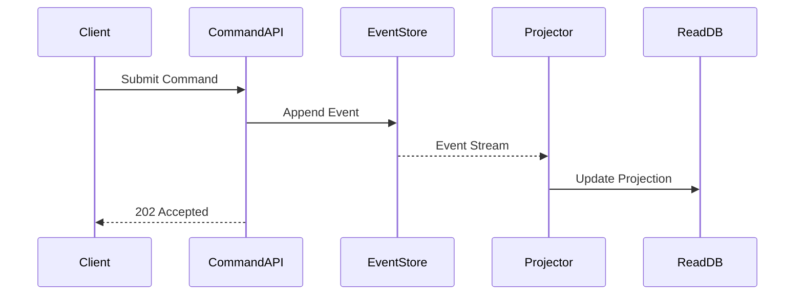

# Event Sourcing & CQRS Sync [Senior]

## 1. Contexto General & Definición del Concepto
El patrón Event Sourcing (ES) almacena el estado de una entidad como una serie de eventos inmutables en lugar de un estado actual. CQRS separa las operaciones de lectura (Query) de las de escritura (Command). La sincronización es el desafío crítico de propagar cambios del Event Store a las Read Models mediante un bus de eventos (Proyecciones), asegurando la consistencia eventual.

## 2. Forma de Aplicación, Buenas Prácticas & Ventajas
Aplicar en dominios de alta complejidad transaccional donde el audit trail y el análisis temporal son mandatorios. Evitar en aplicaciones CRUD simples donde el overhead de infraestructura no justifica el ROI.

| Ventajas | Desventajas / Riesgos |
| :--- | :--- |
| Audit completo inmutable | Complejidad de versionado de eventos |
| Escalabilidad de lectura mediante proyecciones | Eventual consistency lag |
| Mejora en el throughput de escritura | Curva de aprendizaje y tooling |

## 3. Flujo Arquitectónico


## 4. Implementación .NET 10
```csharp
public record OrderCreated(Guid Id, decimal Amount, DateTime CreatedAt);

public class OrderAggregate {
    private List<object> _changes = new();
    public void Apply(OrderCreated e) => /* Logic */;
    
    public async Task HandleCommand(CreateOrder cmd) {
        var evt = new OrderCreated(Guid.NewGuid(), cmd.Amount, DateTime.UtcNow);
        _changes.Add(evt);
        await _eventStore.SaveAsync(evt);
    }
}
```

## 5. Implementación React + Vite
```tsx
import { useQuery, useMutation } from '@tanstack/react-query';

const OrderView = () => {
  const { data } = useQuery({ queryKey: ['orders'], queryFn: fetchOrders });
  const mutation = useMutation({ mutationFn: postCommand });

  // Manejo de UI con consistencia optimista
  return <button onClick={() => mutation.mutate({ amount: 100 })}>Place Order</button>;
};
```

## 6. Consideraciones de Concurrencia
- **Consistencia:** Utilizar versiones de eventos (Optimistic Locking) en el Event Store.
- **Latencia:** Minimizar lag entre la escritura y la proyección mediante observabilidad (OpenTelemetry).
- **Resiliencia:** Implementar el [[Transactional-Outbox-Pattern]] para garantizar que el evento sea publicado si o sí.

## 7. Enlaces y Referencias
- [[CQRS-y-Event-Sourcing]]
- [[Transactional-Outbox-Pattern]]
- [[CAP-y-Eventual-Consistency]]
