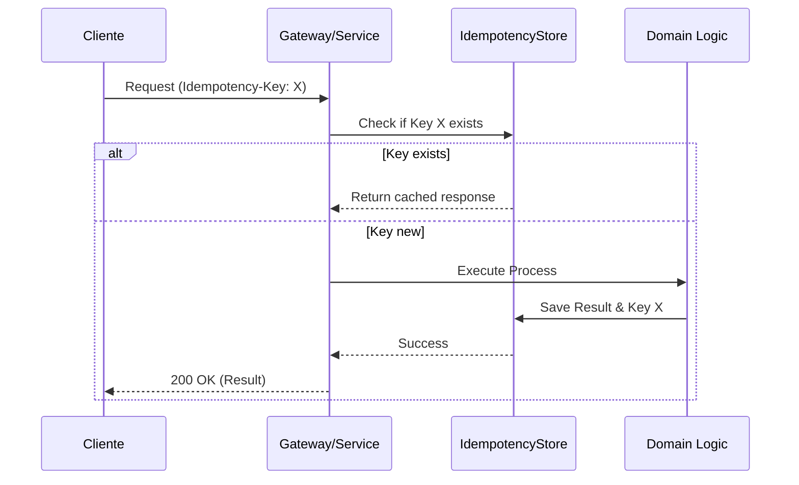

# Idempotencia en APIs y Consumidores de Eventos [Senior]

## 1. Contexto General & Definición del Concepto
La idempotencia es la propiedad de una operación donde múltiples ejecuciones producen el mismo efecto que una sola ejecución. En sistemas distribuidos, es el antídoto contra los fallos de red y los reintentos (retries) automáticos. Sin idempotencia, un fallo de red durante el ACK de un mensaje o respuesta HTTP puede causar duplicidad de estados, violando la integridad de negocio.

## 2. Forma de Aplicación, Buenas Prácticas & Ventajas
Se aplica cuando el coste de la inconsistencia es mayor que el coste de la implementación (e.g., procesos de pago, registros, transferencias). 

### Matriz de Trade-offs
| Dimensión | Ventajas | Desventajas / Costes |
| :--- | :--- | :--- |
| **Consistencia** | Alta: asegura integridad en eventos duplicados | Incremento en la latencia de escritura |
| **Resiliencia** | Permite reintentos agresivos sin miedo | Overhead de almacenamiento (Idempotency Keys) |
| **Complejidad** | Diseño robusto ante fallos parciales | Gestión de expiración de llaves (TTL) |

## 3. Flujo Arquitectónico y Diagrama


## 4. Implementación en .NET 10
Utilizamos un `ActionFilter` o `Middleware` basado en un `DistributedCache` (Redis) para verificar la clave antes de entrar al dominio.

```csharp
public record IdempotentResponse(int StatusCode, object? Body);

public class IdempotencyFilter(IDistributedCache cache) : IAsyncActionFilter {
    public async Task OnActionExecutionAsync(ActionExecutingContext context, ActionExecutionDelegate next) {
        if (!context.HttpContext.Request.Headers.TryGetValue("X-Idempotency-Key", out var key)) {
            await next(); return;
        }
        var cached = await cache.GetStringAsync(key!);
        if (cached != null) { context.Result = new OkObjectResult(JsonSerializer.Deserialize<IdempotentResponse>(cached)); return; }
        
        var result = await next();
        // Guardar resultado con TTL de 24h
        await cache.SetStringAsync(key!, JsonSerializer.Serialize(result), new DistributedCacheEntryOptions { AbsoluteExpirationRelativeToNow = TimeSpan.FromHours(24) });
    }
}
```

## 5. Implementación en React con Vite.js
El frontend debe ser responsable de persistir la clave de idempotencia entre reintentos mediante un Service Layer con manejo de estado.

```typescript
const useIdempotentRequest = () => {
  const [key] = useState(() => crypto.randomUUID());

  const execute = async (data: any) => {
    try {
      return await api.post('/orders', data, {
        headers: { 'X-Idempotency-Key': key }
      });
    } catch (error) {
      if (error.status === 409) return await fetchResult(key);
      throw error;
    }
  };
  return { execute };
};
```

## 6. Consideraciones de Concurrencia y Rendimiento
- **Atomicidad**: El check-and-set debe ser atómico. En Redis, usar `SET NX` para evitar condiciones de carrera si dos peticiones idénticas llegan simultáneamente.
- **Optimistic Locking**: Usar `Version` o `RowVersion` en EF Core para asegurar que la actualización de estado sea atómica incluso si la idempotencia pasa la validación inicial.
- **Latencia**: El almacenamiento de llaves debe ser local o en una capa de caché ultra-rápida (Redis) para no degradar el p99.

## 7. Enlaces y Referencias en Obsidian
- [[Transactional-Outbox-Pattern]]
- [[CQRS-y-Event-Sourcing]]
- [[CAP-y-Eventual-Consistency]]
