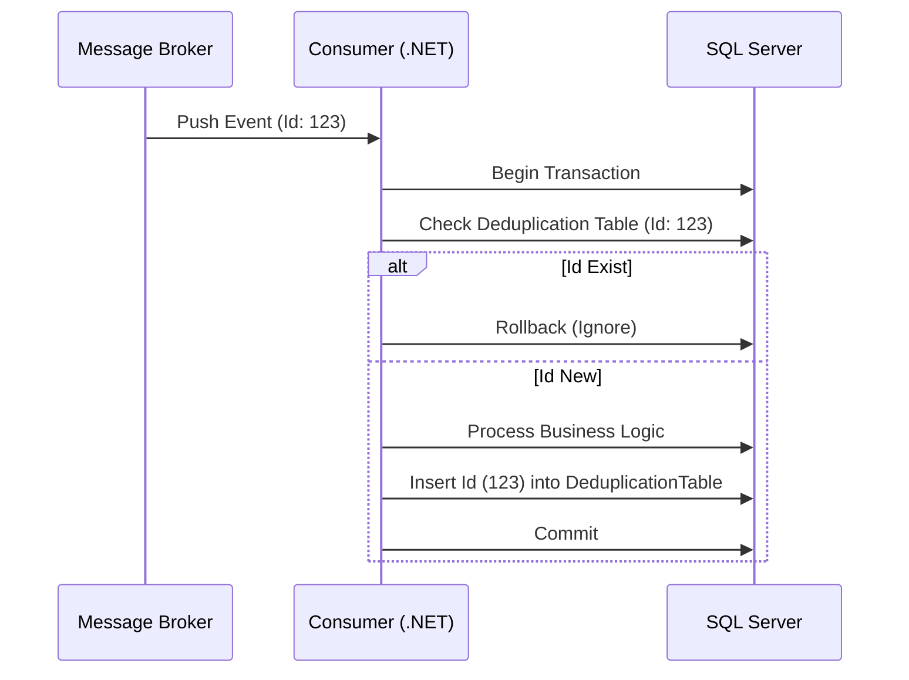

# Idempotent Consumer con SQL Server Deduplication Table [Senior]

## 1. Contexto General & Definición del Concepto
El patrón **Idempotent Consumer** garantiza que el procesamiento de un mensaje (o petición) tenga el mismo efecto, independientemente de cuántas veces se reciba. En sistemas distribuidos con entrega *at-least-once*, la duplicidad es inevitable. La implementación mediante una **Deduplication Table** en SQL Server asegura una consistencia fuerte, permitiendo que la persistencia del estado de negocio y la marca de duplicado ocurran en una transacción atómica.

## 2. Forma de Aplicación, Buenas Prácticas & Ventajas
### Cuándo usarlo
- Cuando el coste de re-procesar una operación es alto (ej: cobros, envíos, inventarios).
- Cuando la infraestructura de mensajería (Service Bus, RabbitMQ) no garantiza *exactly-once*.

### Matriz de Trade-offs
| Ventaja | Desventaja | Coste Operativo |
| :--- | :--- | :--- |
| Consistencia Fuerte | Latencia de escritura adicional | Moderado (almacenamiento) |
| Simplicidad lógica | Contención en la tabla de logs | Bajo (nativos SQL) |

## 3. Flujo Arquitectónico y Diagrama (Mermaid)


## 4. Implementación en C# .NET 10
```csharp
public async Task ProcessEventAsync(Guid messageId, EventData data, CancellationToken ct)
{
    using var transaction = await _dbContext.Database.BeginTransactionAsync(ct);
    try {
        // Verificar idempotencia
        if (await _dbContext.ProcessedMessages.AnyAsync(m => m.Id == messageId, ct))
            return;

        // Lógica de negocio
        var entity = new DomainEntity(data);
        _dbContext.Entities.Add(entity);

        // Registrar mensaje procesado
        _dbContext.ProcessedMessages.Add(new ProcessedMessage { Id = messageId, ProcessedAt = DateTime.UtcNow });

        await _dbContext.SaveChangesAsync(ct);
        await transaction.CommitAsync(ct);
    }
    catch (Exception) { await transaction.RollbackAsync(ct); throw; }
}
```

## 5. Implementación en React con Vite.js
Para evitar el doble clic en el cliente, usamos una técnica de **Idempotency Key** enviada en los headers del Request.
```typescript
const useSubmitOrder = () => {
  const [loading, setLoading] = useState(false);
  const execute = async (order: Order) => {
    const idempotencyKey = crypto.randomUUID(); // Generado en el cliente
    setLoading(true);
    try {
      await axios.post('/api/orders', order, { 
        headers: { 'X-Idempotency-Key': idempotencyKey } 
      });
    } finally {
      setLoading(false);
    }
  };
  return { execute, loading };
};
```

## 6. Consideraciones de Concurrencia
- **Optimistic Locking**: Utilizar versiones (`RowVersion` en SQL Server) junto a la tabla de duplicación para evitar *lost updates*.
- **Limpieza**: Implementar un proceso de background (`IHostedService`) para purgar entradas de la tabla de deduplicación con un TTL (ej: 7 días).

## 7. Enlaces y Referencias
- [[Transactional-Outbox-Pattern]]
- [[CQRS-y-Event-Sourcing]]
