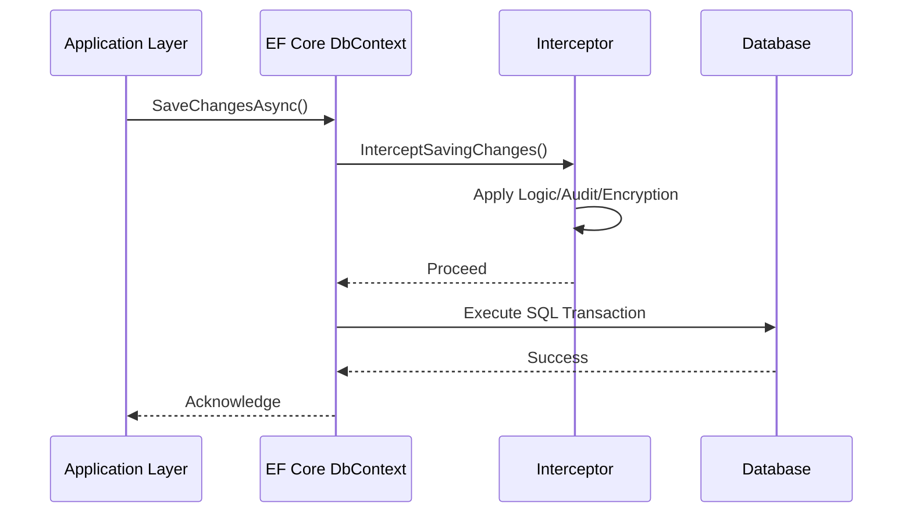

# Interceptor Pattern en EF Core [Senior]

## 1. Contexto General & Definición del Concepto
El patrón Interceptor permite inyectar lógica transversal (cross-cutting concerns) en el ciclo de vida de las operaciones de base de datos de EF Core sin acoplar el dominio. En sistemas distribuidos, esto es crucial para auditoría, soft-delete, encriptación en reposo y la implementación del [[Transactional-Outbox-Pattern]].

## 2. Forma de Aplicación, Buenas Prácticas & Ventajas
### Cuándo aplicar
- Auditoría automatizada (Who/When).
- Implementación de Multi-tenancy.
- Encriptación de campos transparentes (PII).
- Dispatching de Domain Events post-save.

### Matriz de Trade-offs
| Ventaja | Desventaja | Impacto Operativo |
| :--- | :--- | :--- |
| Desacoplamiento de cross-cutting | Latencia extra en SaveChanges | Mínimo pero medible |
| DRY en persistencia | Debugging complejo | Moderado |
| Cumplimiento de NFRs | Riesgo de side-effects | Alto (Cuidado con el ciclo de vida) |

## 3. Flujo Arquitectónico


## 4. Implementación en C# .NET 10
```csharp
public class AuditInterceptor : SaveChangesInterceptor
{
    public override async ValueTask<InterceptionResult<int>> SavingChangesAsync(
        DbContextEventData eventData, 
        InterceptionResult<int> result, 
        CancellationToken ct = default)
    {
        var context = eventData.Context;
        foreach (var entry in context!.ChangeTracker.Entries<IAuditable>())
        {
            if (entry.State == EntityState.Added)
                entry.Entity.CreatedAt = DateTime.UtcNow;
            entry.Entity.ModifiedAt = DateTime.UtcNow;
        }
        return await base.SavingChangesAsync(eventData, result, ct);
    }
}
```

## 5. Implementación en React (Vite.js) con Axios Interceptors
En el frontend, el patrón se traslada al manejo de peticiones para inyectar headers de autenticación o normalizar errores de API.
```typescript
import axios from 'axios';

const apiClient = axios.create({ baseURL: '/api' });

apiClient.interceptors.request.use(config => {
  const token = localStorage.getItem('jwt');
  if (token) config.headers.Authorization = `Bearer ${token}`;
  return config;
});

apiClient.interceptors.response.use(
  response => response,
  error => {
    if (error.response?.status === 401) { /* Redirect to Login */ }
    return Promise.reject(error);
  }
);
```

## 6. Consideraciones de Concurrencia y Rendimiento
- **Consistencia:** Los interceptores en EF Core se ejecutan dentro de la transacción de base de datos. Mantenerlos ligeros para evitar el bloqueo de recursos (Lock contention).
- **Latencia:** En sistemas de alto tráfico, evitar operaciones I/O bloqueantes dentro del interceptor.

## 7. Referencias
[[persistencia-ef-core-arquitectura-avanzada]]
[[domain-events-dispatching-en-transaccion]]
