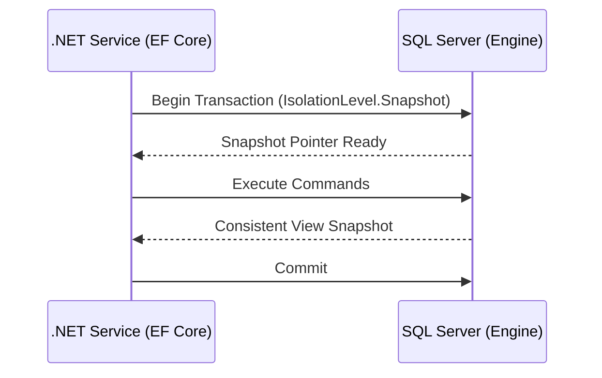

# Niveles de Aislamiento en SQL Server [Senior]

## 1. Contexto General & Definición del Concepto
En sistemas distribuidos de alto tráfico, el aislamiento transaccional es el compromiso entre la consistencia estricta (ACID) y la concurrencia (performance). En SQL Server, los niveles definen qué tan protegido está un proceso frente a fenómenos como *Dirty Reads*, *Non-repeatable Reads* y *Phantom Reads*. Entender estos niveles es crucial para evitar bloqueos (deadlocks) que degradan el throughput y la latencia p99.

## 2. Forma de Aplicación, Buenas Prácticas & Ventajas
- **Uso recomendado:** `Read Committed Snapshot (RCSI)` es el estándar de facto para aplicaciones modernas en .NET para maximizar el throughput sin sacrificar consistencia.
- **Antipatrón:** Utilizar `Serializable` por defecto por miedo a la inconsistencia. Esto estrangula el escalamiento del sistema.

| Nivel | Consistencia | Throughput | Bloqueos (Locking) | Ideal para |
| :--- | :--- | :--- | :--- | :--- |
| Read Uncommitted | Baja | Muy Alto | Mínimo | Reportes no críticos |
| Read Committed | Media | Alto | Moderado | CRUD estándar |
| Snapshot | Alta | Alto | Bajo | Lecturas complejas |
| Serializable | Máxima | Bajo | Alto | Reportes financieros |

## 3. Flujo Arquitectónico


## 4. Implementación y Ejemplos Prácticos en C# / .NET 10
```csharp
public async Task ExecuteTransactionalOperationAsync(Guid id, CancellationToken ct)
{
    using var strategy = _dbContext.Database.CreateExecutionStrategy();
    await strategy.ExecuteAsync(async () => {
        using var transaction = await _dbContext.Database.BeginTransactionAsync(IsolationLevel.Snapshot, ct);
        var entity = await _dbContext.Entities.FindAsync(id);
        entity.UpdateStatus(Status.Processed);
        await _dbContext.SaveChangesAsync(ct);
        await transaction.CommitAsync(ct);
    });
}
```

## 5. Implementación y Ejemplos Prácticos en React con Vite.js
En el frontend, la gestión de la concurrencia se traslada a la actualización optimista para mejorar la percepción de latencia.
```typescript
const useUpdateEntity = () => {
  const queryClient = useQueryClient();
  return useMutation({
    mutationFn: updateApi,
    onMutate: async (newData) => {
      await queryClient.cancelQueries(['entity', newData.id]);
      const previous = queryClient.getQueryData(['entity', newData.id]);
      queryClient.setQueryData(['entity', newData.id], newData);
      return { previous };
    },
    onError: (err, newData, context) => queryClient.setQueryData(['entity', newData.id], context.previous)
  });
};
```

## 6. Consideraciones de Concurrencia y Rendimiento
Para arquitecturas Senior, la recomendación es mover la lógica de integridad hacia la capa de aplicación (Optimistic Locking con `RowVersion`) permitiendo que la base de datos funcione en modo `RCSI` o `Snapshot`, reduciendo significativamente los bloqueos pesimistas en el motor.

## 7. Enlaces y Referencias
- [[Optimistic-vs-Pessimistic-Locking]]
- [[persistencia-ef-core-arquitectura-avanzada]]
