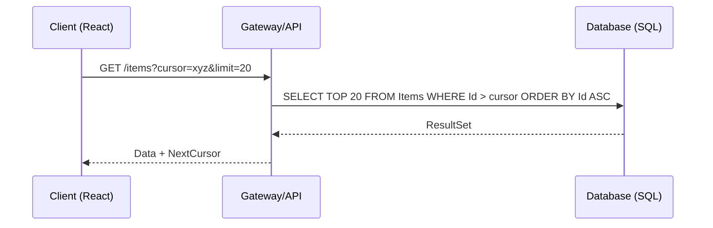

# Paginación Eficiente en Sistemas Distribuidos [Senior]

## 1. Contexto General & Definición del Concepto
La paginación no es solo un filtro de base de datos; en sistemas distribuidos de alta escala, es una estrategia crítica de gestión de tráfico. El uso de `OFFSET/LIMIT` tradicional causa degradación del rendimiento O(N) al aumentar el desplazamiento. La paginación eficiente implica el uso de **Keyset Pagination** (o Cursor-based) para asegurar un rendimiento constante O(1) independientemente del volumen del conjunto de datos.

## 2. Forma de Aplicación, Buenas Prácticas & Ventajas
- **Offset Pagination**: Útil para UI con saltos aleatorios de página (ej: tablas pequeñas).
- **Cursor/Keyset Pagination**: Estándar en APIs modernas (Infinity Scroll). Evita duplicados o saltos al insertar registros nuevos.

| Técnica | Rendimiento | Orden | Complejidad UI | Salto a Página N |
| :--- | :--- | :--- | :--- | :--- |
| Offset | O(N) | Estable | Simple | Soportado |
| Cursor | O(1) | Variable | Compleja | No soportado |

## 3. Flujo Arquitectónico y Diagrama (Mermaid)


## 4. Implementación y Ejemplos Prácticos en C# / .NET 10
Utilizamos `Records` y `LINQ` para asegurar eficiencia. Evitamos cargar objetos pesados usando `Projection` (Select).

```csharp
public record PagedResult<T>(IEnumerable<T> Items, string? NextCursor, bool HasNext);

public async Task<PagedResult<ProductDto>> GetProductsAsync(string? cursor, int pageSize = 20)
{
    var query = _context.Products.AsNoTracking().OrderBy(p => p.Id);
    
    if (!string.IsNullOrEmpty(cursor))
    {
        // Decodificar Base64 del cursor
        var lastId = Guid.Parse(Decode(cursor));
        query = query.Where(p => p.Id > lastId);
    }

    var items = await query.Take(pageSize + 1).Select(p => new ProductDto(p.Id, p.Name)).ToListAsync();
    var hasNext = items.Count > pageSize;
    var result = hasNext ? items.Take(pageSize) : items;
    var nextCursor = hasNext ? Encode(items.Last().Id.ToString()) : null;

    return new PagedResult<ProductDto>(result, nextCursor, hasNext);
}
```

## 5. Implementación y Ejemplos Prácticos en React con Vite.js
Uso de `useInfiniteQuery` de TanStack Query para abstracción de estados.

```typescript
const { data, fetchNextPage, hasNextPage } = useInfiniteQuery({
  queryKey: ['products'],
  queryFn: ({ pageParam }) => fetchProducts(pageParam),
  getNextPageParam: (lastPage) => lastPage.nextCursor ?? undefined,
});
```

## 6. Consideraciones de Concurrencia, Consistencia y Rendimiento
1. **Estabilidad**: El cursor debe estar basado en campos indexados (clustered index).
2. **Observabilidad**: Monitorear el costo de las consultas mediante `Exceeded Execution Time`. 
3. **Consistencia**: Considerar que con Cursor-based, nuevos registros pueden aparecer mientras el usuario navega.

## 7. Enlaces y Referencias en Obsidian
- [[CQRS-Arquitectura-Distribuida]]
- [[Estrategias-Cache-Distribuido-Senior]]
- [[repository-unit-of-work-pattern-senior]]
